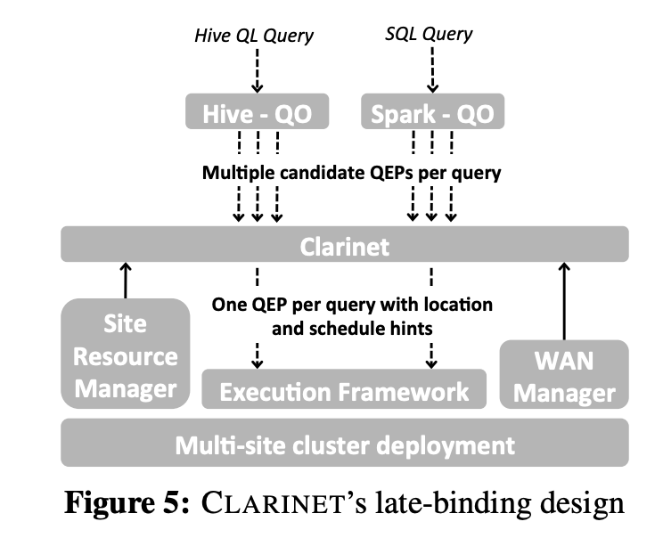

# CLARINET: WAN-Aware Optimization for Analytics Queries

### TL;DR:

CLARINET is a novel WAN-aware query optimizer. Deriving a WAN-aware Query Execution Plan\(QEP\) requires working jointly with the execution layer of analytics frameworks that places tasks to sites and performs scheduling. The authors design efficient heuristic solutions in CLARINET to make such a joint decision on the QEP. Experiments with a real prototype deployed across EC2 datacenters, and large-scale simulations using production workloads show that CLARINET improves query response times by ≥ 50% compared to state-of-the-art WAN-aware task placement and scheduling.

### Summary:

Recent work showed that centrally aggregating and analyzing data could be slow and, sometimes, even not possible due to data sovereignty issues\[1\]. Thus, Geo-distributed analytics are becoming more ubiquitous nowadays. However, existing query optimizers\[2\] ignore the underlying heterogeneous network, because they were designed for single server setup. Multiple queries could contend simultaneously for limited WAN bandwidth. QOs for GDA must consider 1\) task placement and network transfer scheduling when determining a QEP's quality, and 2\) plan for multiple queries at once.\[3\]

Clarinet lies between the existing Hive/Spark QO and the execution framework as an intermediate shim layer. Clarinet collects the QEP-Sets from multiple queries/QOs, computes a single, optimal QEP per query as well as location and scheduling hints and forward these to the execution framework. 

Each node \(operator\) in a QEP, forwarded from QOs to CLARINET, is annotated with its output cardinality and parallelism as estimated by the QO. The cardinality represents the total amount of data transferred from the current operator to its successor operator. The operator parallelism decides the number of tasks to be spawned for each operator.

For a single query, Clarinet will choose one QEP from the query's QEP-set, such that its running time is minimized. For multiple contending queries, if we pick the optimal QEPs independently, they may contend for network resources. The straw-man solution is to emulate shortest-job first and iteratively determines the QEP, placement, and schedule from the set of all QEPs of all jobs. However, it may lead to resource fragmentation. The authors present a novel approach: k-Shortest Jobs First Heuristic. Clarinet will maintain a dynamic set, D, consisting of k-shortest queries. Whenever a flow belonging to a query in D is available, and the resource it needs is free, Clarinet will immediately schedule the flow on the resource\[5\].

### Comment: 

The overall idea is great, and it works for all QOs that can provide multiple QEPs based on its current cost model. However, it seems that how to choose k in the k-shortest jobs first heuristic is not adequately discussed.

\[1\]  e.g. German BDSG data protection act 

\[2\]  The query optimizer\(QO\) takes users' input query/script and determines an optimal execution plan, which is essentially a DAG of many interdependent tasks. 

\[3\] Jointly determining the QEP for all queries provides better opportunities to avoid resource contention. 

\[4\] The best combination of multiple queries to minimize the JCT is computationally intractable. 

\[5\] Break ties in favor of short durations.

