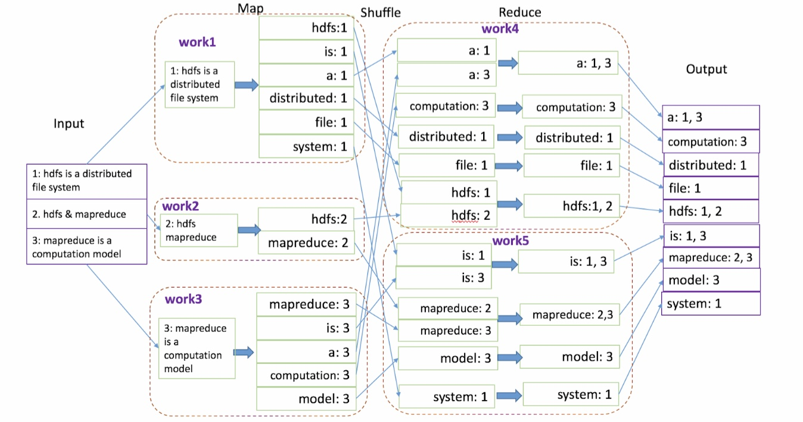
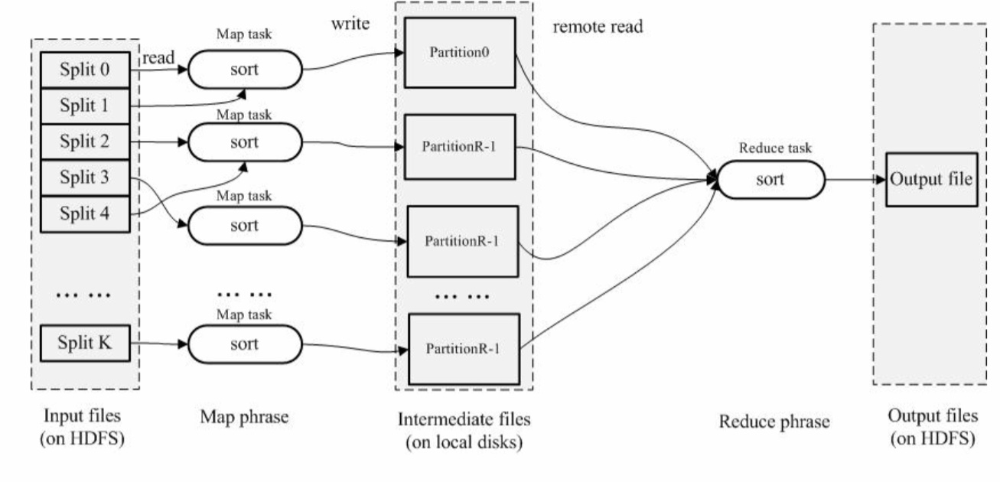
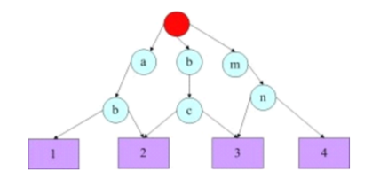
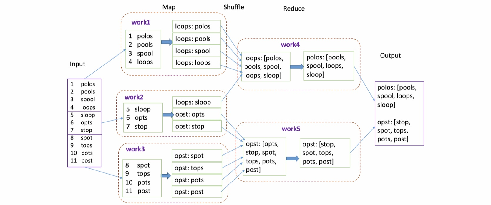

# MapReduce: Simplified Data Processing on Large Clusters

### Motivation:

The input data of computations within Google is usually very large, forcing the programmer to distribute the tasks across lots of machines. The problem is: how to build a distributed computation framework that can process large data sets in parallel and handle fault tolerance?

### Overview:

MapReduce is a framework that hides the details of parallelizing your workflow, fault-tolerance, distributing data to workers, and load balancing behind the abstractions _map_ and _reduce_. The user of MapReduce is responsible for writing these map and reduce functions, while the MapReduce library is responsible for executing that program in a distributed environment.

### Programming Model:

The computation to be performed is expressed through two functions: map and reduce. The map function takes an input key, value pair and outputs an intermediate key, value pair, while the reduce function accepts the intermediate key and a set of values for that key. The reduce function merges together these values to form a possibly smaller set of values.

### Execution:

Image there is a client invokes MapReduce and supplies the map and reduce function. The client will connect to one of the machine in the cluster and that machine is going to be the special machine, the so-called master process.

Any machine can play any role and the master is going to make a decision to split up the input of the job. It will make the assumption that the input docs is already out there on the machines\(In Google, there is a system called Google File system, that spreads document randomly around machines, makes sure there is at least three copies of each doc which are far away from each other to protect against power failures..etc\) The master is first going to make an attempt that for each doc, it's going to schedule a worker machine that process the doc, and it will schedule that work on machine that the doc is already located. \(Because moving computation is cheaper than moving data\). This may not always be possible, because the docs may be placed in a skewed fashion. Imagine a pessimistic scenario where all our document are on machine A, it doesn't make sense to respect locality, it make sense to move docs to other places so we get more parallelism. In general, the master schedules the tasks as close as it can, while also maximum the parallel resources. It, in some sense, is a multi-level optimization problem the master has to deal with.\[1\]

The map tasks have the nice property that they are embarrassingly parallel and the intermediate result are write out to mappers' local disks. The master is responsible for keeping track the process of these map tasks, by asking them to periodically report their progress. After the map phase is finished, the master is going to talk to the reducers and assign reduce tasks and reducer is going to ask the data from the mappers and process them. 

### Fault tolerance: 

What could go wrong is the problem we should ask when we program distributed systems, because anything could go wrong, will.

1.Master failure: The google authors say it totally probably won't happen. \(so, it's just pretend for a minute, that the master doesn't fail\)

2.Mapper failure: Because the master asks the worker to send heartbeat messages, if a worker hasn't been phone home for a sufficient long amount of time, the master could decide that worker is never coming back. Thus, the master can reschedule the task in other workers. But of course, what if the process that we decided was never going to come back indeed does come back, is that a problem? Because of the way the master structure the map functions, because it's pure functional. We could also just ignore the problem, because the two copy of the tasks are going to compute the same result, so we can just forget about the fact we ask two workers to do it and whoever finish the last, they are overwriting the same thing the other guy writing. 

3.Reducer failure: same thing. they can just go back and read the code data on disk of mappers. \(The mappers, once their result are written to disk, it's sort of checkpoint barrier here.\) 

4. Stragglers\(e.g. bad disk, bad nic card\): Stragglers are machines that takes an unusually long time to complete. When a MapReduce operation is close to completion, the master schedules backup executions of the remaining in-progress tasks. The task is marked as completed whenever either the primary or the backup execution completes

\[1\] Please check delay scheduling paper for more details

\[2\] The decision is going to be made via a hash function mod k about which keys go to which reducer

### Note: 

1. For the users, they only need to write a Map function and a Reduce function. They don't need to understand parallelism and distributed programming. 

2. No reduce starts before all maps are finished because if there exists at least one map task running, it's possible that it will generate some key/value pairs, but the reduce job for that key has already been processed. 

3. Each map/reduce task is independent of each other\(No communication required between map task or reduce task\) 

4. The input data of the map function comes from the distributed file system\(e.g., GFS or HDFS\), and the output of the map function is written into the local disk of the node. The reducer will read the data from the mappers' disk and write the output back to the distributed file system.

### Challenges:

There are six challenges when designing large-scale systems like Mapreduce. This paper proposes some "naive" solutions to them and most of the papers in this section propose more advanced solutions. The challenges are: 

* Parallelism
* Network
* Stragglers 
* Scheduling
* Fault-tolerance
* Locality

### Example1 - Distributed Grep:

How to quickly grep for some term in documents which spread across machines?

The term will be passed in map function, where the whole map function will be hard-coded for the term. So, the map function will just say, for every Y in the document, emit\(print\) the line, if it has the word in it, otherwise, don't. The reduce function can be ignored.

### **Example2 - Inverted index**: 

How to produce a produce a report that, instead of finding the word and how many times it occurred, find the documents a word occurred in, which is a list of url,? \(Later we can to use this to build my search engine.\)

To build a search engine, we could create a term vector, for example: Apple occurred in `url[2, 3, 4]` Banana occurred in `url[4, 9, 10]`. If someone wants to search for the phrase the Apple Banana, we can look up all the terms and take the intersection of their matching document. In the earlier days of internet, this is exactly how it works. So, this will be a way of saying that we  have these document spread everywhere, but they are not searchable, we have to send queries to all the servers. To make them searchable, we can transform them into so-called inverted index and the inverted index, which we can computed using MapReduce, can be use to index back to the docs.

### Example3 - Terasort:

How to quickly sort 1TB data?\(You can view the data as an array of strings\) 

Naive Solution: In the map phase, every mapper gets some subsets of data and sort them. Then, in the reduce phase, a single reducer gets all data and performs "merge-sort". 

However, the reduce phase will bottleneck as a single reducer gets all the data. 

\*\*\*\*[**TeraSort**](http://sortbenchmark.org/YahooHadoop.pdf): In the map phase, the input of every task are divided into R partitions, where R is the number of reducer. In particular, every key in $$R_i$$ is smaller than every key in $$R_{i+1}$$ for all $$i > 0$$ . For example, you can use the first character in the string. 

In the reduce phase, the $$i^{th}$$ reduce task is responsible for sorting all $$R_i$$ s, which means the output of reduce i are all less than the output of reduce i + 1.

Terasort consist of three steps, sampling, tagging\(map\) and sorting\(reduce\). At a very high level, sampling is performed in JobClient. We sort a subset of input data\(e.g. 100,000 keys\) and divide them into R partitions. Then, we find the upper bound and the lower bound of every partition\(called the reduce boundaries\) and store them. For example, if the sampling data is `[b, abc, abd, bcd, abcd, efg, hii, afd, rrr, mnk]`. Then, after you sort it, the resulting data will be `[abc, abcd, abd, afd, b, bcd, efg, hii, mnk, rrr]`If you have 4 reducers, the reduce boundaries will be abd, bcd ,and mnk 

In map phase, the inputs of the map tasks are data and the reduce boundaries. The mapper will first use the reduce boundaries to build a two level trie\(where the leave nodes is the reduce number\) that quickly indexes into the list of sample keys based on the first two bytes of the key. Then, for every key, the mapper will find the corresponding partition and tag it with the partition number.  For example, abg will be tagged with 2 and mnz will be tagged with 4.

In the reduce phase, reducer i will fetch all partition i's from all mapper's local disk and sort them. The final sorted result can be printed by combining all reduce outputs in order. 

### **Example4 -** [**Two sum**](https://leetcode.com/problems/two-sum/)**:** 

We can map all pairs which sum to the target value into the same reducer and every reducer can perform local two sum on its own. To map the pairs into the same reducer, for every integer i, if $$i < target / 2 $$, then $$h(i) = i$$, otherwise $$h(i) = target - i$$. Then, if $$a + b = target$$ and $$a < target / 2 $$, $$h(a) = a = target - b = h(b) $$, which means a and b will go the same reducer. 

### Example5 - [Group Anagrams](https://leetcode.com/problems/group-anagrams/): 

The mapper will take a list a words and for every string in the list, output\(emit\) `{sorted string, string}`and the reducer will take `{sorted string, a list of anagram words [A1, A2 ... ]}`and  output `{[A1, A2, A3]}`\([code](https://github.com/Romero027/adhoop/tree/master/anagram)\).

