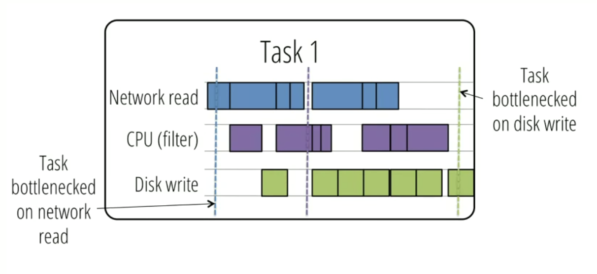
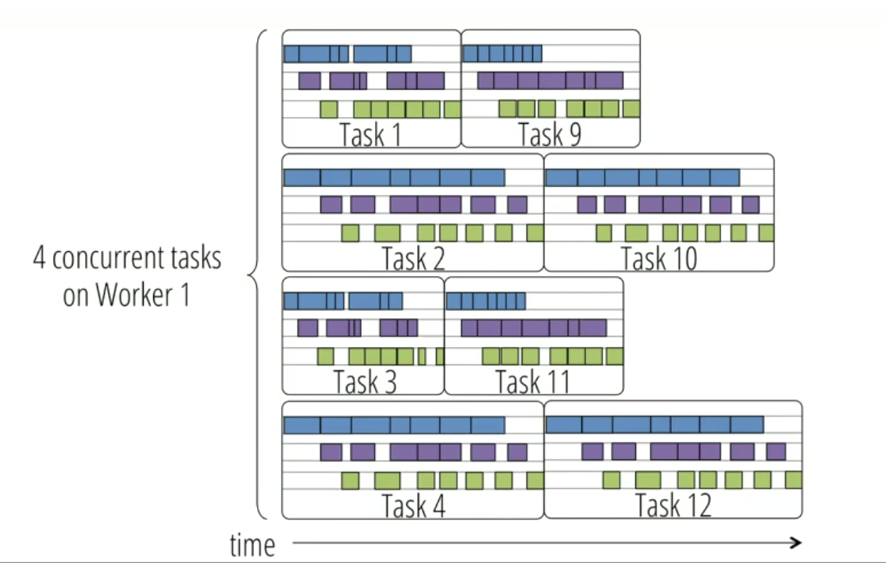

# Monotasks: Architecting for Performance Clarity in Data Analytics Frameworks

### TL;DR:

This work explores how to architect systems for performance clarity: the ability to understand where bottlenecks lie and the performance implications of various system changes. The main objective of this paper is to explore how systems can provide performance clarity, and as a result it does not focus on optimizing performance. 

### Summary:

The paper was inspired by the problem that people often spend a lot of time trying to understand the systems so that they can tune them for better performance\[1\]. Even worse, Software and hardware are constantly evolving so performance is always in flux The authors argue that simplify reasoning about performance enable users to determine what configuration parameters to set and what hardware to use to optimize runtime.

The problem looks simple at first glance, but there are lots of challenges:

1.Task pipelines multiple resources, bottlenecked on different resources at different times.

2. Concurrent tasks may contend for the same resources\(e.g. network\)

To solve challenge 1, the authors propose breaking jobs into monotasks: unit of work that each use a single resource.\[2\] Monotasks do not interact with or block on other monotasks during their execution. And to deal with challenge 2, MonoSpark has per-resource schedulers control contention and have complete control over resources. \[6\]

### How are multitasks decomposed into monotasks?

Decomposing jobs into monotasks does not require users to write their jobs as a sequence of monotasks and can be done internally by the framework without changing the existing API. With MonoSpark, the decomposition of jobs into monotasks is performed on worker machines rather than by the central job scheduler.

### How do we use Monotask to model performance?

Ideal CPU time: total CPU monotask time / \# CPU cores. The ideal network and disk runtime can be computed in the same manner. Then, the job runtime will just be the maximum of ideal runtimes. 

In MonoSpark, question like How much faster would the job be with 2x throughput will be trivial to answer. The ideal disk time would be divided by two, and the new modeled job completion time would be the new maximum time for any of the resources.

In general, we could predict the runtime on different hardware.\[3\] , with deserialized data\[4\] or even with both hardware and software changes. It could also be used for understanding bottlenecks.\[5\]

### Result:

The performance of MonoSpark is very similar to the performance of Spark, sometimes even faster because of higher resource utilization. 

Predictions for different hardware within 10% of the actual time. 

### Limitations:

Jobs with few tasks: If a job has a small number of multitasks relative to the available resources, then there may be no opportunities for coarse-grained pipelining across different monotasks

Jobs with large tasks: In MonoSpark, data must fit in a buffer in-memory after it is read from \(or before it is written to\) persistent storage.

The monotasks ideas will not work in current virtual machine, container, or cloud environments. Monotasks require direct access to machines to implement per disk, per CPU, and network schedulers.

\[1\] Questions like What hardware should I run? Why did my workload run so slowly? Etc. 

\[2\]  Monotasks use exactly one of CPU, disk, or network.  

\[4\]  e.g. to estimate the improvement in runtime if input data were stored in-memory and deserialized, rather than serialized on disk. See 6.3 for details. 

\[5\] The authors conclude that for the big data benchmark, CPU is the bottleneck for most queries, improving disk speed could reduce runtime of some queries, and improving network speed has little effect

\[6\] Today's frameworks break jobs into tasks that time-share the use of CPU, disk, and network. Concurrent tasks may contend for resources, even when their aggregate resource use does not exceed the capacity of the machine.In contrast, a single monotask has exclusive access to a resource. The benefit this provides is guaranteed resource isolation without any cross contention from another tasks.

### Related Links:



