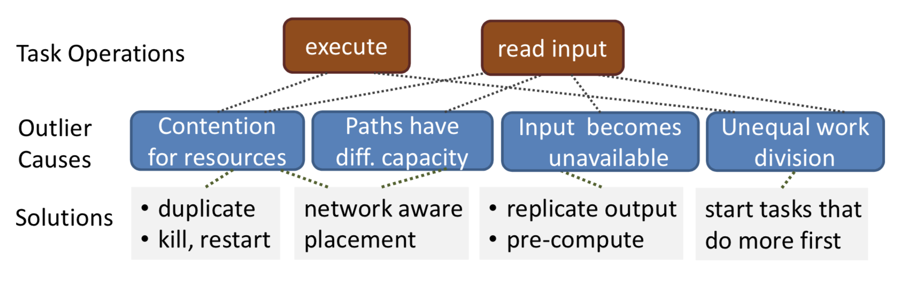
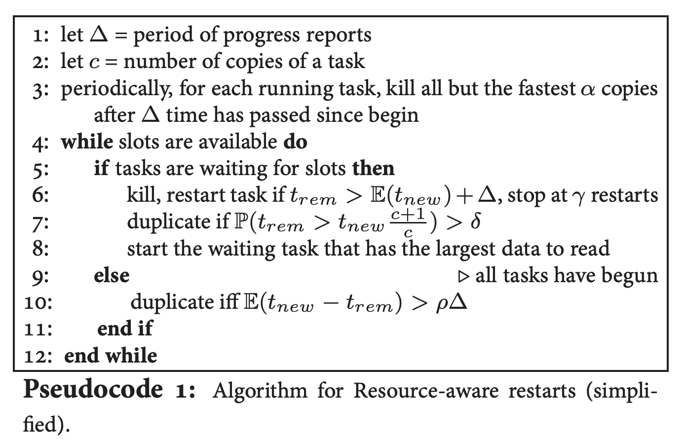

# Reining in the Outliers in Map-Reduce Clusters using Mantri

### TL;DR:

This paper present Mantri, a system that monitor tasks and culls outliers using cause- and resource-aware techniques. Mantri’s strategies include restarting outliers, network-aware placement of tasks and protecting outputs of valuable tasks. Deployment in Bing's production cluster shows that Mantri improves job completion times by 32%

### Motivation:

Experiment in production shows that outliers in Mapreduce jobs inflate the completion time by 32% at median. The authors argue three root causes of straggler. 1. Machine characteristics 2. Network characteristics: Over-subscribed datacenter network results in congestion among different path. 3. Input Skew: Partitioning data over a low entropy key space leads to a skew in the input sizes.\[1\]

**‌**While the first cause is identified by previous works such as LATE, the second and the third remain unexploited. In addition, previous works only act at the end of a phase, which will miss early outliers. Even worse, none of the previous work protect against data loss.  

### Summary:

In short, Mantri is a system that monitors task and culls outliers based on their causes. It uses the following techniques: 1\) Restarting outlier tasks cognizant of resource constraints and work imbalances 2\) Network aware placement of tasks, and 3\) Protecting output of tasks based on cost-benefit analysis.

### **Causes of outliers‌:**

**Data Skew**: Dividing work evenly is a non-trivial problem. First, scheduling each additional task has overhead at the job manager.\[2\] Network bandwidth might also make it not feasible to split work into multiple tasks and move data over the network. A third reason is poor coding practice.

‌**Cross-rack Traffic**: Since the maps are spread across the cluster, regardless of where a reduce task is placed, it will read a lot of data from other racks. Current implementation\(e.g. Hadoop\) place reduce tasks on any machine with spare slots. Thus, a rack that has too many reduce tasks will be congested on its network link, leading to outliers.

‌**Bad and Busy Machines**: Bad Machines which inflate the runtime are randomly spread across the cluster, but recompilations are more localized. Half of them happen on 5% of the machines in the cluster. When a machine loses the output of a task, it has a higher chance of losing the output of other tasks. So, replicate the outputs to protect against data loss on another machine within the same rack might help.

### **Mantri:**

Based on task progress reports, Mantri estimates for each task the remaining time to finish, ****$$t_{rem} $$ ​, and the predicted completion time of a new copy of the task, $$t_{new} $$ . Tasks report progress once every 10s or ten times in their lifetime, whichever is smaller.\(We use $$	\bigtriangleup  $$ to refer to this period.\)

#### Resource-aware Restart:

Mantri uses two variants of restart, the first kills a running task and restarts it elsewhere, the second schedules a duplicate copy. \(In either method, Mantri restarts only when P\( $$t_{new} $$&lt; $$t_{rem} $$ \) is high. Mantri kills and restarts a task if its remaining time is so large that there is more than even chance that a restart would finish sooner. 

However, the current job schuler\(in 2010\) incurs a queueing delay before restarting a task, which can be large and highly variant. Thus, Mantri will schedule duplicates. As we mentioned before, duplicates consume extra resources which may increase job completion time. Hence, when there are outstanding tasks and no spare slots, Mantri schedule a duplicate only if the total amount of computation resource consumed decreases. 

When spare slots are available, as happens towards the end of the job, Mantri schedules duplicates more aggressively. 

#### Network-Aware Placement:

A rack with too many reduce tasks is congested on its downlink and such tasks will straggle. With Mantri, each job manager places tasks so as to minimize the load on the network and avoid self-interference among its tasks. \[3\]

#### Avoiding Recomputation:

To mitigate costly recomputations that stall a job, Mantri protects against interim data loss by replicating task output. It acts early by replicating those outputs whose cost to recompute exceeds the cost to replicate. Mantri estimates the cost to recompute as the product of the probability that the output will be lost and the time to repeat the task.\[4\]

#### Data-aware Task ordering:

The last interesting decision made by Mantri is that it will schedule tasks in a phase in descending order of their.

If you are interested of how $$t_{rem}$$ and $$t_{new} $$ are calculated, please read section 5.5

\[1\]  ****Again, Duplicating these tasks would not make them run faster and will waste resources. See comments on the LATE paper

\[2\] For example, if you divide a task with large input size to several smaller tasks.

\[3\] See paper for details.

\[4\]Again, see paper section 5.4 for details.



