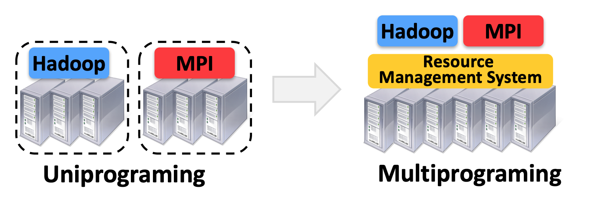
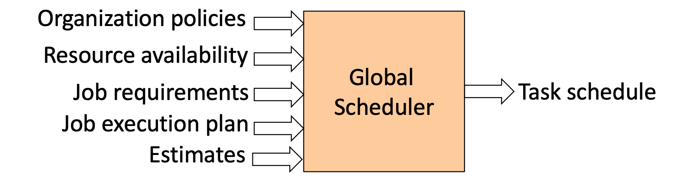

# Resource Management

### Motivation: 

Clusters of commodity servers have become a major computing platform, powering both large Internet services and a growing number of data-intensive scientific applications. Driven by these applications, researchers and practitioners have been developing a diverse array of cluster computing frameworks to simplify programming the cluster. However, it is known that no single framework is optimal for all applications. 

Note: 

* A **framework** \(e.g. Hadoop\) manages one or more jobs in a computer cluster
* A **job** consists of one or more **tasks**
* A **task** \(e.g., map, reduce\) is implemented by one or more processes running on a single machine. 

In the past, each framework runs on its dedicated cluster or cluster partition\(i.e. We statically partition the cluster and run one framework per partition, or to allocate a set of VMs to each framework. While this greatly simplified the design, it brought many challenges: 1. Inefficient resource usage: frameworks cannot use available resources from other frameworks. 2.Hard to share data: Because these frameworks are developed independently, there is hard or even impossible to perform fine-grained sharing across frameworks. 3. Hard to cooperate: For example, it's hard for Pregel to use graphs generated by Hadoop. The overarching goal of most works in resource management is: _How to run multiple frameworks on the same cluster?_  

### What do we want?

Roughly speaking, we want a common resource sharing layer that:

1. Abstracts \("virtualizes"\) resources to frameworks
2. Efficient utilization of resources\(CPU, memory, disk, and network bandwidth\)
3. Support diverse frameworks\(both existing and future\)
4. Scalability to 10,000's of nodes
5. Reliability in the face of node failures.

### Overview of some common approaches

One approach would be for a resource manager to implement a centralized scheduler that takes as input framework requirements, resource availability, and organizational policies, and computes a global schedule for all tasks. While this approach can optimize scheduling across frameworks, it faces several challenges: 1.complexity: it's hard to scale and ensure resilience 2. It's hard to anticipate future frameworks' requirements. 3. Many existing frameworks have their own sophisticated scheduler, and moving this functionality would require expensive refactoring. 

