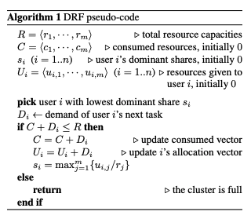
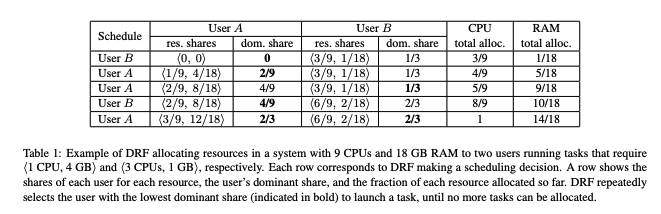

# Dominant Resource Fairness: Fair Allocation of Multiple Resource Types

### Summary

To address the problem of fair resource allocation in a system containing different resource types, the paper proposes _**Dominant Resource Fairness\(DRF\)**,_ a generalization of max-min fairness to multiple resource types. DRF satisfies four properties: **sharing incentive, strategy-proofness, Pareto efficiency and envy-freeness.** 

### [Max-Min Fairness](http://www.mathcs.emory.edu/~cheung/Courses/558/Syllabus/11-Fairness/Fair.html)

One of the most popular resource allocation strategy is **max-min fairness**, which maximize the minimum allocation received by a user in the system. More specifically, we say a **sharing** of a network resource\(e.g. bandwidth\) is **max-min fair** when: 

1. The lowest demand on the network resource is maximized
2. After the lowest demand on the network resource has been satisfied, only then the second lowest demand on the network resource will be maximized;
3. After the second lowest demand on the network resource has been satisfied, only then the third lowest demand on the network resource will be maximized;
4. and so on...

**The Max-Min Fairness Assignment Algorithm**

* Repeat until converge
  * Compute the fair share of each unsatisfied request
  * Assign the fair share to each unsatisfied request
  * Some flows may have received more than its request
  * If there are over-assignments:
    * Take back the over-assigned shares and compute the sum of the over-assigned shares, called the residual amount. 
    * Assign the residual amount to the remaining unsatisfied requests

For example: Consider the problem of the max-min fair allocation for a set of four sources with demands 2, 2.6, 4, 5 when the resource has a capacity of 10. If we run the above algorithm, the fair allocation is: source 1 gets 2, source 2 gets 2.6, sources 3 and 4 get 2.7 each.

Prior to this work, despite the vast amount of work on fair allocation, the focus has so far been primarily on single resource type. 

### Motivation

Existing fair schedulers for clusters, such as Quincy and the Hadoop Fair Scheduler, ignore the heterogeneity of user demands, and allocate resources at the granularity of **slots**, where a slot is a fixed fraction of a node. This leads to inefficient allocation as a slot is more often than not a poor match for the task demands. The paper provides an analysis of a real-world trace showing that most of the tasks either underutilize or overutilize some of their slot resources. 

### Dominant Resource Fairness\(DRF\)

For every user, DRF computes the share of each resource allocated to that user. The maximum among all shares of a user is called that user’s **dominant share**, and the resource corresponding to the dominant share is called the **dominant resource**. Then, DRF simply applies max-min fairness across users' dominant shares. 

The algorithm tracks the total resources allocated to each user as well as the user's dominant share. At each step, DRF picks the user with the lowest dominant share among those with task ready to run. 

### An Example

Consider a system consisting of 9 CPUs, 18 GB RAM and two users, where user A runs tasks with demand <1 CPU, 4GB>, and user B runs tasks with demand <3 CPUs, 1 GB> each. In this case, user A's dominant resource is memory, and user B's dominant resource is CPU. 

At the end of the above allocation, user A gets <3 CPU, 12GB>, while user B gets <6 CPU, 2 GB>, i.e. each user gets 2/3 of its dominant resource. 

