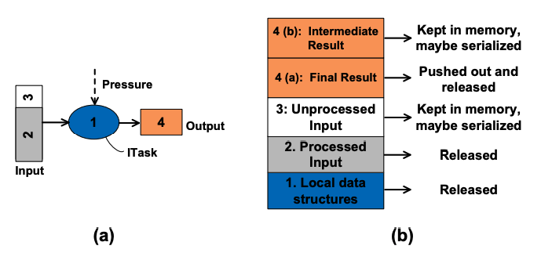
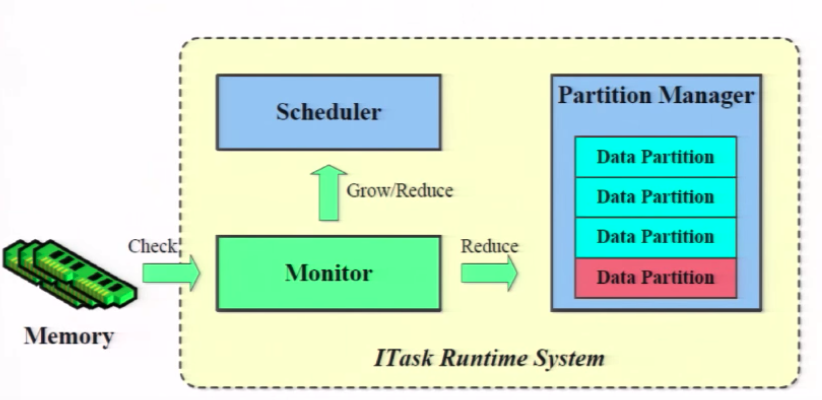

# Interruptible Tasks:Treating Memory Pressure AsInterrupts for Highly Scalable Data-Parallel Program

### Motivation:

Memory problems\[1\] lead to excessive GC effort and out-of-memory errors, significantly hurting system performance and scalability.

No existing technique can systematically address the **individual node** memory pressure problem. Practical solutions center around making “best practice” recommendations for manual tuning of framework parameters.

### Summary:

This paper proposes Interruptible Tasks \(ITasks\) - a new type of data-parallel tasks that can be interrupted upon memory pressure with part or all of their used memory reclaimed and resumed when the pressure goes away. As a result, ITask improves both scalability \(because out-of-memory crashes are avoided\) and performance \(because GC time is reduced\).

### ITask:

When the system detects memory pressure, a selected task is interrupt, with part or all its consumed memory reclaimed. For Component 1 and 2, it's safe to discard them. For Component 3, ITask will try to keep the unprocessed input in memory and serialize it \(lazily\) when needed. For component 4, final result will be pushed to next operator, whereas intermediate result\[2\] will stay in memory and wait to be aggregated. 

The ITasks Runtime system contains three components: the partition manager, the scheduler, and the monitor. The **monitor** determines when to interrupt or reactivate an ITask. It focuses on Long and useless garbage collection. consider a GC as a LUGC if the GC cannot increase the free memory size above M% of the heap size, where M is a user-specified parameter. The **Partition manager** determines when to serialize or deserialize data partitions. The scheduler determines ITask and how many instances of them to run. 

### Comments:

It is interesting that this paper seeks for opportunities to systematically address individual node memory pressure problem, which has been largely unexplored. I like figure 8 as it neatly explains how different components interact with each other. However, I have few concerns/questions. 1. I feel like the evaluation should not be drawn from stackoverflow\(especially, I don't think we should use fix recommended on Stack Overflow as baselines\). 2. In section 5.2, they should run some sensitivity analysis about M and N. 3.  In section 5.4, when the authors talk about how to select tasks to interrupt, I think they should provided a more detailed algorithm, instead of just few heuristics. 4. my biggest concern is: will this approach introduce more stragglers? I didn't see any heuristic that prioritize tasks within the same stage.  

\[1\] Hot keys and large intermediate results are the most common cause of memory problems. 

\[2\]An interrupt to a map task generates a final result, whereas an interrupt to a reduce task generates an intermediate result. 

