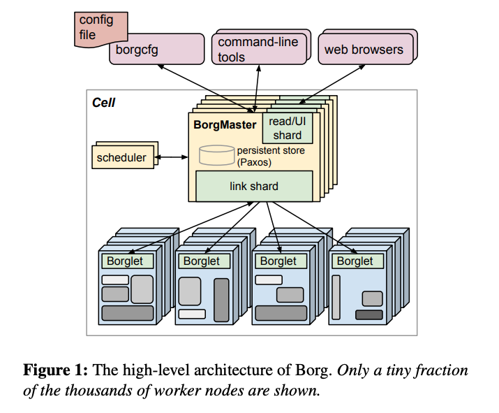

# Large-scale cluster management at Google with Borg

### Introduction

Google's Borg is a cluster manager which manages both long-running services and batch jobs across a number of clusters each with up to O\(10k\) machines. 

At a very high level, users submit their work to Borg as _**Jobs**_, each of which consists of one or more _**tasks**_ that all run the same program\(binary\). Each job runs in one Borg cell, a set of machines that are managed as a unit. 

Many application frameworks and distributed storage systems are built on top of Borg, including MapReduce, FlumeJava, Millwheel, Pregel, CFSm Bigtable and Megastore. 

### Concepts

The machines in a cell belong to a single _**cluster**_, defined by the high-performance datacenter-scale network fabric that connects them. A cluster usually hosts one large _**cell**_\(one cell usually consists of 10k machines\) and some small-scale special-purpose cells. _**Tasks**_ are single-node component of a _**job**_, which is a run of a multi-node application.

To solve the problem of more jobs than available resources can accommodate, Borg assigns every job a _**priority**_. Higher priority jobs\(e.g. production jobs\) can obtain resource at the expense of a lower-priority one, even if that involves preempting the latter. _**Quota**_, which is expressed as a vector of resource requirements, is used to decide which jobs to admit for scheduling.  

Note: In Google, monitoring systems have the highest priority.

### Borg Architecture

A Borg cell consists of a set of machines, a logically centralized controller called the _**Borgmaster**_, and an agent process called the _**Borglet**_ that runs on each machine in a cell.

The _**Borgmaster**_ is replicated five times five times to avoid the problem of single point failure. \(Borg uses Paxos-based protocol and five is a magic number for Paxos\). When a job is submitted, the Borgmaster records it persistently in the Paxos store and adds the job’s tasks to the pending queue. This is scanned asynchronously by the _**scheduler**_, which assigns tasks to machines if there are sufficient available resources that meet the job’s constraints. \(The scheduler primarily operates on tasks, not jobs.\)

For task scheduling, the scheduler first does a _**feasibility checking**_, to find machines on which the tasks could run, and _**scoring**_, which picks one of the feasible machines. Feasibility checking is necessary because Borg allows Jobs to have constraints and the score is mostly driven by some well-known heuristics. 

