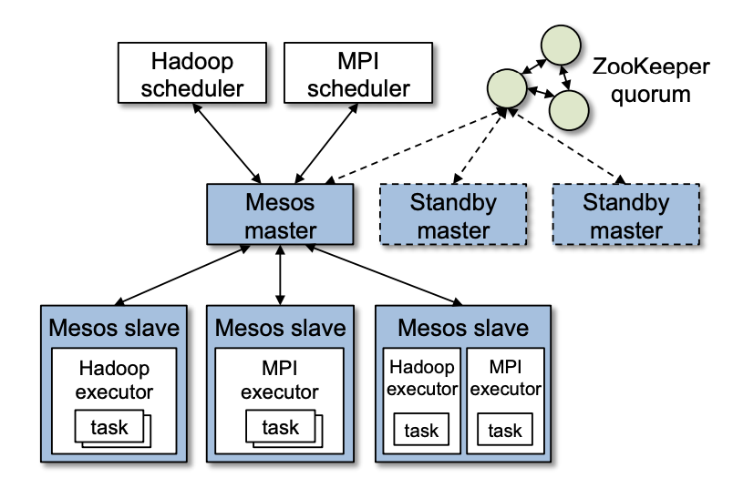
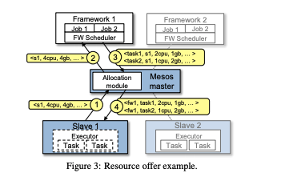

# Mesos: A Platform for Fine-Grained Resource Sharing in the Data Center

### High-Level Goal

The main design question for Mesos is how to build a scalable and efficient system that supports a wide array of both current and future frameworks. 

### Architecture

The design philosophy is to define a minimal interface that enables efficient resource sharing across frameworks, and otherwise **push control of task scheduling and execution to the frameworks**. Such design allows frameworks to implement diverse approaches to various problems in the cluster independently. 

Mesos consists of a master process that manages slave daemons running on each cluster node, and frameworks that run tasks on these slaves. One of the core concept in Mesos is **resource offers**, which are lists of free resources on multiple slaves. The master decides how many resources to offer to each framework according to an pluggable allocation module which defines the organization policy, such as fair sharing\([DRF](https://cs.stanford.edu/~matei/papers/2011/nsdi_drf.pdf)\) or priority-based. 

Each framework running on Mesos consists of two components: a **scheduler** that registers with the master to be offered resources, and an **executor** process that is launched on slave nodes to run the framework’s tasks. While the master determines how many resources to offer to each framework, the frameworks’ schedulers select which of the offered resources to use.

### Example

1. Slave 1 reports to the master that it has 4 CPUS and 4 GB of memory free. Then, the master decides that framework 1 should be offered all available resources.
2. The master sends the resource offer to framework 1.
3. Framework 1's scheduler replies to the master with information about two tasks. 
4. The master sends the tasks to slave 1, which allocates appropriate resources and launches the two tasks. 

Note that because 1 CPU and 1 GB of RAM are still free, the allocation module may now offer them to other frameworks.  

### Making Resource Offers Scalable and Robust

Because some frameworks will always reject certain resources, Mesos lets them short-circuit the rejection process and avoid communication by providing filters to the master. Second, because a framework may take time to respond to an offer, Mesos counts resources offered to a framework towards its allocation of the cluster. Third, if a framework has not responded to an offer for a sufficiently long time, Mesos rescinds the offer and re-offers the resources to other frameworks.

### Fault Tolerance

The master’s only state is the list of active slaves, active frameworks, and running tasks. Mesos runs multiple masters in a hot-standby configuration using ZooKeeper \[4\] for leader election.

Related Links:

* Mesos' [official website](http://mesos.apache.org/)
* [Mesos GitHub Repo](https://github.com/apache/mesos)

