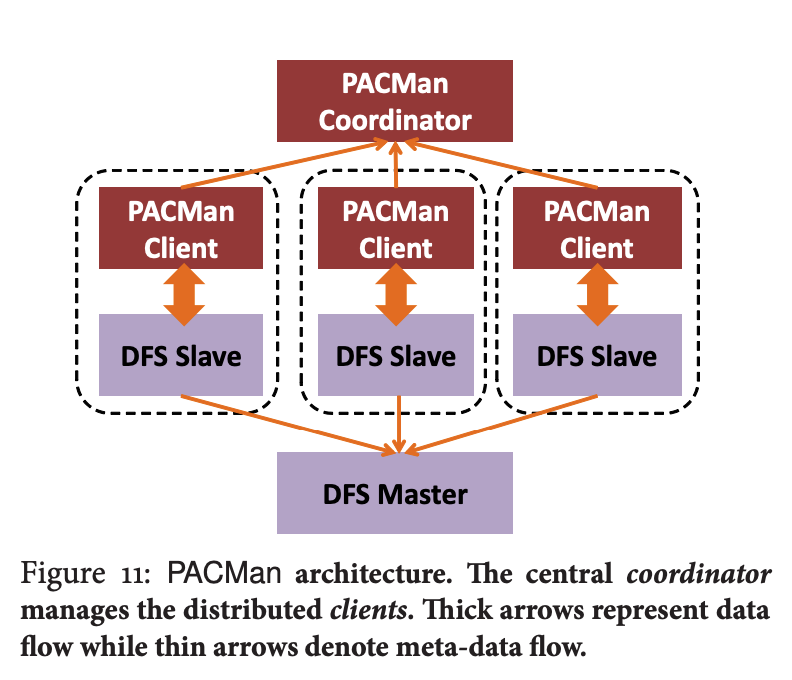

# PACMan: Coordinated Memory Caching for Parallel Jobs

This paper focuses on investigating the use of _memory locality_ to speed-up data-intensive jobs by caching their input data. Interestingly, it was published in NSDI 12, the same venue as the Spark paper ,and also written by researchers from the AMP lab.

### Cache Replacement for Parallel Jobs

**Waves**

Frameworks split jobs into multiple tasks that are run in parallel.\(ignoring stages for now\). There are often enough idle compute slots for small jobs, consisting of few tasks, to run all their tasks in parallel. Such tasks start at roughly the same time and run in a single wave. In contrast, large jobs, consisting of many tasks, seldom find enough compute slots to run all their tasks at the same time. Thus, only a subset of their tasks run in parallel. As and when tasks finish and vacate slots, new tasks get scheduled on them. Such jobs run in multiple waves. 

**All-or-Nothing property**

Achieving memory locality for a task will shorten its completion time. But this need not speed up the job. In the BSP model, jobs speed up when an entire wave-width of input is cached. The wave-width of a job is defined as the number of simultaneously executing tasks.Therefore, jobs that consist of a single wave need 100% memory locality to reduce their completion time. The paper refers to this as the _all-or-nothing_ property.  

### Sticky Policy

Traditional cache replacement schemes that maximize cache hit-ratio do not consider the wave-width constraint of all-or-nothing parallel jobs. The authors proposed a _sticky policy_, which preferentially evicts blocks of incomplete files: If there is an incomplete file in cache, it sticks to its blocks for eviction until the file is completely removed from the cache. 

### Average Completion time and Cluster Efficiency 

In addition to the All-or-Nothing Property, the authors observed that: 1. In a cluster with multiple jobs, average completion time is best reduced by favoring the hobs with the smallest wave-widths. \(LIFE\) 2. Efficiency is best improved by retaining the most frequently accessed files. \(LRU-F\)

### PacMan: System Design

Pacman globally coordinates access to its caches. Global coordination ensures that a job's different input blocks, distributed across machines, are viewed in unison to satisfy the all-or-nothing constraint. 

PacMan's architecture consists of a central coordinator and a set of clients located at the storage nodes of the cluster. 

The coordinated infrastructure's global view is fundamental to implementing the sticky policy. Since LIFE and LFU-F are global cache replacement policies, they are implemented at the coordinator. 

