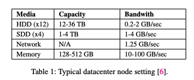
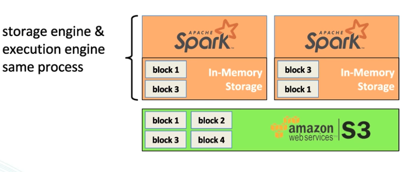
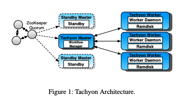
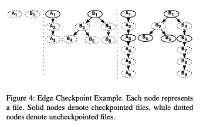

# Tachyon: Reliable, Memory Speed Storage for Cluster Computing Frameworks

### Summary

In today's big data analytic systems, while caching can dramatically improve read performance, unfortunately, it does not help much with write performance. To improve write performance, we present **Tachyon**, an in-memory storage system that allows reliable data sharing at memory speed within and across cluster frameworks/jobs.

### Motivation

In-memory computation frameworks\(e.g., Spark\) significantly speed up the performance of individual jobs. However, sharing\(writing\) data reliably among different jobs often becomes a bottleneck. Because existing big data storage solutions often replicate data across the network to provide fault-tolerance, writes have to incur at least one access to non-volatile media. However, disk and network bandwidth are often two orders of magnitude slower than memory bandwidth. 

Another drawback is that in-memory storage are not shared across jobs/frameworks. For example, in the following example, Spark will create two copies of block 1 and 3, which may result in large JVM heap overhead.

### Tachyon

Tachyon circumvents the throughput limitations of replication by leveraging the concept of **lineage**, where lost output is recovered by re-executing the operations \(tasks\) that created the output. 

In addition to managing metadata, the master also contains a workflow manager. The role of this manager is to track lineage information, compute checkpoint order, and interact with a cluster resource manager to allocate resources for recomputation.

#### Checkpointing

Because Tachyon runs continuously, the lineage accumulated can be substantial, requiring long recomputation time in the absence of checkpoints. The key insight behind Tachyon's checkpointing approach is that lineage enables us to asynchronously checkpoint in the background, without blocking writes. 

The checkpointing algorithm\(called the Edge Algorithm\) models the relationship of files with a DAG, where vertices are files, and edge represents "casualty"\(i.e., dependencies\). 

The algorithm checkpoints the latest data by checkpointing the leaves of the DAG, which means not all nodes in the DAG are checkpointed. In the above example, in step 3, if a failure occurs when A6 is being checkpointed, Tachyon only needs to recompute from A4 through A6. 

The paper also described some augmentation to the algorithm, such as incorporating priorities\(i.e. the degree of the vertices\). 

#### Resource Allocation

The recomputation tasks have to finish in a timely manner. Tachyon uses a priority-based scheduling strategy, in which the recomputation jobs' priorities are assigned based on its corresponding jobs' priority.

### Reference:

* [Alluxio](https://www.alluxio.io/) - A company based on Tachyon. 

