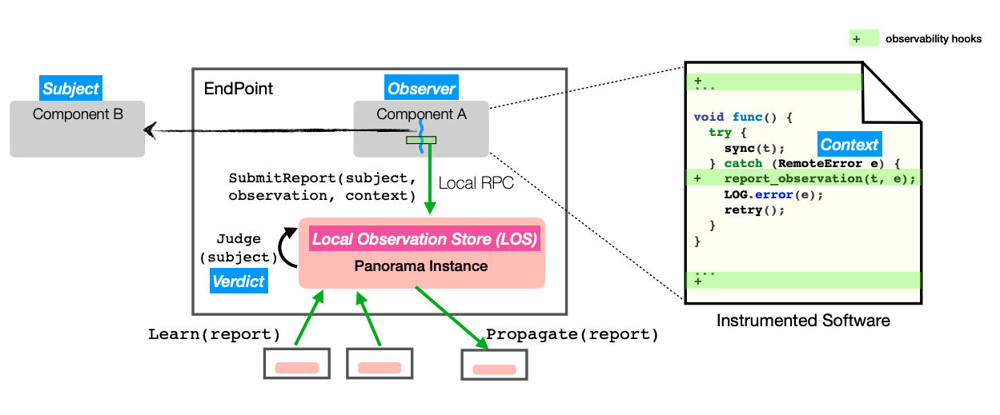
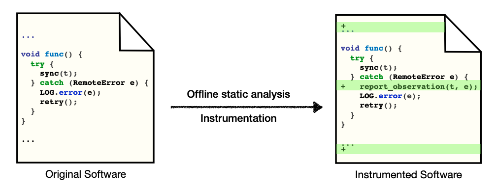

# Capturing and Enhancing In Situ System Observability for Failure Detection

### The Problem 

This paper focuses primarily on catching [**gray failures**](https://xzhu0027.gitbook.io/blog/), in which some components in the system failed but the whole system typically doesn’t crash-stop. One example of such a failure is a ZooKeeper cluster that could no longer service write requests event though the leader was still actively exchanging heartbeat messages with its followers. 

As a result, the main goal of this paper is to design a failure detector that can correctly report the status of each component. The quality of such failure detector is measured by 1\)**Completeness**, which requires that if a component fails, a detector eventually suspects it; and 2\) **Accuracy**, which requires that a component is not suspected by a detector before it fails. 

### Panorama 

> The key insight of this paper is that the place where we have the most relevant information about the health of a process is in the clients that call it.

Based on this insight, Panorama takes a collaborative approach: It gathers observations about each component from different sources in real time to detect complex production failures. 

Panorama is divided into two phases: 

#### Offline Phase

Panorama includes an offline tool that statically analyses a program’s source code \(using Soot\), finds critical points for observation capture, and injects hooks\(green lines in the below figure\) for reporting observations \(using AspectJ\). A typical example of an observation point would be an exception handler invoked when an exception occurs at an observation boundary. We also need positive \(i.e. success\) observations too of course.

One nice thing about these hooks is that they capture first-hand observations, especially runtime errors that are generated from the executions of these code regions in production. Thus, when Panorama reports a failure, there is concrete evidence and context to help localize where the failure happened.

### Runtime Phase

Each Panorama instance maintains a Local Observation Store\(LOS\) that stores all observations reports made by colocated components. The observations are 1\) synchronized with that of other Panorama instances that share common subjects\(a subject is a process that is observed\). There is also a _central verdict server that_ allows easy querying of judgments and arbitrates amongst the decentralized LOSes.

With the observations collected about a subject, Panorama uses decision engine to reach a verdict and stores the result in the LOS. A process is judged as unhealthy if the latest status is unhealthy or the healthy status does not have a recent majority. The summaries across all observers are then aggregated and status decided using a simple majority.

The paper also has some neat techniques to deal with indirection and async function calls.

### Evaluation

Panorama was applied to ZooKeeper, HDFS, HBase, and Cassandra, at both the process and thread level. 

One thing to note is that:

> When a Panorama instance is active, it consumed about 0.7% of CPU on average, and up to around 50MB of memory for a highly active instance. The latency increase and throughput decrease for each instrumented system are below 3%.

