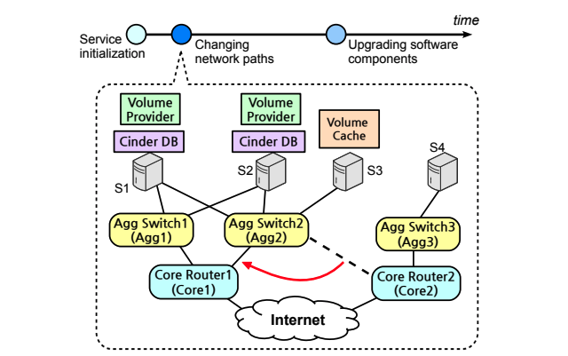
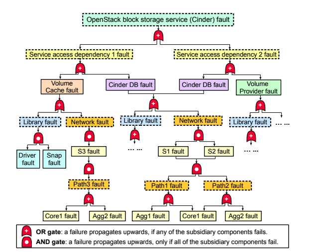

# Check before You Change: Preventing Correlated Failures in Service Updates

### TL;DR

This paper presents CloudCanary, a system that can perform real-time audits on service updates to identify the root cause of correlated failure risks, and generate improvement plans with increase reliability. This is a follow-up work of their [INDaaS](https://www.usenix.org/system/files/conference/osdi14/osdi14-paper-zhai.pdf) paper in OSDI' 14. 

### Background and Motivation

To enhance reliability, cloud providers typically replicate states and functionality across multiple servers. However, the complex. multilayered nature of network/software stacks may conceal underlying interdependencies between seemingly independent components. Failures of these common service dependencies can lead to correlated failures despite replication, causing system downtime. For example, a faulty top-of-rack switch would affect all replicas in the same rack. 

#### Risk Group

In redundant systems, a **risk group** or RG is a set of components whose simultaneous failures could cause a service outage. To prevent correlated failures, the operator needs a tool to check for risk groups in a service deployment and generate improvement plans. For example, if a risk group only contains one element, e.g., a shared switch, it may potentially become a SPOF. In this case, the operator may want to improve the deployment so that even the smallest risk group contains more than one element. 

As most services experience frequent updates in their lifetime, checking for risk groups and generating improvement plans need to be performed continuously in real time. 

#### [Fault Graphs](https://en.wikipedia.org/wiki/Fault_tree_analysis)

A fault graph is a layered DAG representing the logical relationships between component faults within a given system. The fault graph has two types of nodes: _fault events and logic gates_. The leaf nodes in a fault graph are _basic faults_, which are the smallest units of failures under consideration, e.g., the failure of a switch or software library. The root node in a fault graph represents a _target service fault_, which indicates the failure of the entire service. 

#### Limitation of existing solutions

Prior to CloudCanary, the state-of-the-art auditing systems either performs an exhaustive search\(e.g., INDaas\), which is fine for one-shot service audits but infeasible for frequent updates, or use heuristics, which sacrifices accuracy. Moreover, they do not provide any improvement plans and rely on manual effort  to meet the reliability requirements. 

### CloudCanary

CloudCanary consist of two primitives: SnapAudit, which is responsible for extracting risk groups, and DepBooster, which generates improvement plans. 

#### SnapAudit

SnapAudit uses an incremental auditing algorithm that identifies differential fault graphs capturing the delta between the before and after state of the service following an update. At service initialization, SnapAudit not only audits the overall fault graph, but also every subgraph and store in a key-value cache. To speed up analysis, SnapAudit then turns a differential fault graph into a boolean formula and uses a a high performance MinCostSAT solver. 

The goal of the analysis is to extract top-k _minimal risk groups_. A risk group is minimal if the removal of any of its constituent elements makes it no longer a risk group. The top-k risk groups of a given fault graph are ranked by size or by failure probability.

**DepBooster**

DepBooster offers the operator an interface to specify "reliability goals", and assesses if the current deployment meets the goals. If not, DepBooster generates improvement plans with increased reliability. 

In particular, it allows the operator to specified the requirements\(e.g., the size of the smallest RG or the minimum failure probability\), the actions\(e.g., add, link and remove\), and the constraints. 

I enjoyed reading the paper overall and I think it is much more solid than their previous system INDaaS. Fault graphs and risk groups are important and powerful tools in our resilience engineering toolbox. 

### Related Reading:

[http://psteitz.blogspot.com/2011/10/correlated-failure-in-distributed.html](http://psteitz.blogspot.com/2011/10/correlated-failure-in-distributed.html)

[https://storage.googleapis.com/pub-tools-public-publication-data/pdf/36737.pdf](https://storage.googleapis.com/pub-tools-public-publication-data/pdf/36737.pdf)  

