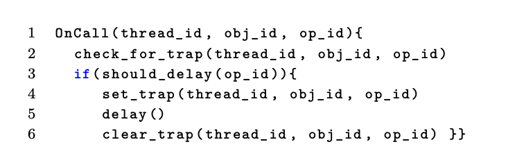

# Efficient Scalable Thread-Safety-Violation Detection

### Motivation

The paper deals with **thread safety violations**\(TSV\). A thread-safety violation occurs when the client fails to meet the thread-safety contract of a class or library. For example, the C\# list has a contract that says two adds operation cannot be concurrent. However, such thread safety violations still widely exist and  hard to find in code reviews. 

Tools for testing at large-scale requires 1. Generate little/no false positives. 2. Have minimal runtime overhead and 3. Require little/no configuration. The approach of active delay-injection is promising but existing tools either inject too many delays or require sophisticated analysis. 

### TSVD

This paper proposes TSVD, a scalable dynamic analysis tool for TSVs. TSVD uses lightweight instrumentation and dynamic analysis to identify potential conflicting accesses without paying the overhead while being effective in finding bugs. 

#### Algorithm

First, TSVD requires a static analysis that identifies all the call sites\(called TSVD points\) to relevant data structures’ methods whose thread-safety needs to be checked in the code. 

The only interface to TSVD is the `OnCall` with arguments that show the thread making the call `thread_id`, the object being accessed `obj_id`, and the operation being performed `op_id`. 

The trap mechanism works as follows. When a thread calling this `OnCall` method and it is chosen by the `shoud_delay`, `set_trap` will register the current method call to some global table, and the thread will sleep for some period\(e.g., 100ms\). During this period, every other thread entering `OnCall` checks if it conflicts with the currently registered traps. If two traps conflicts and at least one operation is a write, TSVD find a bug. Notice that such delay-based strategy will guarantee that if a violation is found, this is a true bug\(i.e., no false positives\). 

**Where to inject delays?**

* **Near miss tracking**: TSVD maintains a set\(called trap set\) of dangerous-pairs of program locations that can likely contribute to thread-safety violations and injects delays at only these locations. TSVD looks for conflicting calls with close-by physical timestamps. If two calls from different threads to the same object occur within a short physical time window, TSVD will add these two calls into the set. Such method is more efficient and scalable than trying to do a happened-before analysis and finding calls with concurrent logical timestamps. 
* **Happen before inference**: To avoid repeatedly injecting delays to calls with synchronization, TSVD uses happen before inference: If m1 synchronized before m2, a delay added to m1 will cause a proportional delay in m2. If this close correlation is observed in the delays, TSVD infers synchronization and removes these pairs of calls from the trap set. 

One drawback of TSVD is that it may cause a false-negative by adding the random delay, but when you run the TSVD multiple times, those missed false negatives are very likely to be captured due to different random delays tried.

### Thread-safety Violations vs. Data races 

A data race occurs when two threads concurrently access the same variable and at least one of these accesses is a write. Thread-safety violations are a generalization of data races to objects and data structures and occurs when the client fails to meet the thread-safety contract of a class or library. As a result, by definition, every TSV is a concurrency error while a data race can either be a concurrency error or a benign one. 

