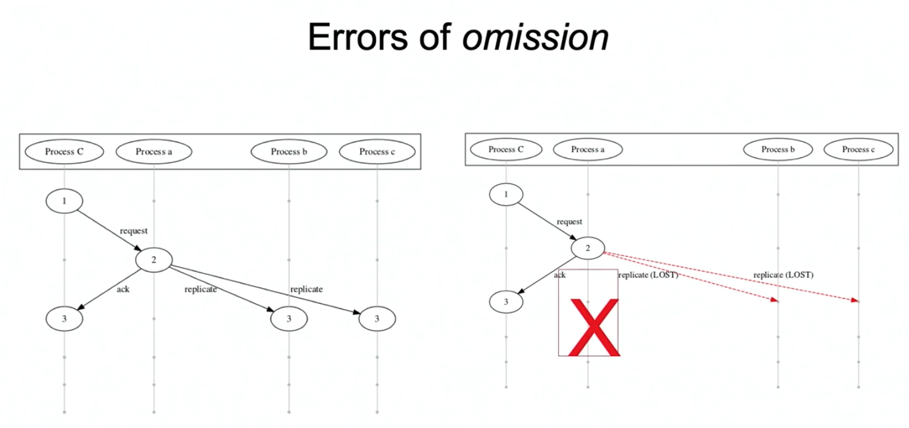

# Fixed It For You:Protocol Repair Using Lineage Graphs

I want to briefly talk about the difference between our work and diff provenance. Diff prov only works with a certain class of bug, which we usually call an error of commission. This is a type of bug where there is an offending line of code to point to. However, it's not always going to be the case. Some errors we have in our program, especially distributed programs, are errors of omission. The code is buggy simply because we haven't sufficiently developed our program to tolerate the things that will occur in the running environment. 

For example, in primary backup replication, instead of synchronously replicate update to all backups, the master acknowledge the client immediately and asynchronously replicate the update. Thus, if the all messages to the replicas are dropped and the master crashed, the data is lost despite the fact that the client got an promise of durability.



