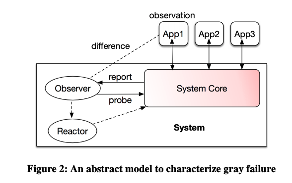

# Gray Failure: The Achilles’ Heel of Cloud-Scale Systems

### TL;DR:

This paper proposes a definition for ****[**gray failures**](https://www.hpl.hp.com/techreports/tandem/TR-85.7.pdf) ****and argues that a key feature of such failures is **differential observability:** instances of gray failure possess is that they are perceived differently by different entities. 

### Gray Failures

The authors define gray failure using the model depicted in the above figure. The system provides a service and multiple apps use the system. Within a system, an observer\(e.g., a failure detector\) actively or passively gathers information about whether the system is failing or not and a reactor takes action based on the observations. 

#### Differential Observability

> _**Thus, a system is defined to experience gray failure when at least one app makes the observation that system is unhealthy, but observer observes that system is healthy**._

As a result, gray failures naturally are under the radar of failure detectors. Note that gray failure is not unique to large-scale systems. Small-scale or even single node system can also experience gray failures.

#### Temporal Evolution

Gray failure tends to exhibit an interesting evolution pattern along the temporal dimension: initially, the system experiences minor faults \(latent failure\) that it tends to suppress. Gradually, the system transits into a degraded mode \(gray failure\) that is externally visible but which the observer does not see. Eventually, the degradation may reach a point that takes the system down \(complete failure\), at which point the observer also realizes the problem. A typical example is a memory leak.

#### Directions to address gray failures

A natural solution to gray failure is to close the observation gaps between the system and the apps that it services. One feasible approach is for a system to measure metrics that approximate the observations of its apps. For example, to tackle the network gray failure example \(§2.1\), the cloud system can send probes to measure server-to-server latency and reachability to emulate observations of the network by common applications.

Another promising direction is to leverage the power of scale. In particular, since gray failure is often due to isolated observations of an observer, leveraging the observations from a large number of different components that are complementary to each other can help uncover gray failure rapidly. 

