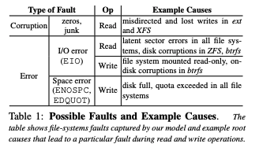

# Redundancy Does Not Imply Fault Tolerance

### Does Redundancy imply Fault Tolerance?

In our distributed system class, our instructor, Peter Alvaro, usually say that redundancy enables fault tolerant system. Redundancy in time\(e.g. retries\) protects our system from delayed or dropped packets, whereas redundancy in space\(e.g. replication\) can mask failures such as system crashes, power failures, and bad disks. However, is redundancy all we need to provide fault tolerance? This paper tries to answer this question by discussing a particular class of fault - **File-system fault.** 

### File-system faults

There are two common problems that may arise for file systems: 

* **Block Errors**, where certain blocks are inaccessible\(also called latent sector errors\)
* **Block corruptions\***, where certain blocks do not contain the expected data

\*File system can receive corrupted data due to a misdirected or a lost write caused by bugs in drive firmware or if the in-disk Error Correcting Code\(ECC\) does not detect a bit rot. The default Linux file system, ext4, simply returns errors or corrupted data to applications when underlying block is not accessible or is corrupted. In a few other cases, the file system\(e.g. btrfs and ZFS\) transform an underlying corruption into an error. 

Given that local file systems can return corrupted data or errors, the responsibility of data integrity and proper error handling falls to applications. 

### Testing Distributed System

We only consider injecting exactly a single faults to a single file-system block in a single node at a time, and we injects faults only into application-level on-disk structures and not files-system metadata. 

The following are the expected behaviors we test for: 

*  Committed data should not be lost 
* Queries should not silently return corrupted data 
* Cluster should be available for reads and writes 
* Queries should not fail after retries

### Observations Across Systems

The paper studied a variety type of systems, including key-value stores \(e.g., Redis\), configuration stores \(e.g., ZooKeeper\), document stores \(e.g., MongoDB\), column stores \(e.g., Cassandra\), messaging queues \(e.g., Kafka\), and databases \(e.g., RethinkDB\).

**\#1: System employ diverse data integrity strategies.**

On one end of the spectrum, there are systems that try to protect against data corruption in the storage stack by using checksums \(e.g., ZooKeeper, MongoDB, CockroachDB\) while the other end of spectrum includes systems that completely trust and rely upon the lower layers in the storage stack to handle data integrity problems \(e.g., RethinkDB and Redis\). Despite employing numerous data integrity strategies, all systems exhibit undesired behaviors.

**\#2:** **Local Behavior: Faults are often undetected; even if detected, crashing is the most common local reaction.**

Local behavior refers to how a node locally react to an injected fault. Based on the experiment, they found that faults are often locally undetected. Even if they are detected, crashing is the most common local reaction to faults. 

**\#3: Redundancy is underutilized: A single fault can have disastrous cluster-wide effects**

The global effect of a fault is the result that is externally visible. For example, in Redis, all of user data can become inaccessible when metadata in the appendonly file is faulty or when there are read and write errors in appendonly file data.

**\#4: Crash and corruption handling are entangled.** 

We find that detection and recovery code of many systems often inadvertently try to detect and fix two fundamentally distinct problems: crashes and data corruption. In most cases, on detecting a checksum mismatch due to corruption, all systems invariably run the crash recovery code. 

### Lesson learned 

1. We should not expect the underlying storage stack layers to reliably store data. 
2. The recovery codes in distributed systems are often not rigorously tested, contributing to undesirable behaviors.
3. We must carefully design our system such that corrupted or inaccessible parts of data can be identified.

