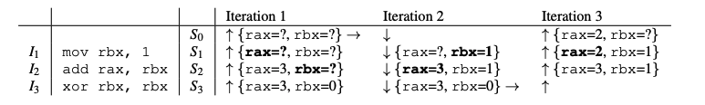
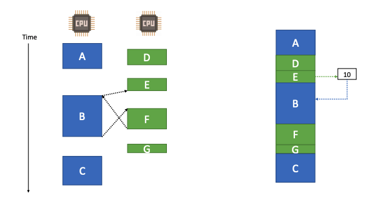

# REPT: Reverse Debugging of Failures in Deployed Software

### Motivation:

Debugging failures is a long-standing problem. Existing works can be roughly divided into two categories:

* **Automatic root cause diagnosis**: It attempts to automatically determine the culprit statements that cause a program to fail. However, due to various limitations \(e.g., requiring code modification, inability to handle complex software efficiently  or being limited to a subset of failures\), none of these systems are deployed in practice.
* **Failure reproduction**: Exhaustive testing techniques such as symbolic execution, model checking, or state-space exploration can be used to determine inputs and state that lead to a failure for the purpose of debugging, but they suffer from the state-explosion problem. Record/replay systems record the program executions that can later be replayed to debug\(a.k.a reverse debugging or time-travel debugging\). However, they incur prohibitive overhead. 

> To be practical, the solution must \(1\) impose a very low runtime performance overhead when running on a deployed system, \(2\) should be able to recover the execution history accurately and efficiently, \(3\) work with unmodified source code/binary, \(4\) apply to broad classes of bugs \(e.g., concurrency bugs\).

### Problem Statement:

Given a core dump and all its preceding instructions, how do we recover the program state at each point in the history? \(Note that there is no existing hardware support for efficiently logging all data values of a program's execution. However, with Intel PT or ARM Embedded Trace Macrocell, we can efficiently log the control flow and timing information\) 

### Summary:

To enable reverse debugging, REPT faces three challenges when recovering register and memory values in the execution history.

* How to handle irreversible instructions\(e.g. xor rax, rax\)?
* How to handle memory writes to unknown addresses?
* How to correctly identify the order of shared memory access?

First, let's look at how REPT recovers irreversible instructions without any memory access. REPT iteratively performs both _forward analysis_ and _backward analysis._  As long as the destroyed value is derived from some other registers and memory locations, and their values are available, we can use these values to recover the destroyed value.

```text
Intialization: Mark all register values as unknown in program states from S0 to Sn-1 

while fixed point is not reached:
    Do backward recovery from Sn-1 to S0
    Do forward recovery from S0 to Sn-1
```

Note: 1. we are given the state of $$S_{n} $$ 2. Fixed point means no state is updated in a backward and forward analysis\(recovery\) 3. REPT maintains a data inference graph\(3.3.1\) when performing backward and forward analysis.



REPT uses _error correction_ to solve the irreversible instructions with memory access. The intuition behind REPT is to keep using the memory values that are possibly valid to infer other values, and to correct the values later if the values turn out to be invalid based on conflicts. Please refer to the paper about how it works, and I will only put the example here. 

![We skip the fourth iteration which will recover \[g\]&apos;s value to be 2](../../.gitbook/assets/screen-shot-2019-10-02-at-3.05.00-am.png)

```text
(Since I don't know x86)

lea rbx, [g] # load the effective address of global variable g to register rax(LEA loads a pointer to the item you're addressing) 
mov rax, 1 # Set rax = 1
add rax, [rbx] # Add g to rax ([rbx] means the memory contents at address rbx)
mov [rbx], rax # write the result back to the gobal variable g stored in memory
xor rbx, rbx # clear rbx
```

In the first iteration of the backward analysis, since we do not know rbx’s value in $$S_{4}$$ , we do not change the value at the address g. In the second iteration of the forward analysis, there is a conflict for rax in $$S_{3}$$. The original value is 3, but the newly inferred value would be 4 \(rax+\[g\] =  1+3 = 4\). Our analysis keeps the original value of 3 because it was inferred from the final program state which we assume is correct. In the third iteration of the backward analysis, based on rax’s value before and after the instruction $$I_{3} $$ , we can recover \[g\]’s value to be 2.

Please read the paper on how REPT handle multiple instruction sequences executed simultaneously on multiple cores. The high-level ideas are: 1. we can leverage the timing information logged by hardware tracing to construct a partial order of instructions executed in different threads. and 2. memory writes are the only operations whose orders may affect data recovery. 



REPT first divides them into subsequences, then merges them into a single conceptual instruction sequence based on the inferred orders. For two subsequences whose order cannot be inferred, REPT arbitrarily inserts one before the other in the newly constructed sequence. Since we cannot tell the order of concurrent instruction subsequences, our goal is to eliminate the impact of their ambiguous order on data recovery. 

### Comments:

I liked the paper overall. It shows how we can take advantage of the new intel PT processor, which is very powerful. I also appreciate the design choice they made: they chose to only rely on the data in a memory dump rather than logging more data during execution and to do the analysis at binary level instead of at the source code level. 

