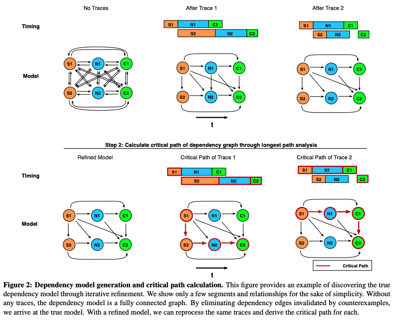
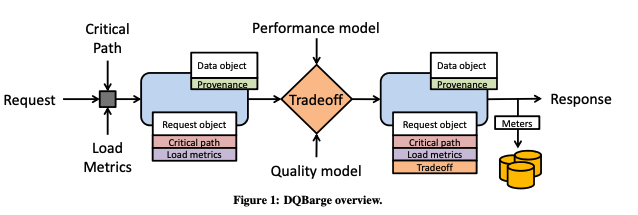

# The Mystery Machine: End-to-end Performance Analysis of Large-scale Internet Services

_The Mystery Machine_ is a performance analysis tool for measuring and uncovering performance insights about complex, heterogeneous distributed systems. The key insight is that the large amount of requests handled by modern services allows us to gather observations of the order in which messages are logged over a tremendous number of requests. Thus, we can leverage these logs/traces to generate a causal model of system behavior without the need to add substantial new instrumentation or manually generate a schema of application behavior.

Given a large corpus of logs, _The Mystery Machine_ uses iterative refinement to infer causal relationships. It first generates all possible hypotheses for casual relationships among segments\(tasks\). Then, it iterates through the traces and rejects a hypothesis if it finds a counterexample in any trace, based on happens-before, mutual exclusion, and pipeline. The nice thing about _The Mystery Machine_ is that it discovers __causal relationships/dependencies between segments automatically, which is critical for services that evolve quickly and constantly.

Once a causal model of segments is generated, we can perform several types of performance analysis. 

* Critical path analysis - how individual components of a parallel execution impact end-to-end latency
* Slack\* analysis - useful for determining where to focus optimization effort. For example, we can prioritize service that has no slack
* Anomaly analysis/detection 

\*Slack is defined as the amount by which the duration of a segment may increase without increasing the end-to-end latency. By definition, segments on the critical path have no slack. 

\*\*\*\*[**DQBarge: Improving Data-Quality Tradeoffs in Large-Scale Internet Services**](https://www.usenix.org/conference/osdi16/technical-sessions/presentation/chow) - Chow et al., OSDI' 16

DQBarge is a follow-up work of _The Mystery Machine_ and allows components to make data-quality trade-offs. For each production request, DQBarge passes extra data\(load metrics, critical path, etc.\) along the casual path of request processing. It predicts the critical path for each request and which software components will have substantial slack in processing time. At each potential tradeoff site, services query DQBarge to determine which tradeoffs to make. 

