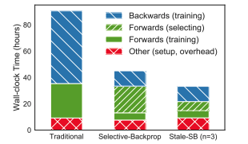
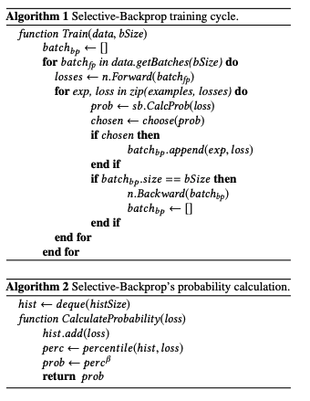
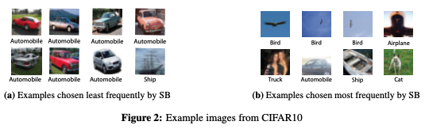
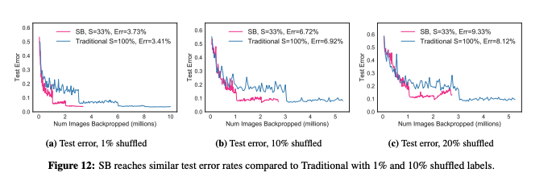

# Accelerating Deep Learning via Importance Sampling

### **Motivation**

This work bases on the author's observation that not all examples are equally useful; many of them are properly handled after a few epochs of training. The authors show that examples with low loss correspond to gradients with small norm and thus contributed little to the gradient update. 

### Selective-Backprop\(SB\)

In a nutshell, importance sampling aims at increasing the convergence speed of SGD by focusing computation on samples that actually induce a change in the model parameters. Selective-Backprop is a simple and effective sampling technique for prioritizing high-loss training examples throughout the training. 

**The algorithm:**

In each epoch, Selective-Backprop does a forward pass in the standard fashion. However, for each example i, after computing a forward pass to obtain its loss, Selective-Backprop then decides whether to include the example for a gradient update by selecting it with probability  $$P(L ) $$ that is a function of the current loss. Note that this is a probabilistic algorithm, as in Algorithm 2. \(hist is the history of recent losses\).

The authors discuss another possible optimization in the paper: after reducing backward passes with SB, the largest remaining fraction of training time is the full complement of forward passes used to selection the SB batches. Thus, it's possible to execute selection passes every n epoch, allowing some staleneses.

The paper also presents some nice experimental results. For example, the above images are examples that were chosen most/least frequent by SB. It's obvious that the images on the left are easier to classify compared to the images on the right.

However, there is one potential drawback for this algorithm: **mislabeled images will impact accuracy.** Mislabeled examples will result in higher losses and they are always going to be picked by SB, which may possibly degrade our test performance. In fact, the authors realize this and provide us with some sensitivity analysis:

With 1% or 10% mislabeled examples, SB still reaches similar test error rates while giving us a considerable performance boost. However, SB is worse than the traditional approach on 20% mislabeled datasets. Since the retain rate of SB is 33%, and there are 20% mislabeled data, most examples we pick will be incorrectly labeled. Thus, our model will start to overfit mislabeled examples.

