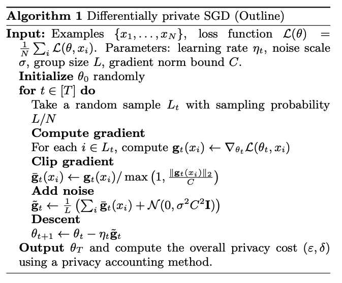

# Deep Learning with Differential Privacy

### Summary

This paper proposes a new algorithm which allows us to train a deep neural network under a modest privacy budget. It offers protection against a strong adversary with full knowledge of the training mechanism and access to the model's parameters.

### Differential Privacy

Note that:

* We say that two of sets are adjacent if they differ in a single entry, that is, if one image-label pair is present in one set and absent in the other. 
* $$e^\epsilon $$ is the [exponential function](https://en.wikipedia.org/wiki/Exponential_function) applied to the parameter $$\epsilon > 0 $$ . If $$\epsilon $$ is very close to 0, then $$e^\epsilon $$is very close to 1, so the probabilities are very similar. The bigger$$\epsilon $$is, the more the probabilities can differ.
* This paper uses the variant, which allows for the possibility that plain $$\epsilon$$-differential privacy is broken with probability $$\delta$$.

### The Algorithm

The algorithm is very similar to the traditional SGD algorithm with few exceptions:

1. To guarantee our model is differentially private, we need to bound the influence of each individual example on our model. Thus, , we clip each gradient in l2 norm.
2. The algorithm adds noise at lot-level. Lots are similar to a batches, but, to limit the memory consumption, we may set the batch size much smaller than the lot size. We perform the computation in batches, then group several batches into a lot for adding noise.
3. The algorithm computes the overall privacy cost of the train. 

