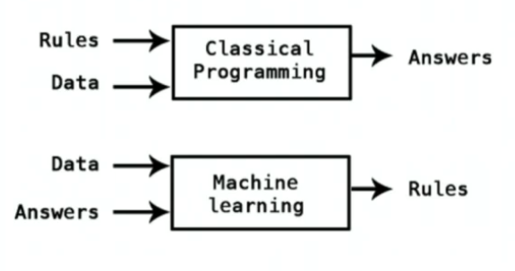
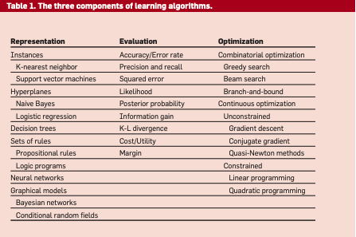
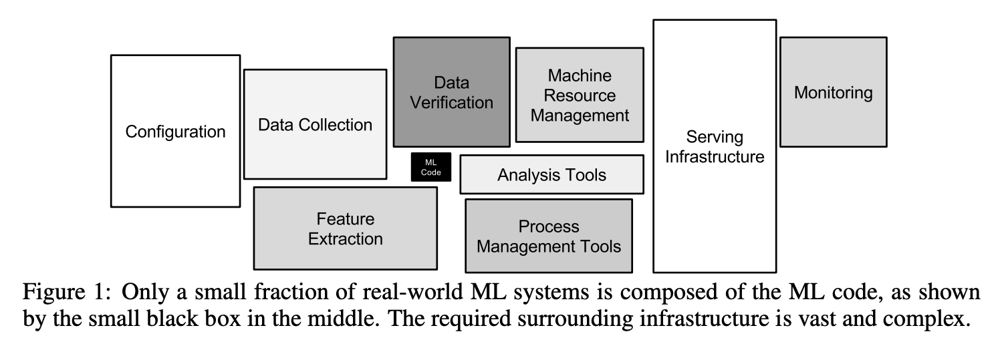

# A Few Useful Things to Know About Machine Learning

### Learning = Representation + Evaluation + Optimization

To choose from thousands of learning algorithm, we need to realize that they consist of three components:

* **Representation**: It is basically the space of allowed models \(the _hypothesis space_\). 
* **Evaluation**: \(A.k.a Objective function or scoring function\) It is used to distinguish good classifier from bad ones. 
* **Optimization**: It is a method to search among the classifiers in the language for the highest-scoring one. Worded differently, optimization is how you search the space of represented models to obtain better evaluations.

### Generalization

The fundamental goal of machine learning is to generalize beyond the examples in the training set. The most common mistake among machine learning is to test the training data and have the illusion of success. Even if you keep some of the data to yourself as test data, contamination of your classifier by test data can occur in insidious ways, for example, if you use test data to tune parameters and do a lot of tuning. Finally, To cope with the reduction in training data, we can use **cross validation**. 

### Overfitting

Overfitting refers to a model that models the training data too well. For example, when your learner outputs a classifier that is 100% accurate on the training data but only 50% accurate on the test data, it clearly has overfit. To better understand overfitting, we can decompose generalization error into **bias** and **variance**. 

* **Bias**: The simplifying assumptions made by a model to make the target function easier to learn. 

  * **Low Bias**: Suggests less assumptions about the form of the target function. 
  * **High-Bias**: Suggests more assumptions about the form of the target function

  For example, a linear learner has high bias, whereas decision trees is an example of low-bias machine learning algorithm.

* **Variance**:  The amount that the estimate of the target function will change if different training data was used. Machine learning algorithms that have a high variance are strongly influenced by the specifics of the training data.

  * **Low Variance**: Suggests small changes to the estimate of the target function with changes to the training dataset.
  * **High Variance**: Suggests large changes to the estimate of the target function with changes to the training dataset.

  For example, decision trees suffer from high variance: decision trees learned on different training sets generated by the same phenomenon are often very different, which in fact should be very similar.

The goal of any supervised machine learning algorithm is to achieve low bias and low variance. However, we need to keep in mind that increasing the bias will always decrease the variance. and increasing the variance will decrease the bias. For example, SVMs has low bias and high variance, but the trade-off can be changed by increasing the C parameter in front of the slack variable term that influences the number of violations of the margin allowed in the training data which increases the bias but decreases the variance.

The lesson here is that, contrary to intuition, a more powerful learner is not necessarily better than a less powerful one. In other words, strong false assumption\(e.g. the frontier is linear\) can be better than weak true ones, because a learner with the latter needs more data to avoid overfitting. 

Note: Contrary to intuition, there is no necessary connection between the number of parameters of a model and its tendency to overfit. 

#### How to cope with overfitting?

Besides the well-known cross validation approach, adding a **regularization term** to the evaluation function can also help. It can, for example, penalize classifiers with more structure. thereby favoring smaller ones with less room to overfit. Another option is to perform a **statistical significance test** like chi-square before adding new structure, to decide whether the distribution of the class really is different with and without this structure.

However, we should be cautious about a particular technique that "solve" the overfitting problem. It is easy to avoid overfitting \(variance\) by falling into the opposite error of underfitting \(bias\). Simultaneously avoiding both requires learning a perfect classifier, and short of knowing it in advance there is no single technique that will always do best \(no free lunch\). 

### Dimensions

Another big problem in machine learning is the "the curse of dimensionality". Many Ml algorithms work fin in low dimensions become intractable when the input is high-dimensional. Moreover, generalizing correctly becomes exponentially harder as the dimensionality \(number of features\) of the examples grows, because a fixed-size training set covers a dwindling fraction of the input space. 

The key takeaway is that: although we might think that gathering more features never hurts, since at worst they provide no new information about the class, but in fact their benefits may be outweighed by the curse of dimensionality. 

### Feature Engineering 

One of the most important factor in ML is the feature used. Often the raw data is not in a form that is amenable to learning, but you can construct features from it that are. It is surprisingly time-consuming to gather data, integrate it. clean it and preprocess it.  

Feature engineering is difficult because it is domain-specific, while learners can be largely general purpose. Although it is  possible to automate the feature engineering process, features that look irrelevant in isolation may be relevant in combination. 

### Data

> It’s not who has the best algorithm that wins. It’s who has the most data. - Andrew Ng

As a rule As a rule of thumb, a dumb algorithm with lots and lots of data beats a clever one with modest amounts of it.\[1\] However, it brings the problem of **scalability**. Even though in principle, more data means that more complex classifiers can be learned, in practice simpler classifiers wind up being used, because complex ones takes too long to learn. 

The takeaway is that it pays to try the simplest learner first\(e.g. naive Bayes\). Besides, learners can be divided into two major types: those whose representation has a fixed size, like linear classifiers, and those whose representation can grow with the data, like decision trees. Fixed-size learners can only take advantage of so much data. Variable size learners can in principle learn any function given sufficient data, but in practice they may not, because of limitations of the algorithm or computational cost. 

### Learn multiple models

If instead of selecting the best variation found, we combine many variations, the result are better and at little extra effort for the user. Such method is often called **model ensembles**.\(e.g. bagging\)

\[1\] However, this also brings up an interesting research direction\(e.g. parameter servers\). Since we can improve accuracy by using more data and larger model, we don't need to come up with new machine learning algorithm but, instead, we can try to build systems that can are capable of handling huge data and model size.

