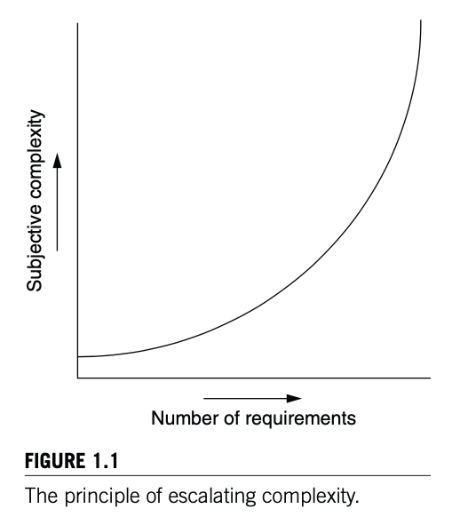
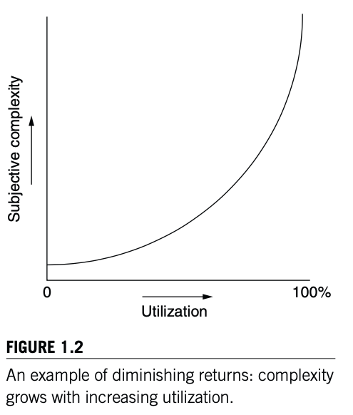
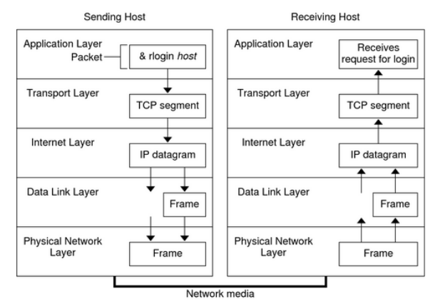

# Managing Complexity

Disclaimer: This summary is mostly paraphrased from chapter 1 of the book.

### What does complex mean?

If we look up the term, we find that complex means "difficult to understand". Lack of systematic understanding is the underlying feature of complexity. It follows that complexity is both a subjective and a relative concept. That is, one can argue that one system is more complex than another, but even though one can count up various things that seem to contribute to complexity, there is no unified measure. 

Rather than creating a definitive description for complexity, we can look for _signs_ that contribute to complexity, and if enough appear, argue that complexity is present: 

* **Large number of components**
* **Large number of interconnections**
* **Many irregularities**
* **A long description**
* **A team of designers, implementers, or maintainers**

\*The book gives a nice illustration by comparing a small-town library with a large university library.

### Common Problems of Systems

* **Emergent Properties**
  * Properties of a system that are not evident in the individual components of a system, but show up when combining those components.
  * Difficult to anticipate system behavior based on the behavior of the individual parts
* **Propagation of effects**
  * A small/local change can have effects that reach from one end of a system to the other
  * Difficult to reason about the effects of changes
* **Inter Commensurate scaling** 
  * As a system increases in size or speed, not all parts of it follow the same scaling rules, so things stop working.
  * For example, CPU speeds and memory bandwidth
* **Trade-offs**
  * We need to find the right balance of competing objectives or requirements
  * Waterbed effect: pushing down on a problem at one point causes another problem to pop up somewhere else. 
  * For example, Bias and Variance 

### Source of Complexity

**Cascading and interacting requirements**

A primary source of complexity is just the list of requirements for a system. Although each requirement seems small, the accumulation of many requirements adds not only their individual complexities but also complexities from their interactions. The underlying cause of this scenario is that the personal computer has been designed to meet many requirements: a well-organized file system, expandability of storage, ability to attach a variety of I/O devices, connection to a network, protection from malevolent persons and so on. Each of these requirements adds complexity of its own, and the interactions among them add still more complexity.

Meeting many requirements with a single design is sometimes expressed as a need for generality. Generality may be loosely defined as “applying to a variety of circumstances.” Unfortunately, generality contributes to complexity, so it comes with a trade-off, and the designer must use good judgment to decide how much of the generality is actually wanted.

> If it is good for everything, it is good for nothing.

There is a tension between exceptions and generality. Part of the art of designing a subsystem is to make its features general enough to minimize the number of exceptions that must be handled as special cases.

Even worse, the requirements may change over time. System designs that are successful usually remain in use for a long time, during which the environment of the system changes. For example, improvements in hardware technology may lead the system maintainers to want to upgrade to faster, cheaper, or more reliable equipment. Thus, the ground rules and assumptions that the original designers used to develop the system begin to lose their relevance. Propagation of effects can amplify the problems caused by change because more distant effects of a change may not be noticed until someone invokes some rarely used feature.

The crux of the problem is that as systems age, they tend to accumulate changes that make them more complex. The lifetime of a system is usually limited by the complexity that accumulates as it evolves farther and farther from its original design.

**Maintaining High Utilization**

One requirement by itself is frequently a specific source of complexity. It starts with a desire for high performance or high efficiency. Whenever a scarce resource is involved, an effort arises to keep its utilization high.

> The more one improves some measure of goodness, the more effort the next improvement will require.
>
>                                                                                                    -- The law of diminishing returns

The more completely one tries to use a scarce resource, the greater the complexity of the strategies for use, allocation, and distribution. 

### Coping with complexity

* **Modularity**: Dividing the system into smaller parts with well-defined boundaries

The simplest, most important tool for reducing complexity is the divide-and-conquer technique: analyze or design the system as a collection of interacting subsystems, called modules. The feature of modularity that we are taking advantage of here is that it is easy to replace an inferior module with an improved one, thus allowing incremental improvement of a system without completely rebuilding it.

* **Abstraction**

Abstraction is arguable the most powerful tool we have to deal with complexity. It enables any module to treat all the others entirely on the basis of their external specifications, without the need for knowledge about what goes on inside. 

> Be tolerant of inputs and strict on outputs.

This principle means that a module should be designed to be liberal in its interpretation of its input values, accepting them even if they are not within specified ranges if it is still apparent how to sensibly interpret them. On the other hand, the module should construct its outputs conservatively in accordance with its specification—if possible making them even more accurate or more constrained than the specification requires. The effect of the robustness principle is to tend to suppress, rather than propagate or even amplify, noise or errors that show up in the interfaces between modules. 

On the other hand, we consider "Leaky Abstractions" to be bad, because they usually require understanding design decisions of the underlying system.

* **Layering and Hierarchy**

Systems that are designed using good abstractions tend to minimize the number of interconnections among their component modules. One powerful way to reduce module interconnections is to employ a particular method of module organization known as _layering_. 

As a general rule, a module of a given layer interacts only with its peers in the same layer and with the modules of the next higher and next lower layers. The **TCP**/**IP** model gives us a good example that follows this principle.

The final major technique for coping with complexity also reduces interconnections among modules but in a different, specialized way. Start with a small group of modules, and assemble them into a stable, self-contained subsystem that has a well-defined interface. The result is a tree-like structure known as a _hierarchy_.

Hierarchy constrains a system of N components, which in the worst case might exhibit $$N \times (N - 1) $$  interactions, so that each component can interact only with members of its own subsystem, except for an interface component that also interacts with other members of the subsystem at the next higher level of hierarchy.\(For a program, it is usually called "application programming interface"\)

If there are no constraints, each module should in principle be prepared to interact with every other module of the system. The advantage of a hierarchy is that the module designer can focus just on interactions with the interfaces of other members of its immediate subsystem.

### Sometimes, Modularity, Abstraction, Layering and Hierarchy aren't Enough.

The problem is that all four of those techniques assume that the designer understands the system being designed. However, in the real-world, for example, it's hard to choose the right modularity from a sea of plausible alternative modularities. Thus, we need _**iteration**_ to save us. 

The essence of iteration is to start by building a simple, working system that meets only a modest subset of the requirements and then evolve that system in small steps to gradually encompass more and more of the full set of requirements. The idea is that small steps can help reduce the risk that complexity will overwhelm a system design.

> You won’t get it right the first time, so make it easy to change.

* **Take small steps**. The purpose is to allow discovery of both design mistakes and bad ideas quickly, so that they can be changed or removed with small effort and before other parts of the system in later iterations start to depend on them and they effectively become unchangeable.
* **Don’t rush:** Even though individual steps may be small, they must still be well planned. 
* **Plan for feedback:** Include as part of the design both feedback paths and positive incentives to provide feedback. 
* **Study failures:** An important goal is to learn from failures rather than assign blame for them. Moreover, don’t ignore unexplained behavior. If the feedback reports something that now seems not to be a problem or to have gone away, it is probably a sign that something is wrong rather than that the system magically fixed itself.

### Keep it Simple

Remarkably, one of the most effective techniques in coping with complexity is also one that is most difficult to apply: simplicity. Computer systems lack natural physical limits to curb their complexity, so the designer must impose limits; otherwise, the designer risks being overwhelmed. 

The bottom line is that a computer system designer’s most potent weapon against complexity is the ability to say, “No. This will make it too complicated.”

> Minimal Design: when in doubt throw it out.

Good systems are defined by what they leave out. 

Again, I'm just trying to write down some important points of this chapter. This is an extremely well-written textbook and I suggest everyone read it, especially the first chapter\).

