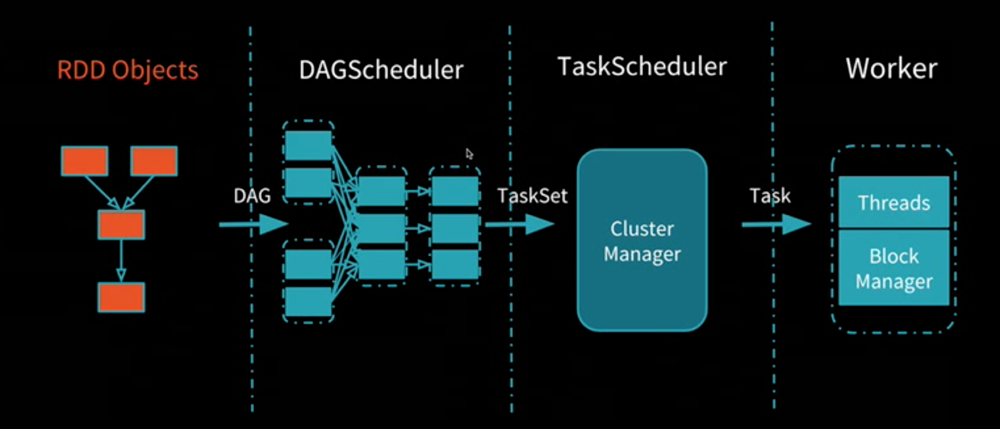
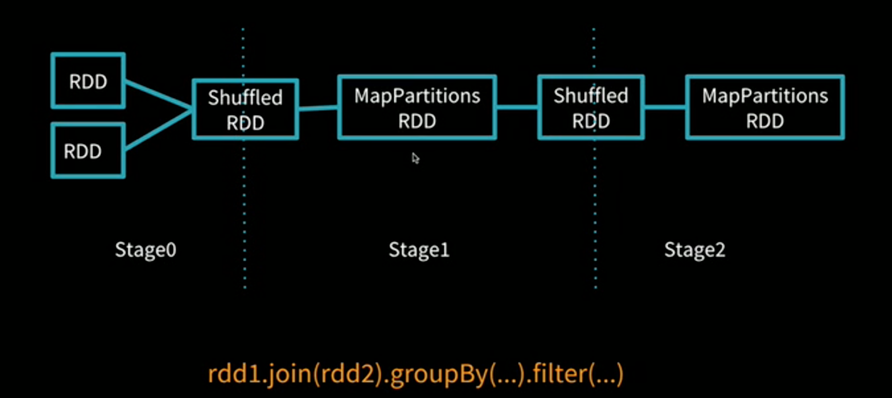
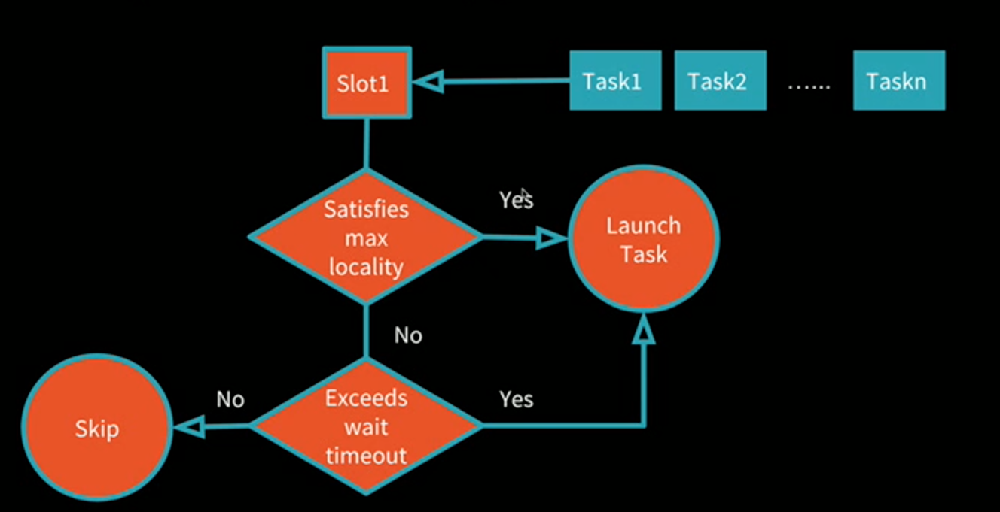

# Deep Dive into the Spark Scheduler

#### Disclaimer: Most of the content is based on Xingbo Jiang's [talk](https://databricks.com/session/apache-spark-scheduler) in Spark Summit 2018.

### Overview:



### RDD Objects:

In this phase, RDDs will be translated into stages. For example: 



### DAGScheduler:

* Implement stage-oriented scheduling
  * Compute a DAG of stages for submitted jobs
  * Keep track of materialized RDD/Stage outputs
  * Find a minimal schedule to run the job
* Stage -&gt; TaskSet
  * TaskSet is a set of tasks submitted to computing missing partitions of a particular stage
  * A stage can correspond to multiple TaskSets

### TaskScheduler:

* DAGScheduler submit set of tasks to TaskScheduler 
* Schedule and monitor tasks with SchedulerBackend. 
* Return events to DAGScheduler
  * JobSubmitted/JobCancelled
  * MapStageSubmitted/StageCancelled
  * CompletionEvent
* How to schedule tasks\(TaskSets\)?
  * Batch scheduling approach
    * Get all available slots
    * Schedule tasks with locality preference
  * [Barrier Scheduling Approach ](https://issues.apache.org/jira/browse/SPARK-24375)
    * Wait until all task in the same TaskSet can be scheduled at the same time
    * Retry all tasks in the TaskSet if any task fails
* How to schedule tasks in a TaskSet?
  * Try to achieve better locality for each task\(This locality-aware scheduling is implemented via [delay scheduling](https://cs.stanford.edu/~matei/papers/2010/eurosys_delay_scheduling.pdf)\)
    * Less data transfer over network
    * Higher performance
  * Locality can have different levels
    * Process Locality\(Cache/Memory\)
    * Node Locality\(Local Disk\)
    * Rack Locality\(Same Rack\)
* SchedulingBackend is responsible for resource management 



```text
// Delay Scheduling in Psedo-code
When a heartbeat is received from node n:
    if n has a free slot then:
        compute maxAllowedLocality for pending tasks
        if exists task t can launch on n with locality <= maxAllowedLocality:
            launch t
            update currentLocality
        else if waitTime > maxDelayTime:
            launch t
        else:
        // Wait for next round of scheduling 
    endif 
```

### Handling Failures:

* Task Failure
  * Record the failure count of the task
  * Retry the task if failure count &lt; maxTaskFailures
  * Abort the stage and corresponding  jobs if count &gt;= maxTaskFailures
* Fetch Failure
  * Don't count the failure into task failure count
  * Retry the stage if stage failure &lt; maxStageFailures
  * Abort the stage and corresponding jobs if stage failure &lt;= maxStageFailures
  * Mark executor/host as lost\(optional\)

### Worker

* A container for executors 
* Executors provide
  * Threads to run Tasks 
  * BlockManager to store/serve blocks


