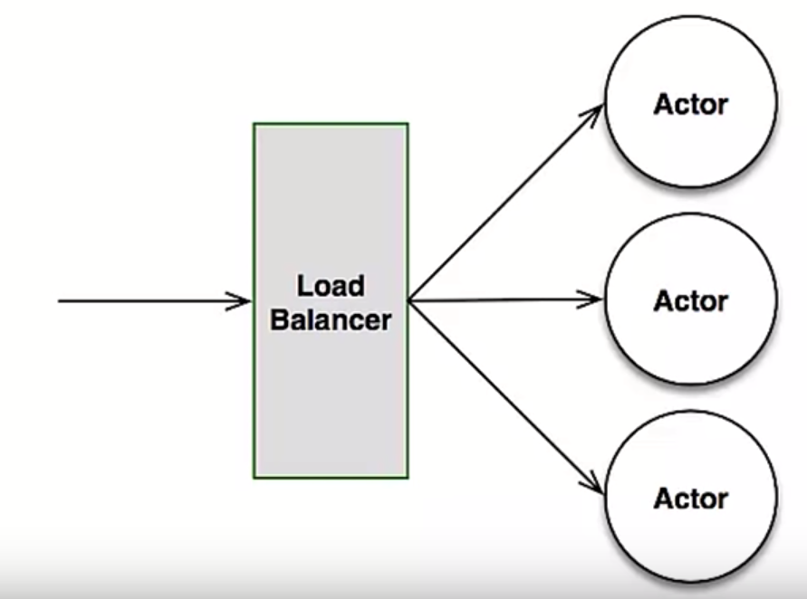

# The Actor Model

This post is primarily a summarization of a [talk](https://www.youtube.com/watch?v=lPTqcecwkJg&list=WL&index=3&t=34s) given by John Murray. You may not get anything out of it that you wouldn’t get out of the talk, but I think it could be helpful when you want to refer to a particular concept. In addition, for my own benefit, writing about them helps solidify it in my head.

### What is the actor model?

The actor model is a conceptual model to deal with concurrent computation. It defines some general rules for how the system’s components should behave and interact with each other.

**Properties of actor:**

* Unlike thread, which no longer exists when it finishes, actors are **persistent**. 
* Unlike goroutine/threads/future, which are **stateless**, actors encapsulate internal state. 
* Actors are **asynchronous**

**What can actors do?**

* Create new actors - similar to the main thread creates other threads.
* Receive messages and in response:
  * make local decisions\(e.g. alter local state\)
  * perform arbitrary, side-effecting action\(e.g. writing to a database, a log file or anything that change the global state of your application.\)
  * send messages to other actors
  * respond to the sender zero or more times. Whereas, in procedural programming paradigm, if you call a function, the function either returns nothing or returns exactly one thing back.
* Process exactly one message at a time. \(The messages are stored in actors' mailboxes until they're processed.\)

> Actors do not communicate by sharing memory; instead, share memory by communicating.

**Example - Checking account:**

Suppose if the current balance of a shared account between Alice and Bob is $80 and we want to make sure that the balance is non-negative at any time. Alice wants to withdraw $60 and Bob wants to withdraw $50.   

Approach \#1: 

```go
struct Checking {
    balance int
}

if( Checking.balance > withDrawAmt) {
    Checking.balance -= withdrawAmt;
    return true;
} else {
    return false;
}
```

However, it's easy to create a situation that violates the invariants - If Alice and Bob submit their request at the same time, it's likely that the interleaving execution will lead to negative balance.

Approach \#2 - Using locks:

```go
struct Checking {
    balance int
    lock Mutex
}

Checking.lock.Lock();
success = false; 
if( Checking.balance > withdrawAmt) {
    Checking.balance -= withdrawAmt;
    success = true;
} else {
    success = false;
}
Checking.lock.Free();
return success;
```

Introducing mutex will solve the problem for us : only one person will be updating at any time. While it is correct, in real world, using locks are often expensive and complicated. You need to make sure that the order is correct and there can be deadlock situations. 

In general, while locks seem to be the natural remedy to uphold the invariants with multiple threads, in practice they are inefficient and easily lead to deadlocks in any application of real-world scale. Even worse, distributed locks, while exists, offer limited potential for scaling out.

Approach \#3 - Using actors:

```scala
Actor Checking {
    var balance = 80
    
    // Looking for incoming messages 
    def receive = {
        case Withdraw(amt) =>
            if( balance > amt) {
                balance -= amt
                // Instead of return, we send a message to the sender
                sender sendMsg true
            } else {
                sender sendMsg false
            }
        }
}
```

If we make two requests:

```scala
// send message to withdraw 60 dollars
Checking sendMsg Withdraw(50)

// send message to withdraw 80 dollars
Checking sendMsg Withdraw(50)
```


Two requests are stored in the mailbox, and the rule of only processing one message at a time will make sure that only one request goes through and the other person will receive a "false" message. Modifying the internal state of the checking actor is only possible via messages, which are processed one at a time eliminating races when trying to keep invariants. Even better, the senders are not blocked as they do when using locks - Millions of actors can be efficiently scheduled on a dozen of threads reaching the full potential of modern CPUs

**Properties of communication:**

* No channels or intermediates\(e.g. CSP\)
* "Best effort" delivery\(i.e. no matter what your underlying protocol is, on the actor's perspective, there are no time-outs/retries\)
* At-most-once delivery
* Message can take arbitrary long to be delivered. In actor model, there is no concept of 'time'\)
* No message ordering guarantees

### Address

Address identifies an actor. However, it may also represent a proxy/forwarder to an actor\(e.g. a load balancer\). The addresses contain location\(e.g. IP addresses\) and transportation information\(e.g. TCP/UDP\). They give us the notion of location transparency. As a programmer, we don't need to care about where the actor lives, as long as we can send message to it. In other words, we can have actors in the same process, or different machines, but how you communicate are completely the same across all of them.




### Handling failure

The running state of an actor is monitored and managed by another actor, which is called the **supervisor**.

Properties of supervision:

* Constantly monitors running state of an actor
* Performs actions based on the state of the actor\(e.g. restart the actor\)

But, who supervise the supervisor? In the actor model, there will be a supervision tree. Similar to a organizational structure within a company, the managers manage their direct reports and they are managed by their managers. At the top, there will be a oracle provided by the framework\(e.g. the [root guardian](https://doc.akka.io/docs/akka/current/general/supervision.html#supervision-and-monitoring) in akka\). It never dies and has some default behaviors about how to handle exceptions and errors.

### Transparent life-cycle management

* Address do not change during restart
* Mailboxes\(Queues\) are persistent outside the actor instance


### When to use actors?

1. Processing pipeline
2. Streaming data
3. multi-user concurrency
4. System with high up-time requirement
5. Applications with shared state

### When not to use actors?

1. Non-concurrent systems
2. Performance critical applications

Note: It's important to keep in mind that, actors are just an abstraction. They exist on top of processes and threads. If you need fine-control over the running threads\(e.g. interrupts\), they you want to use something else. 

### Drawbacks:

* "Too much actors"
* Testing
* Debugging

### Next steps:

* [Don't use Actors for concurrency](https://www.chrisstucchio.com/blog/2013/actors_vs_futures.html)
* [Indexing in an Actor-Oriented Database](http://cidrdb.org/cidr2017/papers/p29-bernstein-cidr17.pdf) - Bernstein et al., 2017
* [Non-scalable locks are dangerous](https://people.csail.mit.edu/nickolai/papers/boyd-wickizer-locks.pdf) - Boyd-Wickizer et al., 2012
* [Anna: A KVS For Any Scale](http://db.cs.berkeley.edu/jmh/papers/anna_ieee18.pdf) - Wu et al., 2018

### 

