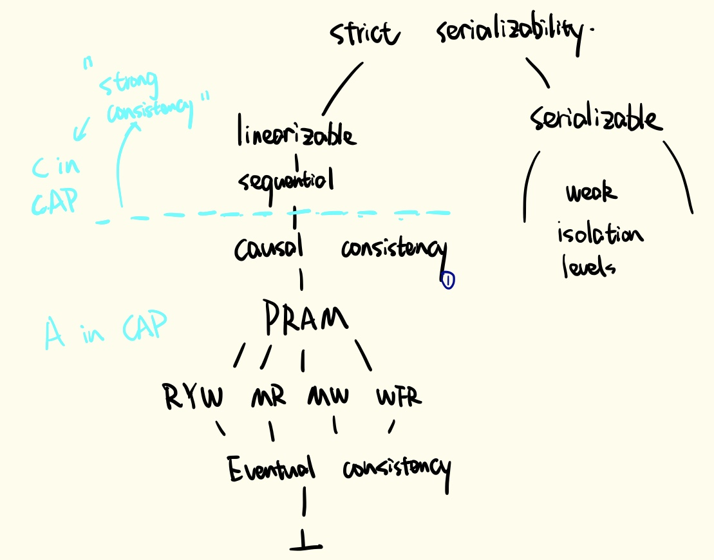

# Consistency Models in Distributed System

### Linearizability

Aka. Single operation, single object, and real-time order. It provides a real-time guarantee on the behavior of a set of single operations on a single object\(e.g. distributed register\). In plain English, under linearizability, writes should appear to be instantaneous. Imprecisely, once a write completes, all later reads \(where “later” is defined by wall-clock start time\) should return the value of that write or the value of a later write. Once a read returns a particular value, all later reads should return that value or the value of a later write.

Linearizability for read and write operations is synonymous with the term “atomic consistency” and is the “C,” or “consistency,” in Gilbert and Lynch’s [proof of the CAP Theorem](http://lpd.epfl.ch/sgilbert/pubs/BrewersConjecture-SigAct.pdf). We say linearizability is _composable_ \(or “local”\) because, if operations on each object in a system are linearizable, then all operations in the system are linearizable.

### Serializability

Aka. multi-operation, multi-object, arbitrary total order. _Serializability is a guarantee about transactions, or groups of one or more operations over one or more objects._ It guarantees that the execution of a set of transactions \(usually containing read and write operations\) over multiple items is equivalent to _some_ serial execution \(total ordering\) of the transactions.

Serializability is the traditional “I,” or isolation, in [ACID](http://sites.fas.harvard.edu/~cs265/papers/haerder-1983.pdf). If users’ transactions each preserve application correctness \(“C,” or consistency, in ACID\), a serializable execution also preserves correctness. Therefore, serializability is a mechanism for guaranteeing database correctness.[1](http://www.bailis.org/blog/linearizability-versus-serializability/#fn:mechanism)

Unlike linearizability, serializability does not—by itself—impose any real-time constraints on the ordering of transactions. Serializability is also not composable. Serializability does not imply any kind of deterministic order—it simply requires that _some_ equivalent serial execution exists.

### Strict Serializability

Combining serializability and linearizability yields _strict serializability_: transaction behavior is equivalent to some serial execution, and the serial order corresponds to real time. For example, say I begin and commit transaction T1, which writes to item _x_, and you later begin and commit transaction T2, which reads from _x_. A database providing strict serializability for these transactions will place T1 before T2 in the serial ordering, and T2 will read T1’s write. A database providing serializability \(but not strict serializability\) could order T2 before T1.

As [Herlihy and Wing](http://cs.brown.edu/~mph/HerlihyW90/p463-herlihy.pdf) note, “linearizability can be viewed as a special case of strict serializability where transactions are restricted to consist of a single operation applied to a single object.”

### Sequential Consistency

Sequential consistency is a strong safety property for concurrent systems. Informally, sequential consistency implies that operations appear to take place in some total order, and that that order is consistent with the order of operations on each individual process.

Lamport [defines](https://www.microsoft.com/en-us/research/uploads/prod/2016/12/How-to-Make-a-Multiprocessor-Computer-That-Correctly-Executes-Multiprocess-Programs.pdf) sequential consistency as: "...The result of any execution is the same as if the operations of all the processors were executed in some sequential order, and the operations of each individual processor appear in this sequence in the order specified by its program."

### Causal Consistency

It requires that value returned from the read at a replica is consistent with the order defined by      --&gt; \(happens before/causality\). i.e. it must appear that the operation that writes a value occurs after all operations which causally precede it. It is also the strongest achievable consistency model under "CAP".

### PRAM\(FIFO\) Consistency

All processes see memory writes from one process in the order they were issued from the process

### Session Guarantees

Session guarantees are a set of guarantees implied by strong consistency, but do not require strong consistency to obtain.

* **Read Your Writes**

If a read R follows a write W in a session and R is performed at server S at time t, then W is included in the state of S at time T. In other words, each user’s reads should reflect the client’s prior writes. It means that, for example, once I successfully post a Tweet, I’ll be able to read it after a page refresh. The SSP parameter server is also an example which provides this kind of guarantee.

* **Monotonic Reads**

The Monotonic Reads guarantee permits users to observe a database that is increasingly up-to-date over time. If a process performs read r1 ,then r2, r2 cannot observe a state prior to the writes which were reflected in r1. Intuitively, reads cannot go backwards.

* **Monotonic Writes**

If a process performs write w1, then w2, all processes observe w1 before w2. The Monotonic Writes guarantee says that Writes must follow previous Writes within the session. In other words, a Write is only incorporated into a server’s database copy if the copy includes all previous session Writes; the Write is ordered after the previous Writes.

* **Write Follow Reads - Respect Causality**

The Writes Follow Reads guarantee ensures that traditional Write/Read dependencies are preserved in the ordering of Writes at all servers. That is, in every copy of the database, Writes made during the session are ordered after any Writes whose effects were seen by previous Reads in the session.

### **Eventual Consistency**

Nothing :\(

### Note: 

#### Linearizability vs. Sequential consistency

They both care about giving an illusion of a single copy, whereas linearizability cares about time and sequential consistency cares about program order. With sequential consistency, the system has freedom as to how to interleave operations coming from differently clients. With linearizability, the interleaving across all clients is determined based on time. The only way someone can distinguish between two is if they can observe all inputs and timing going into system.

### Update:

You should read [this](https://jepsen.io/consistency).

### Reference





