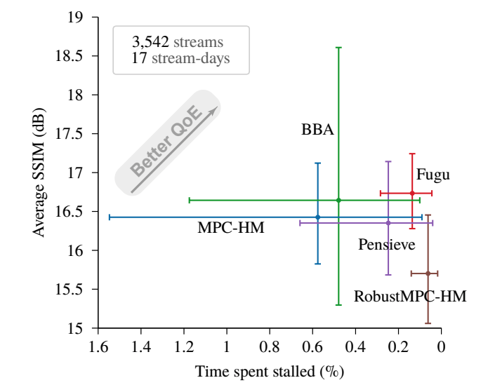
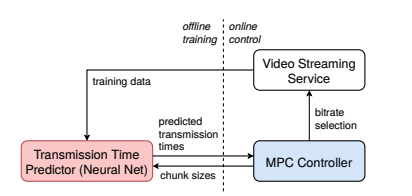

# Learning in situ: a randomized experiment in video streaming

### Background

#### Adaptive Video Streaming

In the basic adaptive video streaming problem, each video consists of multiple segments or “chunks” \(corresponding to a few seconds of playtime\), and each chunk is encoded at multiple discrete bitrates. The chunks from different bitrate streams are aligned so that the video player can switch to a different bitrate if necessary at a chunk boundary. 

The above figure shows an abstract model of an adaptive video player. The player uses some inputs \(e.g., buffer occupancy or estimates of the network throughput\) in its decision logic\(i.e., the **Adaptive Bitrate Selection\(ABR\)** algorithm\) to choose the bitrate level for the next chunks. In making this decision, there are many potentially conflict **Quality of Experience**\(QoE\) considerations a player must account for: 

1. Minimize rebuffering events where the playback buffer is empty and cannot render the video
2. Deliver as high a playback bitrate as possible within the throughput constraints
3. Keep the playback as smooth as possible by avoiding frequent or large bitrate jumps
4. Minimize startup delay so that the user does not quit while waiting for the video to load

To see why these objectives are conflicting, let's consider two extreme solutions. A trivial solution to minimize rebuffering and the startup delay would be to always pick the lowest bitrate, but it conflicts with the goal of delivering high bitrate. Conversely, picking the highest available bitrate may lead to many rebuffering events. Similarly, the goal of maintaining a smooth playback may also conflict if the optimal choice to simultaneously minimize rebuffering and maximizing average bitrate is to switch bitrates for every chunk.

#### Adaptive Bitrate Selection

Researchers have produced a literature of ABR schemes, including “rate-based” approaches that focus on matching the video bitrate to the network throughput\(e.g., [FESTIVE](https://conferences.sigcomm.org/co-next/2012/eproceedings/conext/p97.pdf)\), “buffer-based” algorithms that steer the duration of the playback buffer\(e.g., [BBA](http://yuba.stanford.edu/~nickm/papers/sigcomm2014-video.pdf)\), [control theoretic schemes](https://users.ece.cmu.edu/~vsekar/papers/sigcomm15_mpcdash.pdf) that try to maximize expected QoE over a receding horizon, given the upcoming chunk sizes and a prediction of the future throughput, and learning-based schemes\(e.g., [Pensieve](http://web.mit.edu/pensieve/content/pensieve-sigcomm17.pdf)\).

### Puffer

The authors implemented the existing approaches in their live TV streaming website, Puffer, where user sessions are randomized to different algorithms. The key takeaway of their findings are:

* **Confidence intervals in video streaming are bigger than expected.** The below figure is the result of running the algorithms on 17 days of video, and we can observe that the confidence interval is quite large. The authors argue that we need **2 years of video per scheme to reliably measure a 20% difference**\(but in the paper of existing works, they only use several days of data.\) The main reason is that the **Internet is way more noisy and heavy-tailed**. For example, of the 637,189 streams considered for the primary analysis across all five ABR schemes, only 4% of those streams had any stalls.

* **Sophisticated algorithms did not outperform simple buffer-based control.** [BBA](http://yuba.stanford.edu/~nickm/papers/sigcomm2014-video.pdf) is arguably the simplest algorithm among the existing work, but the experimental result shows that more-sophisticated algorithms do not necessarily beat this simple and old algorithm in production. One reason might be that the new algorithm was evaluated using throughput traces that may not have captured enough of the Internet's heavy tails and other dynamics. However, it is shown that retrain them on more-representative traces doesn't necessarily reverse this.  

###  Fugu

We describe Fugu, a data-driven ABR algorithm that combines several techniques. Fugu is based on MPC \(model predictive control\), a classical control policy, but replaces its throughput predictor with a deep neural network trained using supervised learning on data recorded **in situ** \(in place\), meaning from Fugu’s actual deployment environment, Puffer. In other words, Fugu does not replay throughput traces or require network simulators\(we don't know how to faithfully simulate the Internet!\)

### 

The predictor's input includes the sizes and transmission times of past chunks, size of a chunk to be transmitted and low-level TCP statistics\(min RTT, RTT, CWND, packets in flight, delivery rate\) and it will output the **probability distribution over transmission time**, allowing for better decision making compared with a single point estimate without uncertainty.

### Conclusion

> We conclude that robustly beating “simple” algorithms with machine learning may be surprisingly difficult, notwithstanding promising results in contained environments such as simulators and emulators.
>
> it is difficult to characterize the systematic uncertainty that comes from selecting a set of traces that may omit the variability or heavy-tailed nature of a real deployment experience \(both network behaviors as well as user behaviors, such as watch duration\).

