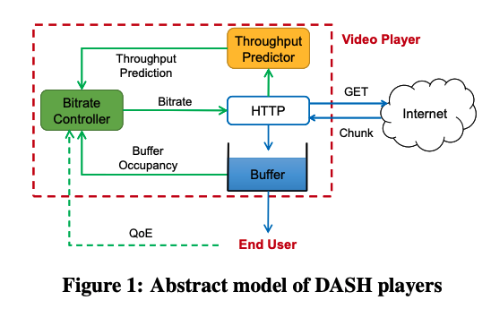

# Learning in situ: a randomized experiment in video streaming

### Background

#### Adaptive Video Streaming

In the basic adaptive video streaming problem, each video consists of multiple segments or “chunks” \(corresponding to a few seconds of play time\) and each chunk is encoded at multiple discrete bitrates. The chunks from different bitrate streams are aligned so that the video player can switch to a different bitrate if necessary at a chunk boundary. 

The above figure shows an abstract model of adaptive video player. The player uses some inputs \(e.g., buffer occupancy or estimates of the network throughput\) in its decision logic\(i.e., the **Adaptive Bitrate Selection\(ABR\)** algorithm\) to choose the bitrate level for the next chunks. In making this decision, there are many potentially conflict **Quality of Experience**\(QoE\) considerations a player must account for: 

1. Minimize rebuffering events where the playback buffer is empty and cannot render the video
2. Deliver as high a playback bitrate as possible within the throughput constraints
3. Keep the playback as smooth as possible by avoiding frequent or large bitrate jumps
4. Minimize startup delay so that the user does not quit while waiting for the video to load

To see why these objectives are conflicting, let us consider two extreme solutions. A trivial solution to minimize rebuffering and the startup delay would be to always pick the lowest bitrate, but it conflicts with the goal of delivering high bitrate. Conversely, picking the highest available bitrate may lead to many rebuffering events. Similarly, the goal of maintaining a smooth playback may also conflict if the optimal choice to simultaneously minimize rebuffering and maximizing average bitrate is to switch bitrates for every chunk.

#### Adaptive Bitrate Selection

Researchers have produced a literature of ABR schemes, including “rate-based” approaches that focus on matching the video bitrate to the network throughput\(e.g., [FESTIVE](https://conferences.sigcomm.org/co-next/2012/eproceedings/conext/p97.pdf)\), “buffer-based” algorithms that steer the duration of the playback buffer\(e.g., [BBA](http://yuba.stanford.edu/~nickm/papers/sigcomm2014-video.pdf)\), [control theoretic schemes](https://users.ece.cmu.edu/~vsekar/papers/sigcomm15_mpcdash.pdf) that try to maximize expected QoE over a receding horizon, given the upcoming chunk sizes and a prediction of the future throughput, and learning-based schemes\(e.g., Pensieve\).

[https://reproducingnetworkresearch.files.wordpress.com/2018/07/recreating\_pensieve.pdf](https://reproducingnetworkresearch.files.wordpress.com/2018/07/recreating_pensieve.pdf)  
[https://conferences.sigcomm.org/hotnets/2017/papers/hotnets17-final59.pdf](https://conferences.sigcomm.org/hotnets/2017/papers/hotnets17-final59.pdf)

Real-world Video Adaptation with Reinforcement Learning

