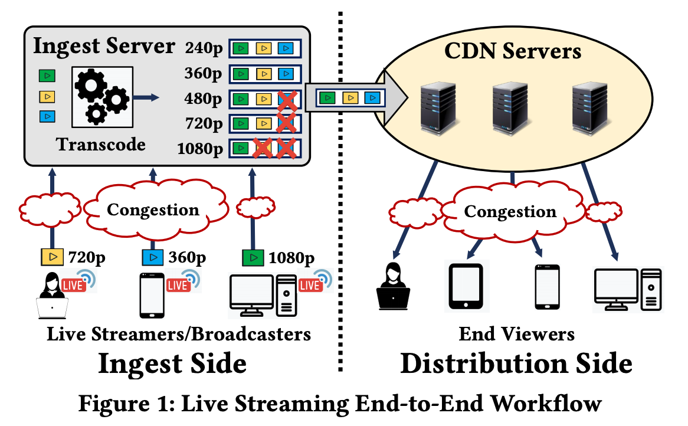
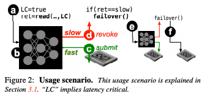
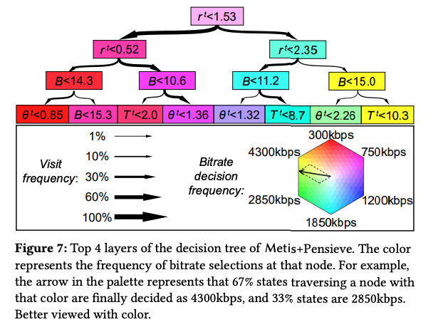

# Short Summaries

### [Neural Adaptive Content-aware Internet Video Delivery](https://www.usenix.org/system/files/osdi18-yeo.pdf) - Yeo et al., OSDI' 18

The key idea of this paper is to use **super-resolution**, a technique that uses DNN to recover a high-resolution image from lower resolution images, on top of ABR to enhance client-side video quality. It will train a DNN for each video offline, exploiting DNN's inherent overfitting property to guarantee reliable and superior performance. 

When a client requests a video from CDN server, the server provides the DNN corresponding to the video. The client then applies the DNN to the received low-quality video chunks by utilizing its own computing power. 

### \*\*\*\*[**Neural-Enhanced Live Streaming: Improving Live Video Ingest via Online Learning**](http://ina.kaist.ac.kr/~livenas/livenas_sigcomm2020.pdf) - Kim et al., SIGCOMM' 20

The key observation is that the stream quality is fundamentally constrained by the streamer's uplink bandwidth and its computational capacity. Extending the idea of the above paper, this paper presents **LiveNAS**, a neural-enhanced live video streaming system, which breaks the strong dependency between the quality of live video and the ingest client's bandwidth.

Since it focuses on live streaming applications, pre-trained networks are not possible. Instead, LiveNAS trains super-resolution DNNs via online learning. Besides the encoded video, the client transmits small patches of high-quality raw frames which will serve as ground truth for training. Note that even a fraction of ground truth labels can provide substantial training gains because of the video's temporal redundancy.

### \*\*\*\*[**LinnOS: Predictability on Unpredictable Flash Storage with a Light Neural Network**](https://www.usenix.org/system/files/osdi20-hao.pdf) - Hao et al, OSDI' 20

As SSD's internal complexity continues to grow, achieving highly predictable latency on modern flash devices is very challenging. This paper tries to use a simple neural network to learn the device behavior at per-I/O scale. 

The key characteristic/design decisions of LinnOS are 1\) it converts the hard latency inference problem into a simple binary inference\("fast" or "slow" speed\). and 2\) it makes binary inference on every incoming I/O with a light neural network in a black-box manner. 

Some details about the model:

* The model is a fully-connected neural network with only three layers. With several optimizations, it can achieve 4-6us inference speed
* The input to the model is the number of pending I/Os of that device +  the latency of N\(e.g., 4\) most-recently completed I/Os + the number of pending I/Os at the time when each of the R completed I/Os arrived
* To train the model, LinnOS uses the current live workload that the SSD is serving. Each traced I/Os is labeled as "fast" or "slow". 

### \*\*\*\*[**Interpreting Deep Learning-Based Networking Systems**](https://dl.acm.org/doi/10.1145/3387514.3405859) ****- Meng et al., SIGCOMM' 20

Deep learning-based networked systems \(e.g., [Pensieve](http://web.mit.edu/pensieve/) and [Decima](https://web.mit.edu/decima/content/sigcomm-2019.pdf)\). treat DNNs as black-boxes, which makes them hard to debug, deploy, and adjust. Metis is a framework that provides interpretability of these systems and the goal is to interpret DL-based networked systems with human-readable control policies. It adopts a decision tree conversion method for local systems\(i.e., systems that collect local information and make decisions for one instance only.\) and a hypergraph conversion method for global systems\(i.e., systems that aggregate information across the network and make global planning for multiple instances.\)

