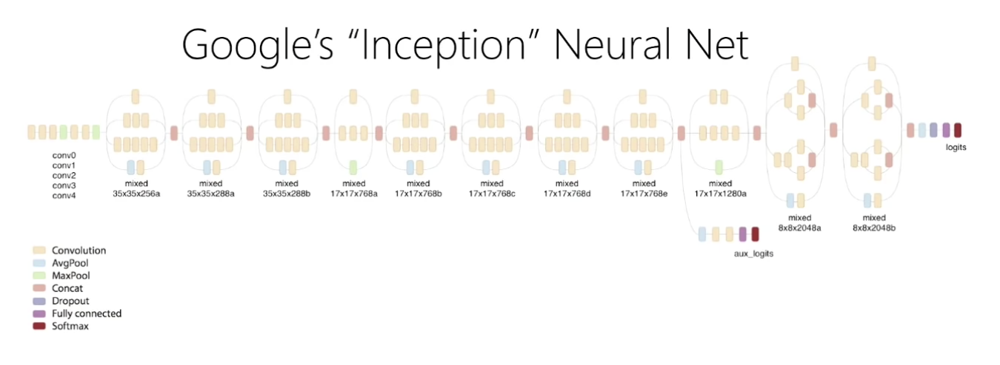

# A Berkeley View of Systems Challenges for AI

### TL;DR:

This paper identifies an agenda for systems research in AI in the next few years and showcase their research in AMP lab/RISE lab. The authors argue that "we need AI systems that make timely and safe decisions in unpredictable environments, that are robust against sophisticated adversaries, and that can process ever increasing amounts of data across organizations and individuals without compromising confidentiality" 

### Motivation:

There are three key factors behind AI's recent success. \(1\) massive amounts of data, \(2\) scalable computer and software systems, and \(3\) the broad accessibility of these technologies.\[1\]

### Trends and challenges:

The paper identifies four trends and challenges in the AI area:

**1\) Mission-critical AI**

Trend: AI is poised to drive more and more mission-critical applications where human well-being and lives are at stake. \(e.g. self-driving car and AI-powered intrusion-detection system\).

Challenge: Design AI systems that learn continually by interacting with a dynamic environment, while making decisions that are timely, robust, and secure.

**2\) Personalized AI**

Trend: user-specific decisions that take into account user behavior \(e.g., a virtual assistant learning a user’s accent\) and preferences \(e.g., a self-driving system learning the level of “aggressiveness” a user is comfortable with\) are increasingly the focus

Challenge: Design AI systems that enable personalized applications and services yet do not compromise users’ privacy and security.

**3\)AI across organization**

Trend: Companies are increasingly leveraging third-party data to augment their AI-powered services

Challenge: Design AI systems that can train on datasets owned by different organizations without compromising their confidentiality, and in the process provide AI capabilities that span the boundaries of potentially competing organization.

**4\)AI demands outpacing the Moore's Law**

Trend: Keeping up with the data being generated will become increasingly difficult, because 1\) data continues to grow exponentially 2\) rapidly improving hardware technology is coming to a grinding halt

Challenge: Develop domain-specific architectures and software systems to address the performance needs of future AI applications in the post-Moore’s Law era, including custom chips for AI workloads, edge-cloud systems to efficiently process data at the edge, and techniques for abstracting and sampling data.

### Research Opportunities:

To enable progress on these fronts, the paper then proposes nine research topics and divides them into three main research area. 

### Acting in dynamic environments:

### R1: Continual Learning

**Systems for Reinforcement Learning**: The central task of RL is to learn a function—a “policy”—that maps observations \(e.g., car’s camera inputs or user’s requested content\) to actions \(e.g., slowing down the car or presenting an ad\) in a sequence that maximizes long-term reward \(e.g., avoiding collisions or increasing sales\). 

Many existing RL applications, such as gameplaying, rely heavily on simulations, often requiring millions or even billions of simulations to explore the solution space and “solve” complex tasks. Despite Reinforcement Learning \(RL\)'s successes \(e.g. Atari games and AlphaGo\), RL has not seen wide scale real-world application. One of the reasons is that large-scale systems have not been built with these use cases in mind. The authors argue that coupling advances in RL algorithms with innovations in systems design will drive new RL applications.

**Simulated reality\(SR\):** Interaction with the environment is fundamental to RL's success. However, In real-world applications, direct interaction can be slow and/or hazardous\(e.g. risking irreversible physical damage\). Simulated Reality \(SR\) focuses on continually simulating the physical world with which the agent is interacting, enabling agents to simulate and predict the outcome of next action before actually taking it. SR enables an agent to learn not only much faster but also much more safely. However, existing softwares does not meet the requirement of very short runtime. 

_Research: \(1\) Build systems for RL that fully exploit parallelism, while allowing dynamic task graphs, providing millisecond-level latencies, and running on heterogeneous hardware under stringent deadlines. \(2\) Build systems that can faithfully simulate the real-world environment, as the environment changes continually and unexpectedly, and run faster than real time._

### **R2: Robust decisions**

The challenges on this front are: \(1\) robust learning in the presence of noisy and adversarial feedback, and \(2\) robust decision-making in the presence of unforeseen and adversarial inputs.

_Research: \(1\) Build €ne grained provenance support into AI systems to connect outcome changes \(e.g., reward or state\) to the data sources that caused these changes, and automatically learn causal, source-speci€c noise models. \(2\) Design API and language support for developing systems that maintain con€dence intervals for decisionmaking, and in particular can flag unforeseen inputs._

### R3: Explainable decisions

AI systems will often need to provide explanations for their decisions that are meaningful to humans. Explainable here means that one can identify the properties of the input to the AI algorithm that are responsible for the particular output, and can answer counterfactual or "what-if" questions. 

Looking at the image above, we might ask: how does each component or weights in each layer affect the classification process? Unfortunately, it is very difficult to answer these questions. In most cases, Machine Learning is inscrutable. The problem arises when you connect the inscrutable Machine Learning algorithm to real-life things. For example, machine learning is recently being used for risk assessment in the criminal justice system. However, the [result](https://www.propublica.org/article/machine-bias-risk-assessments-in-criminal-sentencing) shows that black defendants are incorrectly labeled as "high risk" at twice the rate of white defendants. Moreover, [facial recognition systems](https://www.nytimes.com/2018/02/09/technology/facial-recognition-race-artificial-intelligence.html) can guess the gender of white men with an error rate of 1%, but they have an error rate of 20% to 30% for darker-skinned women. Interestingly, the above result came from systems developed in Europe and America, but gender recognition systems developed in Asia do worse for white faces! Even worse, we don't know what causes these biases. 

_Research: Build AI systems that can support interactive diagnostic analysis, that faithfully replay past executions, and that can help to determine the features of the input that are responsible for a particular decision, possibly by replaying the decision task against past perturbed inputs. More generally, provide systems support for causal inference._

_**Related**:_ [_https://arxiv.org/pdf/1710.00794.pdf_](https://arxiv.org/pdf/1710.00794.pdf) _and_ [_James Mickens's Keynote Talk at Usenix Sec 18'_](https://www.youtube.com/watch?v=ajGX7odA87k&t=1564s)\_\_

### **Secure AI**

### **R4: Secure Enclaves**

Today, organizations run AI applications in the public cloud on a distributed set of servers they do not control, possibly shared with competitors, on a considerably more complex software stack, where the OS itself runs on top of a hypervisor or within a container. We need to make sure that our system do the right thing, even in the presence of malicious inputs.

_Research: Build AI systems that leverage secure enclaves to ensure data confidentiality, user privacy and decision integrity, possibly by splitting the AI system’s code between a minimal code base running within the enclave, and code running outside the enclave. Ensure the code inside the enclave does not leak information, or compromise decision integrity._

### **R5: Adversarial learning**

Two new types of attack emerge with the advent of ML algorithms: evasion attacks and data poisoning attacks. Evasion attacks happen at the inference stage, where an adversary attempts to craft data that is incorrectly classified by the learning system. Data poisoning attacks happen at the training stage, where an adversary injects poisoned data \(e.g., data with wrong labels\) into the training data set that cause the learning system to learn the wrong model, such that the adversary thereby has input data incorrectly classified by the learner.

_Research: Build AI systems that are robust against adversarial inputs both during training and prediction \(e.g., decision making\), possibly by designing new machine learning models and network architectures, leveraging provenance to track down fraudulent data sources, and replaying to redo decisions after eliminating the fraudulent sources._

### **R6: Shared learning on confidential data**

The authors expect more and more organizations to collect valuable data, more third-party data services to be available, and more benefit to be gained from learning over data from multiple organizations. Despite the large volume of theoretical research, there are few practical differential privacy systems in use today, and proposes to simplify differential privacy use for real-world applications.

_Research: Build AI systems that \(1\) can learn across multiple data sources without leaking information from a data source during training or serving, and \(2\) provide incentives to potentially competing organizations to share their data or models._ 

_Related work:_ [_Federated Learning_](https://xzhu0027.gitbook.io/blog/ml-system/towards-federated-learning-at-scale-system-design)\_\_

### AI-specific architecture

### R7: Domain specific hardware

Continuing to keep up with the data being generated will be increasingly challenging. While data continues to grow exponentially, the corresponding performance-cost-energy improvements are reaching the end-of-line. 1\) The transistor are not getting much smaller due to the ending of Moore's law 2\) Power is limiting what can be put on a chip due to the end of Dennard scaling 3\) Limits to parallelism due to Amdahl’s Law

The one path left to continue the improvements in performance-energy-cost of processors is developing domain-specific processors

_Research: \(1\) Design domain-specific hardware architectures to improve the performance and reduce power consumption of AI applications by orders of magnitude, or enhance the security of these applications. \(2\) Design AI software systems to take advantage of these domain-specific architectures, resource disaggregation architectures, and future non-volatile storage technologies._

### R8: Composable AI systems

Today's AI systems are monolithic, which makes them hard to develop, test, and evolve. The paper says modularity and composition will be key to increasing development speed and adoption of AI.

_Research: Design AI systems and APIs that allow the composition of models and actions in a modular and flexible manner, and develop rich libraries of models and options using these APIs to dramatically simplify the development of AI applications._

### R9: Cloud-edge systems

AI systems which are currently cloud only, are moving some of their functionality to edge devices to improve security, privacy, latency and safety.\(including the ability to cope with being disconnected from the internet.\) To address the wide heterogeneity of edge devices and the relative difficulty of upgrading the applications running on these devices, we need new software stacks that abstract away the heterogeneity of devices by exposing the hardware capabilities to the application through common APIs.

_Research: Design cloud-edge AI systems that \(1\) leverage the edge to reduce latency, improve safety and security, and implement intelligent data retention techniques, and \(2\) leverage the cloud to share data and models across edge devices, train sophisticated computation-intensive models, and take high quality decisions._

\[1\]  Many open-source big data software and wide availability of public cloud services 

