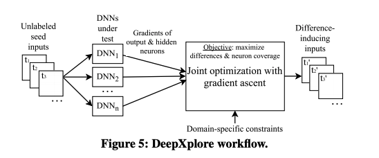

# DeepXplore: Automated Whitebox Testingof Deep Learning Systems

### Background and Motivation

Safety- and security-critical DL systems must be tested systematically to detect and fix ideally any potential flaws or undesired behaviors. Existing DNN testing techniques are not ideal because they require expensive human effort to provide correct labels and, more importantly, they achieve very low test coverage, which will leave different behaviors of DNNs unexplored. 

### Solution Overview 

The key ideas of DeepXplore are the concept of **neuron coverage** for measuring the parts of a DL system's logic exercised by a set of test inputs based on the number of neurons activated and **differential testing**, in which multiple models are used to identify erroneous corner cases without manual checks. 

DeepXplore takes unlabeled test input as seeds and generates new tests. While generating tests, DeepXplore tries to maximize both neuron coverage and the chances of tests that cause the DNN models to behave differently\(i.e., output different labels\). Both goals are necessary for thorough testing that exposes erroneous corner cases. 

DeepXplore solves the above joint optimization problem for neuron coverage and differential behavior maximization using gradient ascent.\(See the paper for the detailed algorithm\)

### Comments

One major limitation of DeepXplore, in my opinion, is its completeness. Although neuron coverage is clearly a better metric compared to code coverage or random testing, it is still far from complete verification of the model.

In particular, for traditional software testing, if we have an if statement\(e.g., if\( x &lt; 0\) ... else ...\), it's easy to generate tests that cover both branches. However, it's hard to use neuron coverage to generate all possible inputs. In addition, DeepXplore requires users to provide input seeds and make minor changes to the input seeds to get the difference- inducing inputs, but how to pick these input seeds? For an image classification model, if the input seeds do not contain any cat images, how to find bugs that can only be caused by cat images? 

On the other hand, the paper only discussed DNN on image recognition tasks. Is it also applicable to other applications?\(e.g., NLP tasks\) and how to make sure that the tests DeepXplore generated are valid sentences?

