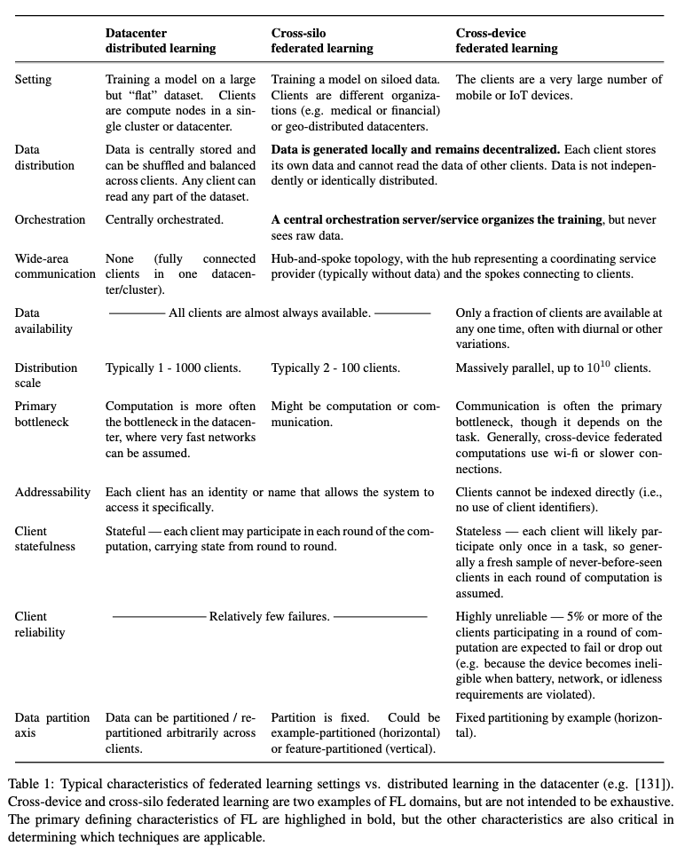
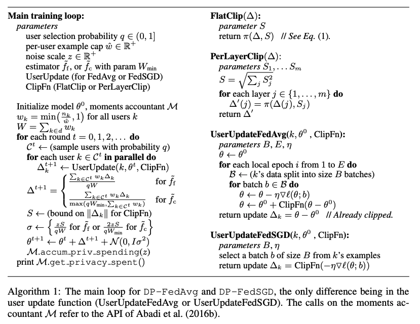

# Federated Learning at Scale - Part II

This part will primarily focus on a recent paper: "[Advances and Open Problems in Federated Learning](https://arxiv.org/pdf/1912.04977.pdf) by Kairouz et al." As the title suggests, this paper surveyed many open challenges in the area of Federated Learning\(FL\). 

### Definition

Although most of the research in the area of Federated Learning focused on mobile and edge device applications, interest in applying FL to other applications has greatly increased, including some which might involve only a small number of relatively reliable clients, for example, several banks might want to collaboratively train an anomaly detection models for fraud detection. Thus, the authors term these two federated learning schemes "cross-device" and "cross-silo" respectively. Given these variations, the authors proposed a definition of FL:

> Federated learning is a machine learning setting where multiple entities \(clients\) collaborate in solving a machine learning problem, under the coordination of a central server or service provider. Each client’s raw data is stored locally and not exchanged or transferred; instead,  focused updates intended for immediate aggregation are used to achieve the learning objective.

Note that: The cross-silo setting can be relevant where a number of companies or organizations share incentive to train a model based on all of their data, but cannot share their data directly. 

### Compare to traditional datacenter distributed machine learning

### Privacy in Federated Learning

Motivated by the prior work on differentially private deep learning algorithms, researchers from Google developed an approach that: given a dataset with a sufficiently large number of users \(a requirement easily met by even small internet-scale datasets\), achieving differential privacy comes at the cost of increased computation, rather than in decreased utility as in most prior work.

#### Motivation

Federated Learning is sometimes used to training language models which might later serve predictions on edge devices.\(e.g. Google's GBoard\). It already provides some notion of privacy in which the raw data itself never leaves the edge devices. However, researchers show that convolutional NNs can memorize arbitrary labelings of the training data and recurrent language models are also capable of memorizing unique patterns in the training data.

#### DP-FedAvg

Most prior work on differentially private machine learning deals with example-level privacy. However, since we cannot access to individual user's data. The authors proposed that we focus on user-level privacy. Specifically: 

> Definition: User-adjacent datasets: Let d and d' be two datasets of training examples, where each example is associated with a user. Then, d and d' are adjacent if d 0 can be formed by adding or removing all of the examples associated with a single user from d.

Intuitively, we want to guarantee that the presence or absence of any specific user’s data in the training set has an imperceptible impact on the \(distribution over\) the parameters of the learned model. 

#### The Algorithm

The above algorithm incorporates the FedAvg algorithm and made the following modifications:

1. We use random-sized batches where we select users independently with probability q, rather than always selecting a fixed number of users. 
2. Similar to [Differentially private SGD algorithm](https://arxiv.org/pdf/1607.00133.pdf), We enforce clipping of per-user updates so the total update has bounded L2 norm. 
3. We use different estimators for the average update
4. We add Gaussian noise to the final average update.

Note that because we are going to add noise to the updates, we need to select more clients to decrease the relative effect of the noise on average.  

