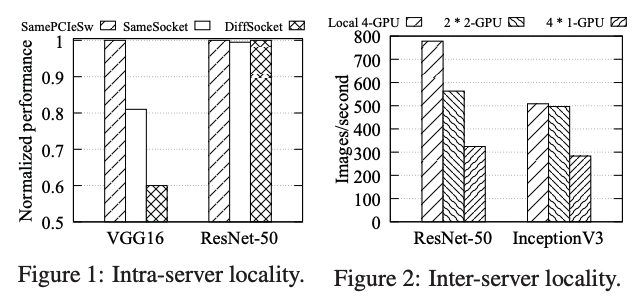
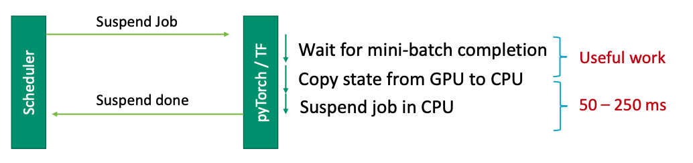

# Gandiva: Introspective Cluster Scheduling for Deep Learning

### Background and Motivation

Existing schedulers mainly treat deep learning training\(DLT\) job as yet another big-data job that is allocated a set of GPUs at job startup and holds exclusive access to its GPUs until completion. However, it is inefficient for two major reasons: 1. **Head-of-line blocking**, as long DLT jobs can run for days and 2. **Low Efficiency.** The job placement is fixed at startup time, but some DLT jobs are sensitive to locality.

The authors point out several unique characteristics for DLT jobs.

#### Locality

The performance of a multi-GPU DLT job depends on the affinity of the allocated GPUs. Different DLT jobs exhibit different levels of sensitivity to inter-GPU and intra-GPU affinity. \(Two GPUs in the same machine might be located in different sockets or PCIe switches.\) 

#### Interference

When running in a shared execution environment\(e.g., PCIe switch\), DLT jobs might interfere with each other due to resource contention, and, again, different jobs have different degree of interferences. For example, when two language model\(LM\) jobs run together, both jobs suffer 19% slowdown. However, ResNet-50 does not suffer from GPU co-location with LM.

#### Intra-job predictability

A DLT jobs consists of numerous mini-batch iterations. Thus, the GPU memory used clearly follows a cyclic pattern, where each cycle corresponds to the processing of a single mini-batch. The maximum GPU memory used can be an order of magnitude larger than the minimum memory used. 

### Gandiva

To address the aforementioned problems, this paper proposes Gandiva, a cluster scheduling framework that utilizes DL-specific characteristics to improve latency and efficiency in a GPU cluster. Gandiva removes the exclusivity and fixed assignment of GPUs in the following ways:

* **Time-Slicing**: DLT jobs are split into 60s subtasks and Gandiva allows incoming jobs to time-share GPUs with existing jobs. Leveraging the cyclic pattern of DLT jobs, when a suspend is issued, Gandiva waits until the minimum of the memory usage cycle. In the evaluation, the authors show that this suspend-and-resume can be accomplished under O\(100ms\). **Packing**, used only during overload, is another mechanism than allows multiple DTL jobs run on the same GPU simultaneously and let the GPU time-share the jobs. Packing is efficient only when the packed jobs do not exceed the GPU resources and do not negatively interfere with each other.  

* **Migration**: Migration can improve the efficiency by 1\) moving time-sliced jobs to vacated GPUs 2\)migrating interfering jobs away from each other and 3\) de-fragmentation of the cluster so that incoming jobs can get GPU locality. It is implemented using model checkpoints. Migration happens when a job departs and Gandiva pick jobs that are not co-located and try to find a new co-located placement.  

