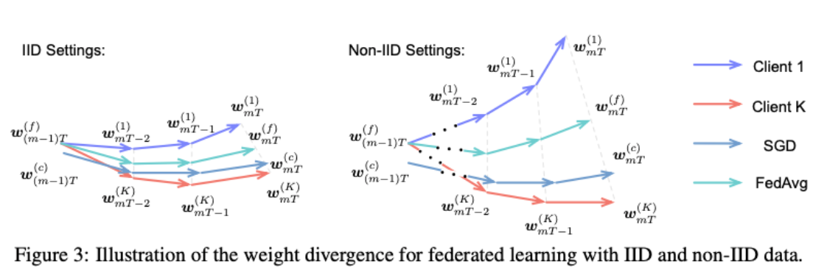

# Learning From Non-IID data

### What does IID mean? 

Informally**, Identically Distributed** means that there are no overall trends–the distribution doesn’t fluctuate and all items in the sample are taken from the same probability distribution. **Independent** means that the sample items are all independent events. In other words, they aren’t connected to each other in any way.

A more technical definition of an IID statistics is:

* Each $$x^{(i)} \sim \mathcal{D}$$ \(Identically Distributed\)
* $$\forall i \ne j  \, \, \, p(x^{(i)}, x^{(j)}) = p(x^{(i)})p(x^{(j)}) $$ \(Independently Distributed\)

### Non-IID data in Federated Learning

A statistical model for federated learning involves two levels of sampling: accessing a datapoint requires first sampling a client $$i \sim \mathcal{Q}$$, the distribution over available clients, and then drawing an example $$(x, y) \sim \mathcal{P_i}(x, y)$$ from that client's local data distribution, where x is the features and y is the label. 

Non-IID data in federated learning typically means the differences between $$\mathcal{P_i}$$ and $$\mathcal{P_j}$$ for different clients i and j. 

The IID sampling of the training data is important to ensure that the stochastic gradient is an unbiased estimate of the full gradient. Worded differently, having IID data at the clients means that each mini-batch of data used for a client's local update is statistically identical to a uniformly drawn sample\(with replacement\) from the entire training dataset, which is the union of all local datasets at the clients\). In practice, it is unrealistic to assume that the local data on each edge device is always IID. More specifically:

* **Violations of Independence**: If the data are processed in an insufficiently-random order. \(e.g. ordered by collection of devices and/or by time, then independence is violated. Moreover, devices within the same geolocation are likely to have correlated data.
* **Violations of Identicalness**: Because devices are tied to particular geo-regions, the distribution of labels varies across partitions. Besides, different devices\(partitions\) can hold vastly different amounts of data. 

Thus,

* Data on each node being generated by a distinct distribution $$x_t \sim P_t$$
* The number of data points on each node, $$n_t$$ , may also vary significantly
* There may be an underlying structure present that captures the relationship amongst nodes and their associated distributions.

Most empirical work on synthetic non-IID datasets have focused on label distribution skew, where a non-IID dataset is formed by partitioning a "flat" existing dataset based on the labels. 

Note: 1. It is also important to note that the distribution $$\mathcal{Q}$$ and $$\mathcal{P_i}$$ may change over time, introducing another dimension of "non-IIDness" 2. For a more detailed classification, please refer to section 3.1 of [this](https://arxiv.org/pdf/1912.04977.pdf) recent survey paper.

### Experiment

Some recent [works](https://arxiv.org/pdf/1910.00189.pdf) show that mose decentralized learning algorithms suffer from major model quality loss \(or even divergence\) when run on non-IID data partitions. However, it is interesting to note that BSP is robust to Non-IID data.

It is [shown](https://arxiv.org/pdf/1806.00582.pdf) that the accuracy may be affected by the exact data distribution, i.e. the skewness of data distribution. More specifically, the skewness can be roughly interpreted as the distance between the data distribution on each client and the population distribution. In addition, such distance can be evaluated with the [earth mover's distance](https://en.wikipedia.org/wiki/Earth_mover%27s_distance)\(EMD\) between distributions. Based on experiment on real-world dataset, the test accuracy falls sharply with respect to EMD beyond certain threshold. 

### Existing Works

Although several solutions have been proposed to deal with highly skewed non-IID data\(e.g. [data-sharing](https://arxiv.org/pdf/1806.00582.pdf) and [model traveling](https://arxiv.org/pdf/1806.00582.pdf)\), they are both somewhat unsatisfactory. For example, some existing works\[1, 2\] proposes heuristic-based approaches by sharing local device data or create some server-side proxy data. However, these methods may be unrealistic: in addition to imposing burdens on network bandwidth, sending local data to the server violates the key privacy assumption of federated learning, and sending globally-shared proxy data to all devices requires effort to carefully generate or collect such auxiliary data.

### Some thoughts 

If the edge devices are equipped with the capability to run training on local data, is training a single global model the optimal objective? Of course, a single global model has its benefits. For example, it can provide a model to clients with no data, or to allow manual validation and quality assurance before deployment. Nevertheless, since local training is possible, it becomes feasible for each client to have a customized model. The authors of [this](https://arxiv.org/pdf/1912.04977.pdf) paper argue that "Training a customized model can turn the non-IID problem from a bug to a feature, almost literally — since each client has its own model, the client’s identity effectively parameterizes the model, rendering some pathological but degenerate non-IID distributions trivial." However, this approach suffers from the problem of overfitting. Thus, I think that [local fine tuning](https://arxiv.org/abs/1910.10252) is the most promising technique. It begins with the federated training of a single model, and then deploy that model to all clients, where it is personalized by additional training on the local dataset before inference. \(There is one [paper](https://www.microsoft.com/en-us/research/uploads/prod/2019/08/sec19colla.pdf) from SEC' 19, which worked on similar directions.\)

### References:

* [Federated Learning with Non-IID Data](https://arxiv.org/abs/1806.00582) - Zhao et al., 2018 \[1\]
* [The Non-IID Data Quagmire of Decentralized Machine Learning](https://arxiv.org/abs/1910.00189) - Hsieh et al., 2019
* [Communication-efficient on-device machine learning: Federated distillation and augmentation under non-iid private data](https://arxiv.org/abs/1811.11479) - Jeong et al., 2018 \[2\] 
* [Federated Learning: Challenges, Methods, and Future Directions](https://arxiv.org/pdf/1908.07873.pdf) - Li et al., 2019

