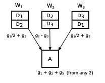

# Distributed Machine Learning Misc.

### \*\*\*\*[Cartel: A System for Collaborative Transfer Learning at the Edge](https://dl.acm.org/citation.cfm?id=3362708) - Daga et al., 2019

Cartel is a framework for Collaborative Learning, where edge nodes learn independently, but selectively collaborate with logical neighbors by using a common technique known as transfer learning. Knowledge transfer happens when a "target edge executing a model detects an issue, such as sudden high error rates, with its current model. 

Cartel maintains a metadata service that stores information about a node\(e.g. data distribution and estimates of class priors\). These metadata are used to do 1\) **Drift Detection**, which allows a node to determine when to ask for help. 2\) **Logical Neighbors**, which allows each node to determine sufficiently similar nodes\(by using Jensen-Shannon Divergence to measure statistical distance\) to provide the required model transfer. 3\) **Knowledge Transfer,** which allows the system to decide on how to merge model portions provided from peer nodes. 

This is an interesting paper. However, I think let each node train a model independently doesn't make much sense if data quantity is highly skewed on each node. Moreover, I don't think ask peers for help is always a good idea.

### [Federated Multi-Task Learning](https://arxiv.org/abs/1705.10467) - Smith et al., 2017

In this work, the authors argue that multi-task learning\* is naturally suited to handle the [statistical challenges](https://xzhu0027.gitbook.io/blog/ml-system/learning-from-non-iid-data) of this setting, and propose a novel systems-aware optimization method, MOCHA, that is robust to practical systems issues.

The example in the paper is learning the activities of mobile phone users in a cellular network based on their individual sensor, text, or image data. Each node \(phone\), $$t \in [m]$$, may generate data via a distinct distribution, and so it is natural to fit separate models, $$\{w_1, ..., w_m\}$$, to the distributed data—one for each local dataset. However, the structure between models frequently exists \(e.g., people may behave similarly when using their phones\), and modeling these relationships via multi-task learning is a natural strategy to improve performance and boost the effective sample size for each node

\*In multi-task learning, the goal is to learn models for multiple related tasks simultaneously. 

### [Machine Learning at Facebook: Understanding Inference at the Edge](https://research.fb.com/wp-content/uploads/2018/12/Machine-Learning-at-Facebook-Understanding-Inference-at-the-Edge.pdf) - Wu et al., 2018

This paper presents some discussion about bringing machine learning inference to the edge. Some highlights are: 

* **The majority of mobile inference run on CPUs and most CPUs are at least six years old.** 
* **The performance difference between a mobile CPU and GPU/DSP is not 100x.**
  * Although the performance gap between server CPUs and GPUs is usually 60-100x, mobile GPUs, and even DSPs, are less than 9x faster than mobile CPUs. 
* **Accuracy is a priority, but it must come with a reasonable model size**
  * It is important to maximize accuracy while keeping model sizes reasonable. Thus, looking forward, method to improve architecture search\(e.g. BayesOpt, AutoML\) are of important interest. 
* **Performance variability is a real problem**

  * An often overlooked issue in the architecture research community is performance variability

 

### [Collaborative Learning between Cloud and End Devices: An Empirical Study on Location Prediction](https://www.microsoft.com/en-us/research/uploads/prod/2019/08/sec19colla.pdf) - Lu et al., 2019

This paper is about decentralized machine learning but took a different approach, compared to Federated Learning. The key insight is that despite limited amount of data and skewed data distribution on each device, in user behavior prediction, there exist common patterns cross users/devices due to the intrinsic correlations in the physical space, hence allowing cloud and \(multiple\) end devices to complement each other and learn collectively. 

In Colla, the name of this project, cloud trains and maintains a large base model M whereas each device holds a small client model m customized for itself.  The learning process consists of for stages.

1. **Bootstrapping**: The cloud trains the very first cloud model from an initial dataset.
2. **First pulling**: When a new device joins the system, it asks the cloud for the latest model.
3. **Client model update**: After making some progress, the devices pulls the latest  model and merge it with the current client model through knowledge distillation. \(Simply put, the heavy cloud model is used as the teacher model to fine-tune the client model over local dataset.\)
4. **Cloud model update**: Once receiving model parameters from N of devices, cloud also updates its model. 

With growing number of users in Colla, maintaining a single model in cloud may not achieve a satisfied prediction accuracy for all users as different groups of users may have very different behavior patterns. To solve this problem, instead of using a one-fits-all cloud model, Colla splits up the cloud model over time to serve different groups of users. Based on N output feature vectors, we use the cross entropy between two feature vectors as the distance of two models, and cluster models into K groups using the Affinity Propagation. 

### [Adaptive Communication Strategies in Local-Update SGD](https://arxiv.org/pdf/1810.08313.pdf) - Wang et al., 2018

One iteration in fully synchronized SGD consists of three stages: 1\) Local stochastic gradient computation 2\) Average gradient across all nodes 3\) Repeat the above steps until convergence. However, the communication between iterations can be even longer than computation time, thus a bottleneck. A promising solution is to allow each node to perform $$\tau$$ local steps before communication. It reduces the communication delay by $$\tau$$times, but imposes the challenge of model divergence: the longer communication period $$\tau$$, the larger deviation between local models. As in the figure below, the large communication period protocol converges faster but results in a suboptimal model. Thus, the overarching goal is to find the optimal $$\tau$$ . 

The key observation of this paper is that the best communication period varies over time\(just like the best learning rate varies over time!\); thus we should aim for an adaptive communication strategy. The proposed solution is first to divide the training process into multiple intervals and estimate the best communication period for each interval. Specifically, the formula to estimate $$\tau_l$$ is:

Where F\(x\) is the objective function, and $$\tau_0$$is the initial communication period, which is obtained by a simple grid search. The empirical result shows that this algorithm works well in practice and can achieve up to 3 times speedup over synchronous SGD

### [Gradient Coding: Avoiding Stragglers in Distributed Learning](http://proceedings.mlr.press/v70/tandon17a.html)  - Tandon et al., 2017

One of the longstanding problems of large-scale distributed machine learning\(especially in the parameter server architecture\) is that sometimes worker nodes can fail or be stragglers. Even without failure, the experiment on EC2 shows that some machines can be 5x slower. There are lots of work in this area, and the most popular works are the asynchronous approaches\(e.g., [Stale Synchronous Parallel](https://kilthub.cmu.edu/articles/More_Effective_Distributed_ML_via_a_Stale_Synchronous_Parallel_Parameter_Server/6475898/files/11907269.pdf)\) or synchronous approach with [backup tasks](https://arxiv.org/pdf/1604.00981.pdf). However, they give up some desirable properties\(e.g., faster convergence rate, ease of producibility and debugging, and amenability to analysis\)

The key idea of this paper is that: Given each example is replicated multiple times using a specific placement policy, every worker can send a single linear combination of gradient vectors. If these linear combinations are carefully designed, any $$n-s$$ contains all the gradient vectors, where n is the number of machines and s is the maximum number of stragglers.  In the example above, A can obtain the vector $$g_1+g_2+g_3$$ from any two out of these three vectors. 

However, it only support rudimentary computations. 

### [**A Generic Communication Scheduler for Distributed DNN Training Acceleration**](https://dl.acm.org/authorize?N695016)

ByteScheduler is a generic version of previous works\[[1](https://www.sysml.cc/doc/2019/199.pdf), [2](https://www.sysml.cc/doc/2019/75.pdf)\] on priority-based communication scheduling and tensor partitioning. The idea of priority-based communication scheduling is that forward propagation  computes from the first layer to the last layer, whereas backward propagation does the opposite. 

The FIFO communication strategy is the default for most frameworks, but, as we see in the above figure, $$push_1$$and $$pull_1$$ gets executed before $$push_0$$and $$pull_0$$, which is suboptimal since $$f_0$$ must be executed before $$f_1$$. Thus, prioritizing $$push_i$$over $$push_j$$if $$i < j$$ is a good solution. And the motivation of tensor partitioning is that the tensor size can vary significantly. A very large tensor, once en-queued in the communication stack, would block other tensors even if they have higher priorities. 

However, I have a few questions about this strategy. 1\) The authors seem to assume that communication time is far more than computation time. However, if we have a faster network and/or slower CPUs\(i.e. $$b_i < push_i$$ \), the above strategy will not work very well. 2\) If we partition the tensors, we may exacerbate the problem of stragglers, since there will be a hard barrier at the end of each partition.

