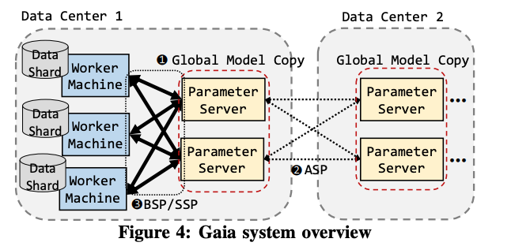

# Parameter Servers and AllReduce

## Parameter Server

### Motivation:

 The parameter server is mainly inspired by the scalability needs of modern machine learning applications. 1\) massive **data volume** such as societal-scale social graphs with up to hundreds of millions of nodes; and 2\) massive **model size**, such as the Google Brain deep neural network containing billions of parameters. As a result, neither the training data nor the parameters can be stored or computed in a single machine. Even the data or the model could be store in a single machine, distributing the data and model could still be beneficial because a known limitation of GPU is that the training speed-up is small when the model does not fit in GPU memory.\(typically less than 12 gigabytes\).

### Parameter Server

There are some variations in the architecture of parameter servers, and I will use the architecture described in this [paper](http://www.cs.cmu.edu/~muli/file/parameter_server_osdi14.pdf). 

**The Model**

The model shared among nodes can be represented as a set of \(key, value\) pairs. For example, in a loss minimization problem, the pair is a feature ID and its weight. 

**Server Group**

A server node in the server group maintains a partition of the globally shared parameters. Server nodes communicate with each other to replicate and/or to migrate parameters for reliability and scaling. A server manager node maintains a consistent view of the metadata of the servers, such as node liveness and the assignment of parameter partitions.

Parameter servers in the server group partition keys using consistent hashing with virtual nodes. Besides, each server node stores a replica of the k counterclockwise neighbor key ranges relative to the one it owns

**Worker Group**

Multiple worker nodes constitute worker groups that communicate with the server groups by pulling the latest parameters and pushing their local updates\(the gradient\). Specifically, workers can make updates $$\delta $$ to a parameter $$\theta $$, where the updates follow an associative, commutative form $$\theta $$ ← $$\theta $$ + $$\delta $$. Hence, the current true value of $$\theta $$ is just the sum over updates $$\delta $$ from all workers. There are three types of guarantees when the worker tries to pull the latest $$\theta $$, which we will discuss later. 

Worker groups will not communicate with each other. A scheduler looks at the worker group and assigns task to them. Generally, the same worker node leverages data stored locally by running iterative algorithms on the same dataset. 

### Consistency model

Because different worker makes progress at different speeds, workers may read stale data which may potentially slow down the convergence progress. Thus, there is a trade of between system efficiency\(or communication overhead\) and algorithm convergence rate\(fresher updates\). 

* **Sequential or Bulk synchronous Parallel\(BSP\)**

In this model, the system synchronizes all updates after each worker goes through its shard of data; all workers need to see the most up-to-date model before proceeding to the next iteration

* **Eventual consistency or Total Asynchronous Parallel \(TAP\)** 

The system removes the synchronization between workers completely; all workers keep running based on the results of best-effort communication. However, this is only recommendable if the underlying algorithms are robust with regard to delays, since, unlike SSP and BSP, TAP does not guarantee convergence. Note that there are some methods that might be even "weaker" than TAP, such as[ Model Averaging](http://martin.zinkevich.org/publications/nips2010.pdf) and Ensemble Learning.

* **Bounded Delay or Stale Synchronous Parallel\(SSP\)**

In next section.

Note that these models exist because one of the major differences between machine learning systems and big data systems is that most of the machine learning algorithms have some tolerance for "stale data".

Doug Terry's [Replicated Data Consistency Explained Through Baseball](https://www.microsoft.com/en-us/research/wp-content/uploads/2011/10/ConsistencyAndBaseballReport.pdf) gives some intuition behind these consistency model in real life. Highly recommended!

### Stale Synchronous Parallel

When a worker asks for $$\theta $$, the SSP model will give it a stale \(i.e. delayed\) version of $$\theta $$. More formally, a worker reading $$\theta $$ at iteration c will see the effects of all $$\delta $$ from iteration 0 to c − s − 1, where s ≥ 0 is a user-controlled staleness threshold. In addition, the worker may get to see some recent updates beyond iteration c − s − 1. The idea is that SSP systems should deliver as many updates as possible, without missing any updates older than a given age — a concept referred to as bounded staleness. The practical effect of this is twofold: \(1\) workers can perform more computation instead of waiting for other workers to finish, and \(2\) workers spend less time communicating with the parameter server, and more time doing useful computation. 

We assume that each server makes additive updates to a shared parameter x ← x + u at regular intervals called clocks. Clocks are similar to iterations, and represent some unit of progress by an ML algorithm.

#### Definition of SSP

Given a **user-chosen staleness threshold** s ≥ 0, SSP enforces the following bounded staleness conditions:

* The slowest and fastest workers must be ≤ s clocks apart — otherwise, the fastest worker is forced to wait for the slowest worker to catch up. 
* When a worker with clock c commits an update u, that u is timestamped with time c. 
* When a worker with clock c reads x, it will always see effects from all u with timestamp ≤ c − s − 1. It may also see some u with timestamp &gt; c − s − 1 from other workers. 
* **Read-my-writes**: A worker p will always see the effects of its own updates up.

Clocks are similar to iterations, and represent some unit of progress by an ML algorithm 

#### Implementation

As described in this [paper](http://www.cs.cmu.edu/~seunghak/SSPTable_NIPS2013.pdf), the SSP parameter server can be implemented with a table-based interface, called [SSPtable](http://www.cs.cmu.edu/~seunghak/SSPTable_NIPS2013.pdf). The workers read the parameters $$\theta $$ from caches on the worker machines whenever possible, and only reading $$\theta $$ from the parameter server when the SSP model requires it.

SSPtable follows a distributed client-server architecture. Clients access shared parameters using a client library, which maintains a machine-wide process cache and optional per-thread thread caches.\(Threads are considered as workers\). 

**Weakness**: Although the paper provides some empirical results showing the effects of staleness threshold on computation and waiting time, there is no systematic way for the user to figure out how to set a reasonable threshold to achieve best trade-off. There are a number of related papers, but it is still an open problem.

Please refer to the paper about the details of the interface and protocol. 

### Gaia: Geo-Distributed Machine Learning Approaching LAN Speeds

It is infeasible to move the geo-distributed\(or geo-generated\) data to a centralized data center before running an ML algorithm over it—moving large amounts of raw data over wide-area networks \(WANs\) can be extremely slow, and is also subject to the constraints of privacy and data sovereignty laws. The evaluation shows that WAN bandwidth is about 15x less than LAN bandwidth.

**Approximate Synchronous Parallelism \(ASP\)**

The main idea of Gaia is to maintain an approximately-correct copy of the global ML model within each data center, and dynamically eliminate any unnecessary communication between data centers. ASP is based on a key finding that the vast majority of updates to the global ML model parameters from each ML worker machine are insignificant**.**

With ASP, these insignificant updates to the same parameter within a data center are aggregated \(and thus not communicated to other data centers\) until the aggregated updates are significant enough.  
ASP builds heavily on the SSP. While SSP bounds how stale \(i.e., old\) a parameter can be, ASP bounds how inaccurate a parameter can be, in comparison to the most up-to-date value.

\*\*\*\*

**Architecture** 

In Gaia, each data center has some worker machines and parameter servers. Each worker machine works on a shard of the input data stored in its data center to achieve data parallelism. The parameter servers in each data center collectively maintain a version of the global model copy, and each parameter server handles a shard of this global model copy**.**

* **Significance Filter**

ASP takes two inputs from an ML programmer to determine whether or not an update is **significant**. They are: \(1\) a significance function and \(2\) an initial significance threshold. The significance function returns the significance of each update. We define an update as significant if its significance is larger than the threshold.

* **ASP selective barrier**

When a parameter-server receives **significant updates** at a rate that is higher than the WAN bandwidth can support, instead of sending updates \(which will take a long time\), it first sends a short control message to other data centers. The receiver of this ASP selective barrier message blocks its local workers from reading the specified parameters until it receives the significant updates from the sender of the barrier.

* **Mirror check**

When each parameter server receives all the updates from its local worker machines at the end of a clock \(e.g., an iteration\), it reports its clock to the servers that are in charge of the same parameters in the other data centers. When a server detects its clock is ahead of the slowest server that shares the same parameters by a predefined threshold DS \(data center staleness\), the server blocks its local worker machines from reading its parameters until the slowest mirror server catches up.

Google's federated learning adopts similar approach\[1\]. Both are based on the parameter-server model, and both prescribe updating the model parameters in a stale/approximate synchronous parallel fashion: several iterations are run locally before sending update the server. The difference is for Federated Learning there is a "master" server group in the datacenter, whereas Gaia takes a peer-to-peer approach where each datacenter has a server group.

One thing I didn't see in the paper is the impact of latency in machine learning jobs. While the impact of bandwidth is well studied in this paper, as well as the community, the impact of latency has remain unexplored. In a recent project, we found that latency across machines is &lt;1 ms within data center, but latencies across sites vary from O\(10\)–400 ms. 

\[1\] The difference between federated learning and general parameter server approach can be found in [federated learning section](https://xzhu0027.gitbook.io/blog/ml-system/towards-federated-learning-at-scale-system-design#comparison-between-ps-and-fl). 

## AllReduce

### Motivation: 

One of the biggest problems in data-parallel training is **communication**. When we only have few GPUs and parameters measured in megabytes of data, it may not matter much exactly how those CPUs communicate. However, when your models have billions of parameters, the gradients may take gigabytes of space \(because there is a gradient value for every parameter\), and you are coordinating dozens of GPUs, the communication mechanism becomes crucial. 

The main issue with the parameter server's communication strategy\(e.g. one parameter server and multiple workers\) was that the communication cost grew linearly with the number of GPUs in the system.

### Ring AllReduce:

In contrast, a ring allreduce is an algorithm for which the communication cost is constant and independent of the number of GPUs in the system, and is determined solely by the slowest connection between GPUs in the system; in fact, if you only consider bandwidth as a factor in your communication cost \(and ignore latency\), the ring allreduce is an optimal communication algorithm. In addition, allreduce allows you to overlap the transmission of gradient 

Details can be found in this awesome blog post: [http://andrew.gibiansky.com/](http://andrew.gibiansky.com/)

In the ring-allreduce algorithm, each of N nodes communicates with two of its peers $$2 \times (N - 1)$$ times. During this communication, a node sends and receives chunks of the data buffer. In the first $$N − 1 $$ iterations, received values are added to the values in the node’s buffer. In the second $$N − 1 $$ iterations, received values replace the values held in the node’s buffer. [Previous work](https://www.cs.fsu.edu/~xyuan/paper/09jpdc.pdf) suggests that this algorithm is bandwidth-optimal, meaning that if the buffer is large enough, it will optimally utilize the available network.

### Case Study - Uber's [Horovod](https://arxiv.org/pdf/1802.05799.pdf): 

In this paper, two Uber engineers describe their journey from single node training to distributed training. The standard distributed Tensorflow package runs with a parameter server approach to averaging gradients\(I believe it's also the standard approach for Pytorch\). However, they found it hard to:

* **Find the right ratio of worker to parameter servers**: If one parameter server is used, it will likely become a networking or computational bottleneck. If multiple parameter servers are used, the communication pattern becomes “all-to-all” which may saturate network interconnects.
* **Handling increased TensorFlow program complexity**

As a result, Uber decided to adopt the ring-allreduce approach introduced by [Baidu Research](http://andrew.gibiansky.com/), and built an open source framework called [Horovod](https://github.com/horovod/horovod). They showed that ring-allreduce can improve both usability and performance.

### Parameter Server vs. AllReduce:

In general, parameter server works better if you have a large number of unreliable and not so powerful machine. AllReduce works better if you have a small amount of fast devices\(variance of step time between each device is small\) run in a controlled environment with strong connected links. 

### Measuring Performance

The convergence speed of distributed machine learning\(e.g. SGD\) is a product of two factors: 1\) System throughput, which is the number of iteration per second and 2\) Error convergence, which is the training progress per iteration. Taken together, we want to achieve high training progress per unit time\(time-to-accuracy\).

### Reference:

* [Gaia: Geo-Distributed Machine Learning Approaching LAN Speeds](https://www.usenix.org/system/files/conference/nsdi17/nsdi17-hsieh.pdf) - Hsieh et al., 2017
* [Scaling Distributed Machine Learning with the Parameter Server](http://www.cs.cmu.edu/~muli/file/parameter_server_osdi14.pdf) - Li et al., 2014 
* [More Effective Distributed ML via a Stale Synchronous Parallel Parameter Server](http://www.cs.cmu.edu/~seunghak/SSPTable_NIPS2013.pdf) - Ho et al., 2013
* [Bringing HPC Techniques to Deep Learning](http://andrew.gibiansky.com/) by Andrew Gibiansky 
* [Horovod: fast and easy distributed deep learning in TensorFlow](https://arxiv.org/pdf/1802.05799.pdf) - Sergeev et al., 2018

### Related Reading:

* [Exploiting bounded staleness to speedup Big Data analytics](https://www.usenix.org/node/184015) - Cui et al., 2014
  * Extended the idea of BSP and defines Arbitrarily-sized Bulk Synchronous Parallel \(A-BSP\). It is similar to _Federated Averaging_ algorithm, where it requires a synchronization after k iterations.
* [Toward Understanding the Impact of Staleness in Distributed Machine Learning](https://openreview.net/forum?id=BylQV305YQ) - Dai et al, 2019

