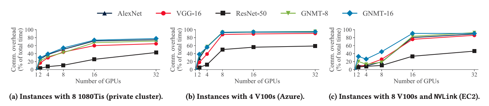
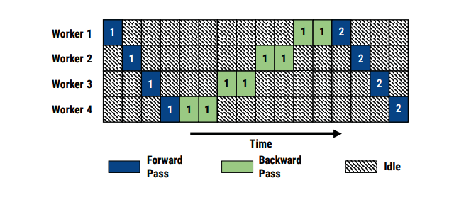
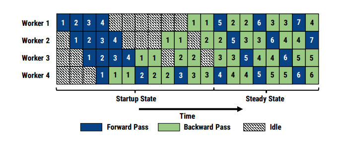
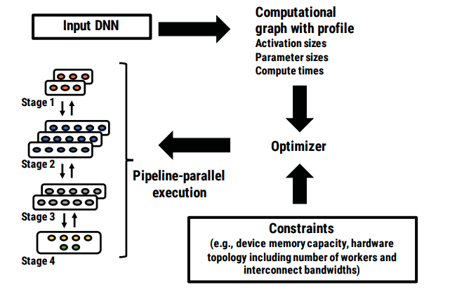
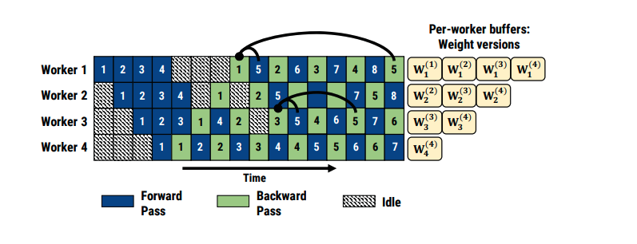
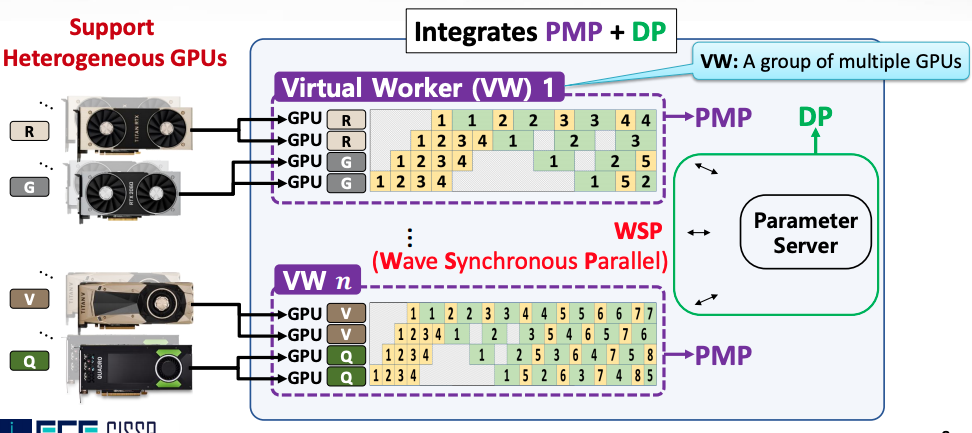

# PipeDream: Generalized Pipeline Parallelism for DNN Training

### Motivation

The most common way to train DNN models is intra-batch parallelization: data parallelism, model parallelism or hybrid intra-batch parallelism. However, they all suffer some disadvantages. 

* Problem with Data Parallelism: Communication overhead for many state-of-the-art models is high. Furthermore, the amount of data communicated is proportional to the number of model weights and the number of workers participating in training. 

* Problem with model parallelism: model-parallel training results in under-utilization of compute resources. As shown in the figure below, at most one worker is active at a given time. Moreover, the burden of partitioning a model across multiple GPUs is left to the programmer. 

### Pipeline Parallelism\(PP\)

This paper introduces PipeDream with **pipeline parallelism, a new parallelization strategy that combines intra-batch parallelism with inter-batch parallelism.** Pipeline-parallel computation involves partitioning the layers of a DNN model into multiple stages, where each stage consists of a consecutive set of layers in the model. Each stage is mapped to a separate GPU that performs the forward pass \(and backward pass\) for all layers in that stage.

As the name hinted, on completing its forward or backward pass for a minibatch, each stage asynchronously sends the output activations or gradients to the next stage, while simultaneously starting to process another minibatch. Since it only has to communicate subsets of the gradient and output activations, PP often can **communicate far less** than data parallelism. More importantly, PP solves the under-utilization problem by **overlapping communication with computation of subsequent minibatches**. 

However, naive pipelining introduces three challenges: work partitioning, work scheduling, and effective learning. 

#### Work Partitioning

Having each stage process mini batches at vastly different throughputs can lead to bubbles in the pipeline. To solve this, PipeDream will run an initial profiling step to record the computation time taken by the forward and backward pass, the size of the layer outputs, etc. Then, its algorithm automatically partitions DNN layers into stages such that each stage completes at roughly the same rate. To further improve load balancing, PipeDream allows a stage to be replicated.

**Work Scheduling**

Once in steady-state, each stage alternates between performing its forward pass for a minibatch and its backward pass for an earlier minibatch. When a stage is replicated, PipeDream uses deterministic round-robin load balancing to spread work across the replicas.

#### Effective Learning

In a naively pipelined system, the backward passes may perform different versions of parameters than their corresponding forward passes. This discrepancy in weight versions results in invalid gradients and can prevent model convergence. Pipedream uses _**weight stashing**_ to avoid the issue of weight mismatch. Weigh stashing maintains multiple versions of the weights, one for each active minibatch. As shown in the above figure, the same version of model parameters is used for the forward pass and backward pass of a given minibatch. 

### Comments

I like the simple, intuitive ideas to address the problem, but, in my view, there are two limitations that are not sufficiently discussed in the paper: 1. Weight stashing stores multiple versions of the parameters, which will greatly increase the memory footprint. The authors claim that PipeDream's peak per-worker memory usage is on par with data parallelism. However, one of the known limitations of data parallelism is it doesn't work if the model is too large to fit into memory. I think reducing the memory footprint will be interesting future work. 2. The paper did not discuss how to handle stragglers. I feel that this problem is more challenge in pipeline parallelism than data parallelism because of intra-stage dependency.

### Update\(9/26/20\)

HetPipe in ATC' 20 is a follow-up work from UNIST to make pipeline parallelism work on heterogeneous GPU. It also adds data parallelism. The key idea is to group GPUs into virtual workers and run pipeline parallelism inside virtual workers and data parallelism across virtual workers. HetPipe also proposes a new synchronization mechanism called Wave Synchronous Parallel\(WSP\), which is very similar to SSP.

