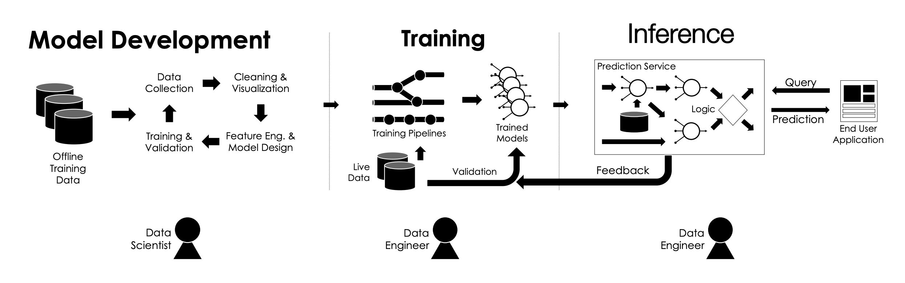
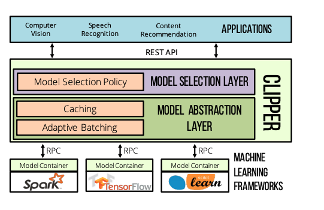
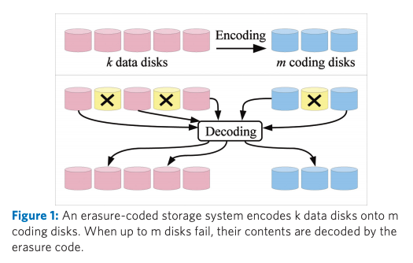
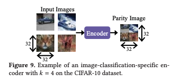
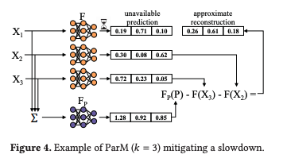
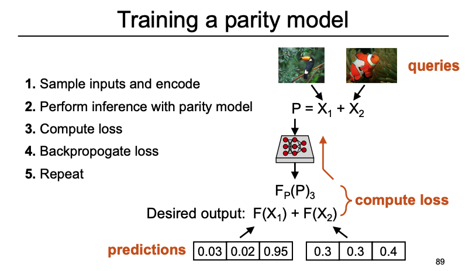
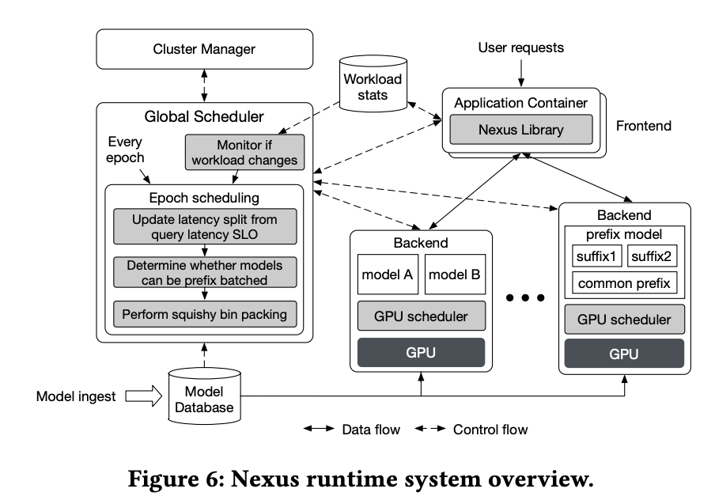
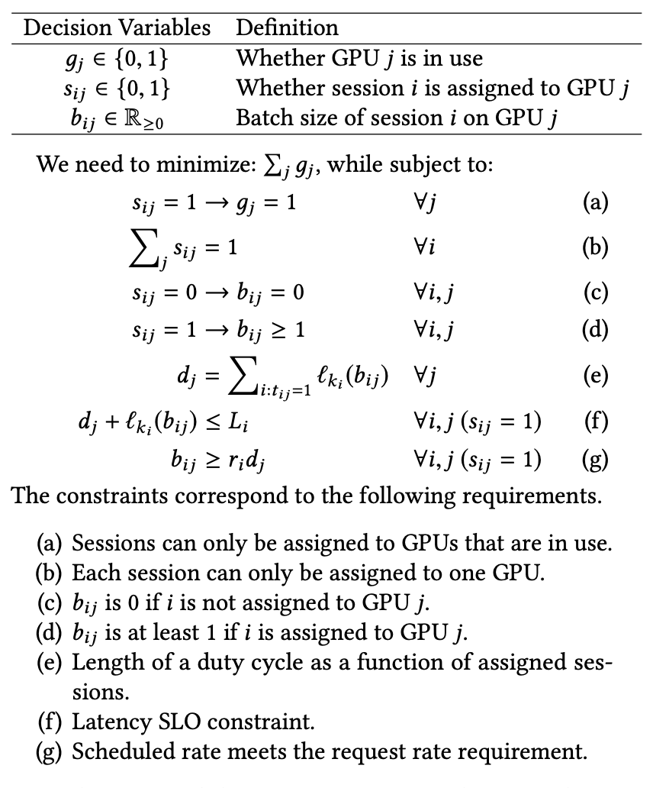
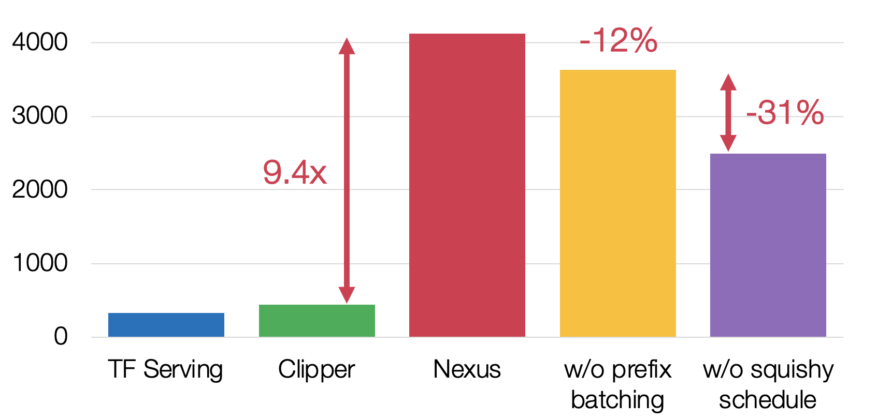
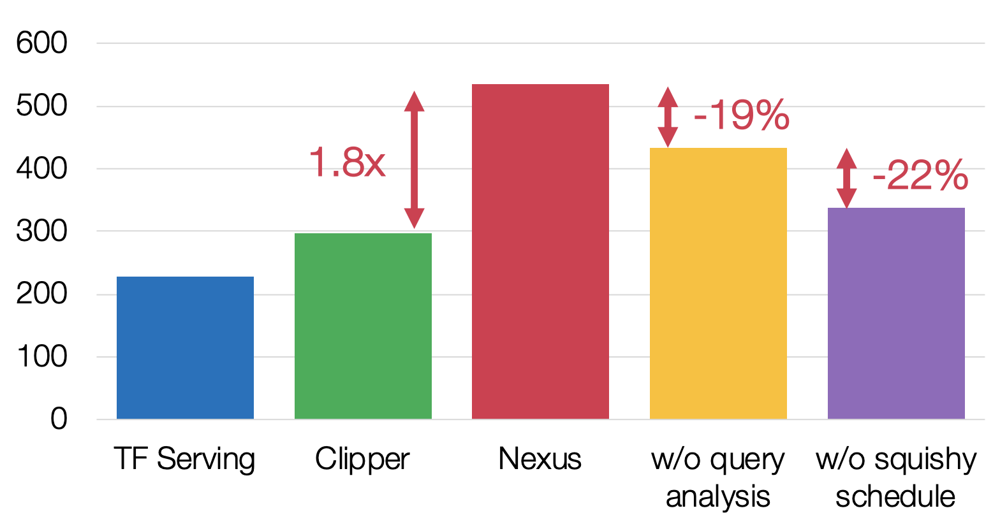

# Serving Systems

### Introduction

Machine learning life-cycle can be divided into three distinct phases: **Model Deployment, Training ,and Inference**. The final phase of rendering predictions is often referred to as prediction serving, model scoring, or inference. It is the process of using the model to make a prediction given input\(e.g. predict a user's rating for a movie.\) Prediction serving requires integrating machine-learning software with other systems including user-facing application code, live databases, and high-volume data streams. As such, it comes with its own set of challenges and tradeoffs and is the domain of the emerging class of prediction-serving systems. I will try to summarize the challenges, traditional approaches and two related papers published recently in top conferences. 

### Challenges

* **Complexity of Deploying Machine Learning**

There is a large and growing number of machine learning frameworks. Each framework has strengths and weaknesses and many are optimized for specific models or application domains \(e.g., computer vision\). Thus, there is no dominant framework and often multiple frameworks may be used for a single application \(e.g., speech recognition and computer vision in automatic captioning\). As a consequence of these design decisions, application developers are forced to accept reduced accuracy by forgoing the use of a model well-suited to the task or to incur the substantially increased complexity of integrating and supporting multiple machine learning frameworks.

* **Prediction Latency and Throughput**

Ideally, the prediction serving system should render predictions in $$O(10ms)$$ even under bursty workloads. \(For example, for [keyboard prediction](https://www.aclweb.org/anthology/W17-4002/) model, users typically expect a keyboard response within 20 ms of an input event\) Because prediction serving is often on the critical path, predictions must both be fast and have bounded tail latencies to meet service level objectives.

### How to provide prediction?

[An ML model can provide predictions in two ways:](https://cloud.google.com/solutions/machine-learning/minimizing-predictive-serving-latency-in-machine-learning)

* **Offline prediction**. This is when your ML model is used in a _batch_ _scoring_ job for a large number of data points, where predictions are not required in real-time serving. In offline recommendations, for example, you only use _historical_ information about customer-item interactions to make the prediction, without any need for online information. Offline recommendations are usually performed in retention campaigns for \(inactive\) customers with high propensity to churn, in promotion campaigns, and so on.
* **Online prediction**. This is when your ML system is used to serve _real-time_ predictions, based on online requests from the operational systems and apps. In contrast to offline prediction, in online recommendations you need the _current context_ of the customer who's using your application, along with historical information, to make the prediction. This context includes information such as date time, page views, funnels, items viewed, items in the basket, items removed from the basket, customer device, and device location.

In the remaining post, we will look at three related papers: 1\) [Clipper: A Low-Latency Online Prediction Serving System](https://www.usenix.org/system/files/conference/nsdi17/nsdi17-crankshaw.pdf) and 2\) [Parity Models: Erasure-Coded Resilience for Prediction Serving Systems](https://dl.acm.org/citation.cfm?id=3359654). 3\) [Nexus: a GPU cluster engine for accelerating DNN-based video analysis](https://dl.acm.org/doi/10.1145/3341301.3359658) 

### [Clipper: A Low-Latency Online Prediction Serving System](https://www.usenix.org/system/files/conference/nsdi17/nsdi17-crankshaw.pdf)

Clipper starts with the design goal of easily serving any trained model at interactive latencies. From this starting point, the paper explores techniques for optimizing both inference performance and accuracy while encapsulating the models in a uniform, black-box prediction interface.

Clipper adopts a modular, layered architecture, running each model in a separate Docker container and interposing an intermediate layer between the models and the querying applications. More Specifically, Clipper is divided into **model selection and model abstraction layers.** The model abstraction layer is responsible for providing a common prediction interface, ensuring resource isolation, and optimizing the query workload for batch-oriented machine learning frameworks. The model selection layer is responsible for dispatching queries to one or more models and combining their predictions based on feedback to improve accuracy, estimate uncertainty, and provide robust predictions.

#### Model Containers

Each model is managed in a separate Docker container to provide process isolation. Clipper supports replicating model containers, both locally and across a cluster, to improve prediction throughput and leverage additional hardware accelerators. 

#### Model Abstraction Layer

The prediction caches provide a partial pre-materialization mechanism for frequent queries and the Clipper batching component transforms the concurrent stream of prediction queries received by Clipper into batches.  

Batching helps amortize the cost of system overheads \(e.g., remote procedure call and feature method invocation\) and improves throughput by enabling models to leverage internal parallelism. For example, many machine-learning frameworks are optimized for batch-oriented model training and therefore capable of using SIMD \(single instruction, multiple data\) instructions and GPU accelerators to improve computation on large input batches. However, batching may increase the latency of predictions since it requires all queries in the batch to complete before returning a single prediction. Clipper solves this problem by employing an AIMD scheme to find the optimal batch size that maximizes throughput subject to constraint that the batch evaluation latency is under the target SLO. 

#### Model Selection Layer

The Model Selection Layer uses feedback to dynamically select one or more of the deployed models and combine their outputs to provide more accurate and robust predictions. The selection policy uses reward feedback to choose between and even combine multiple candidate models for a given prediction request. By selecting the optimal model or set of models to use on a per-query basis, Clipper makes machine-learning applications more robust to dynamic environments and allows applications to react in realtime to degrading or failing models. The selection policy interface is designed to support [ensemble methods](https://en.wikipedia.org/wiki/Ensemble_learning) and explore/exploit techniques that can express a wide range of such methods, including multiarmed bandit techniques and the Thompson sampling algorithm used by [LASER](https://dorx.me/papers/p173-agarwal.pdf).

### [Parity Models: Erasure-Coded Resilience for Prediction Serving Systems](https://dl.acm.org/citation.cfm?id=3359654)

#### Motivation

Prediction serving systems must deliver predictions with low latency\(~10ms\) and adhere to strict SLOs. Queries that are not completed by their SLO are often useless to applications. However, because prediction serving systems are typically run in large scale, multi-tenant clusters\(e.g. public clouds\). There are numerous causes of inflated tail latencies in these settings, such as multi-tenancy and resource contention, hardware unreliability and failures. This paper focuses on minimizing the tail latency of prediction serving systems. 

Common techniques are 1\) Proactively issue redundant requests to multiple servers and wait only for the first replica to respond. 2\) Reactively issue redundant requests only if a certain amount of time has elapsed without receiving the result from the server. While a proactive approach operates with low-latency, it suffers from high resource overhead. Whereas  the reactive approach operates with low resource-overhead, but higher latency.

#### Erasure Codes

Erasure codes are popular tools in storage systems for imparting resilience to data unavailability while remaining agnostic to the cause of unavailability and using less resources than replication-based approaches.\( [Here](https://www.usenix.org/system/files/login/articles/10_plank-online.pdf) is a great introduction to Erasure codes\). An erasure code encodes k data units to produce r redundant “parity” units in such a way that any $$K$$ of the total $$(K + r)$$ data and parity units are sufficient for a decoder to recover the original $$K$$ data units. The overhead incurred by an erasure code is $$\frac{k+r}{k}$$ , which is typically much less than that of replication \(by setting $$r < K $$ \)

To use erasure codes for alleviating the effect of slowdowns and failures that occur in distributed computation, data units are encoded into parity units, and the deployed computation is performed over all data and parity units in parallel. A decoder then uses the outputs from the fast k of these computations to reconstruct the outputs corresponding to the original data units. For a prediction serving system, employing coded-computation would involve encoding queries such that a decoder can recover slow or failed predictions. Coded-computations are very different from the traditional use of erasure code in storage because we want to recover the results of computation over data units rather than the data units themselves.  

#### Parity Model

Since erasure codes for coded computation can be learned, it is tempting to use machine learning\(e.g. neural networks\) models for encoders and decoders. However, neural network encoders and decoders add significant latency to reconstruction. Instead, the author proposes to **use simple, fast encoders\(e.g. summation/multiplication\) and decoders and instead design a new computation over parities**, called "parity model". Parity models are neural network models that transform parities into a form that enables decoding. 

The paper illustrates the power of parity models by using the simple addition/subtraction erasure code. Under this setting, the encoder produces a parity as the summation of queries in a coding group. \(e.g. pixel-wise summation for images.\). The decoder will subtract $$K -1 $$ available predictions from the output of the parity model to reconstruct an unavailable prediction. 

#### Evaluation Result

The Parity Model significantly reducing the tail latency: in the presence of load imbalance, Parity Model reduces 99.9th percentile latency by up to 48%, bringing tail latency up to 3.5x closer to median latency, while maintaining the same median. \(Note that it does not improve tail latency\)

However, because we used a machine learning model, the reconstruction of unavailable outputs will be approximations of the function outputs that would be returned if they were not slow or failed. The evaluation shows that the Parity Model's degraded mode accuracy is no more than 6.5% lower than that when predictions from the deployed model are available. 

### [Nexus: a GPU cluster engine for accelerating DNN-based video analysis](https://dl.acm.org/doi/10.1145/3341301.3359658) 

DNN Serving is similar to traditional distributed serving, but it imposes some additional constraints 1\) Uses accelerators\(e.g., GPUs and TPUs\) 2\) Pre-load models: loading a DNN model into memory can cost hundreds of ms to seconds and 3\) Batching, which allows kernels to avoid stalling on memory access by operating on each loaded input many more times than without batching.

Existing DNN serving systems\(e.g., Clipper and TF serving\) are single application solutions. They do not coordinate resource allocations across DNN applications and rely on external schedulers that cannot perform cross-app optimizations. Moreover, they are not optimized for complex DNN pipelines and limits the granularity of batched execution to whole models.

The authors identified three optimization opportunities. 

* **Cluster Level**: GPU sharing has to account for SLO and “**squishy**” load demands across models. \(Squishy means the input to the packing algorithm varies with the size of the batch.\) In other words, we can change the batch size of the models to increase throughput or meet the SLO requirements.
* **Application Level**: If a certain latency SLO is allocated to the query as a whole, the system needs to partition the latency across different components in the DNN pipeline. Similar to the observation in the [Chameleon](https://people.cs.uchicago.edu/~junchenj/docs/Chameleon_SIGCOMM_CameraReady_faceblurred.pdf) paper,  the best allocation scheme changes as the workload changes.\(Figure 5 in the paper\)
* **Model Level**: Another important observation is that transfer learning adapts a model from one dataset to another or from one task to another by re-training only the last few layers. DNN frameworks assume that if models differ in any layer, they cannot be executed in a batched fashion at all. 

#### Nexus 

To tackle the above challenges, the authors propose Nexus, a GPU cluster for DNN executions that address these problems to attain high execution efficiency on GPU clusters while serving video analysis requests within a specific latency SLO. 

When a model is uploaded to Nexus, a profiler measures the execution latency and memory use for different batch sizes when the models are uploaded to Nexus. The **global scheduler** uses load statistics from the runtime and invokes the **epoch scheduler** to decide which model to execute and at what batch size, and which backend to place the models so as to balance the load and maximize utilization. Allocation, scheduling, and routing updates happen at the granularity of an epoch, typically 30-60s, but a new epoch can also be triggered by large changes in workload. 

#### Profiling-based batch-aware resource allocator

The scheduling problem has the structure of bin-packing, but we need to address the "squishiness" of tasks and the need to meet latency SLOs. The problem can be formulated as follows: 

Nexus uses a squishy bin-packing algorithm which runs in two phases. First, it allocates one GPU for each model session, and choose the largest batch size which meets the SLO. Then, it merges these nodes into fewer nodes. To merge two nodes, the algorithm uses the minimum duty cycle of two nodes as the new duty cycle and adjust the batch size. Such a merge is valid if the occupancy of the merged node is no more than 1. To pick which node to merge, it sorts all nodes by its occupancy in decreasing order and, for each node, find a merging that yields the highest occupancy.

#### Scheduling Complex Queries

The objective is to find the best latency SLO split for each model in the pipeline to minimize the total number of GPUs that are required for the pipeline. Nexus us dynamic programming to solve this optimization problem and more details are in the paper. 

**Batch common prefix across models**

Nexus computes the hash of sub-tree and detect common subtrees. It loads common prefix once and executes common prefix in a batch of mixed requests while executes different suffix sequentially. 

#### Evaluation

#### Comments: 

I liked the observations of Nexus but I was less fond with the writing. It took me some time to figure out the motivation and the corresponding solutions. 

I have few comments/concerns about this Nexus. 1. The assumption of Nexus is that the models are small so that multiple models can fit in one GPU. However, as the models are getting larger, this assumption may not hold anymore. 2. the common prefix batching technique is not applicable if the models are completely different. Thus, how to apply batching to inherently different models is an interesting question.

### References:

* [Clipper: A Low-Latency Online Prediction Serving System](https://www.usenix.org/system/files/conference/nsdi17/nsdi17-crankshaw.pdf) - Crankshaw et al., 2017
* [Parity Models: Erasure-Coded Resilience for Prediction Serving Systems](http://delivery.acm.org/10.1145/3360000/3359654/p30-kosaian.pdf?ip=98.250.74.28&id=3359654&acc=OPEN&key=4D4702B0C3E38B35%2E4D4702B0C3E38B35%2E4D4702B0C3E38B35%2E6D218144511F3437&__acm__=1573881781_92c6916ccb28a3361422e5c0cd60c561) - Kosaian et al., 2019
* [Prediction-Serving Systems](https://queue.acm.org/detail.cfm?id=3210557)  - Crankshaw et al., 2017
* [Tensorflow Serving ](https://www.tensorflow.org/tfx/guide/serving)

