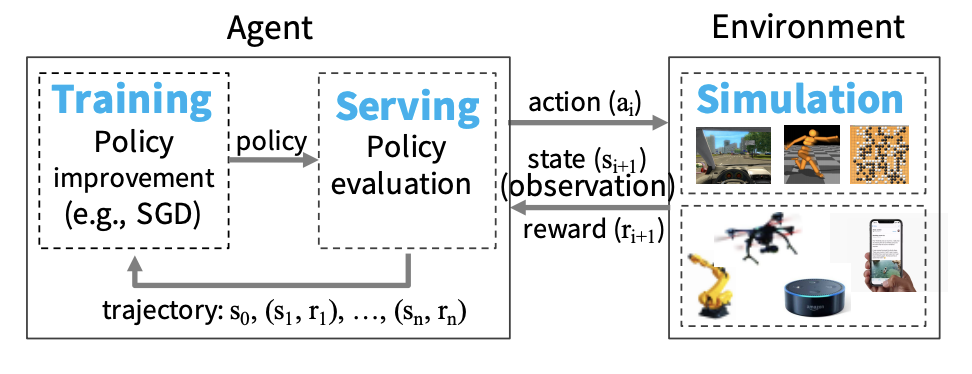
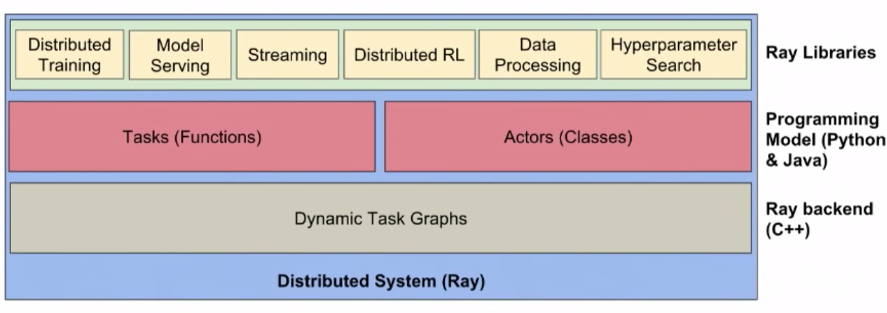
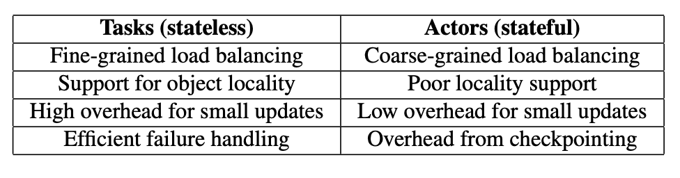
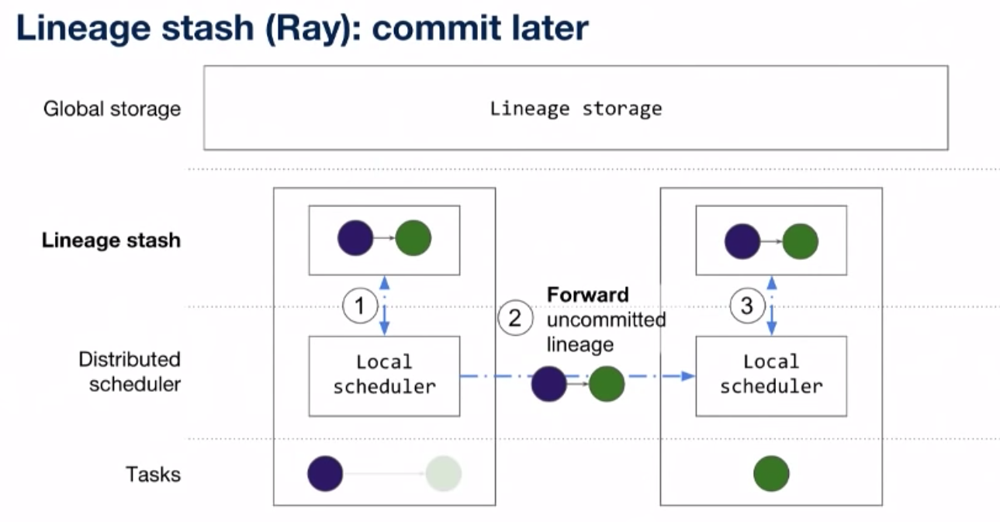
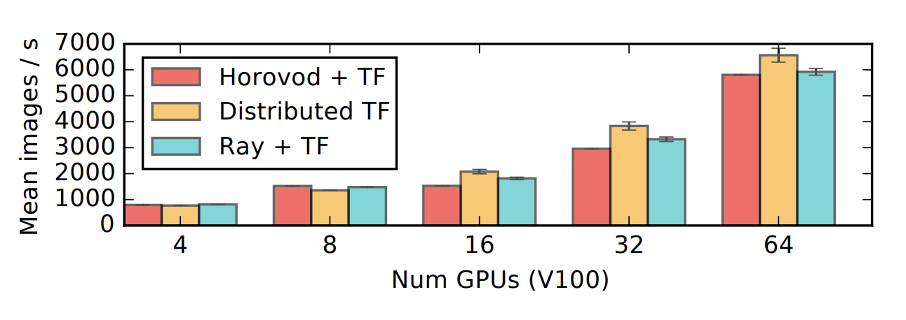
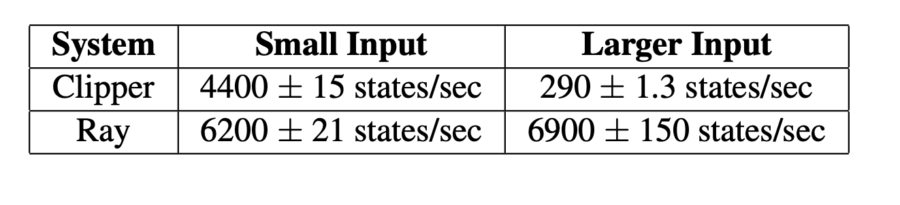
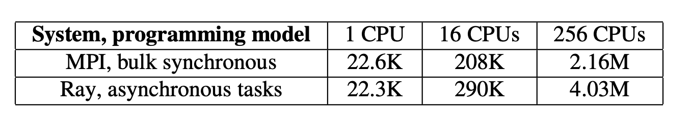

# Ray: A Distributed Framework for Emerging AI Applications

### TL;DR:

This paper presents Ray, a general-purpose cluster-computing framework that enables **simulation, training, and serving** for RL applications.

\[[Github](https://github.com/ray-project/ray)\] \[[Documentation](https://ray.readthedocs.io/en/latest/index.html)\]

### Motivation:

The central goal of an Reinforcement learning application is to learn a policy - a mapping from the state of the environment to a choice of action - that yields effective performance over time. Finding effective policies in large-scale applications requires 1\) _simulation_ to evaluate policies. 2\) _distributed training_ to improve the policy. and 3\) _serve_ the policy in interactive control scenarios.  

To enable simulation, training, and serving for the emerging RL applications, a system must support:

* Fine-grained computations: rendering actions in milliseconds when interacting with the real world
* Heterogeneity: The duration of a computation can range from millisecond to hours. In addition, training often requires heterogeneous hardware\(CPU, GPU, or TPU\)
* Flexible computation model: RL application require both stateless and stateful computations.
* Dynamic execution: The order in which computation finish is not always known in advance and the result of a computation can determine the future computations.

Note that RL is just one of the applications. There are many other usage of the system 

### Programming and Computation Model

Ray models an application as a graph of dependent tasks that evolves during execution. On top of this model, Ray provides both an `actor` and a `task-parallel` programming abstraction, which differentiate Ray from preview works including [CIEL](https://www.cs.princeton.edu/courses/archive/fall13/cos518/papers/ciel.pdf), which only support `task-parallel`labstraction, and [Orlean](https://www.microsoft.com/en-us/research/wp-content/uploads/2016/02/Orleans-MSR-TR-2014-41.pdf)/[Akka](https://akka.io/), which only support actor abstraction.

#### Tasks 

A **task** represents the execution of a remote function on a stateless worker. A **future** representing the result of the task is returned immediately. This allows the user to express parallelism while capturing data dependencies.

Remote functions operate on **immutable** objects and are expected to be `stateless` and `side-effect free`, which implies _idempotence_ and simplifies fault tolerance through function re-execution on failure.

#### Actors 

An actor represents a **stateful** computation. A method execution is similar to a task, in that it executes remotely and returns a future, but differs in that it executes on a stateful worker. Actors provide much more efficient fine-grained updates, as these updates are performed on internal rather than external state, which typically requires serialization and deserialization. 

**Computation Model**

Ray employes a dynamic task graph computation model. There are two types of nodes in a computation graph: `data objects` and `remote function invocations`. And, there are two types of edges: `data edge` and `control edges`. 

To capture the state dependency across subsequent method invocations on the **same actor**, we add a third type of edge: a `stateful edge`. They capture the implicit data dependency between successive method invocations sharing the internal state of an actor. Stateful edges also enable us to maintain **lineage**. We can easily reconstruct lost data.

### Architecture

Ray's architecture comprises 1\) an application layer implementing the API, and 2\) a system layer providing high scalability and fault tolerance. 

#### Application Layer:

* _Driver_: A process executing the user program
* _Worker_: A stateless process that executes tasks \(remote functions\) invoked by a driver or another worker.
* _Actor_: A stateful process that executes, when invoked, only the methods it exposes.

#### System Layer:

**Global Control Store\(GCS\)**: 

GCS is a key-value store with pub-sub functionality, use sharding to achieve scale, and per-shard [chain replication](https://www.cs.cornell.edu/home/rvr/papers/OSDI04.pdf). It maintains the entire control state of the system. 

Maintaining low latency requires minimizing overheads in task scheduling, which involves choosing where to execute, and subsequently task dispatch, which involves retrieving remote inputs from other nodes. Therefore, they store the object metadata \(object locations and sizes\) in the GCS rather than in the scheduler, fully decoupling task dispatch from task scheduling.

**Bottom-Up Distributed Scheduler:** 

Ray needs to dynamically schedule millions of tasks per second, tasks which may take as little as a few milliseconds.\[1\] To satisfy the above requirements, they design a two-level hierarchical scheduler consisting of a global scheduler and per-node local schedulers. 

**A local scheduler first tries to schedules tasks locally** unless the node is overloaded \(i.e., its local task queue exceeds a predefined threshold\), or it cannot satisfy a task’s requirements \(e.g., lacks a GPU\). If a local scheduler decides not to schedule a task locally, it forwards it to the global scheduler. The global scheduler considers each node’s load and task’s constraints to make scheduling decisions.

The global scheduler gets the queue size at each node and the node resource availability via heartbeats, and the location of the task’s inputs and their sizes from GCS. The global scheduler selects the node which provides the lowest estimated waiting time. \( The sum of queuing delay and data transfer time.\) 

NOTE: The global scheduler was removed after [v0.5](https://ray-project.github.io/2018/07/06/ray-0.5-release.html), which is replaced by direct node-manager to node-manager communication. 

**In-memory Distributed Object store:**

On each node, we implement the object store via shared memory. This allows zero-copy data sharing between tasks running on the same node. If a task’s inputs are not local, the inputs are replicated to the local object store before execution. Also, a task writes its outputs to the local object store.

For low latency, we keep objects entirely in memory and evict them as needed to disk using an LRU policy.

One of the nice things of this decentralized design where you have seperate schedulers and metadata storage is that you can scale these things independently. 

\[1\] Most cluster computing frameworks, such as Spark, CIEL, and Dryad implement a centralized scheduler, which can provide locality but at latencies in the tens of ms. Distributed schedulers such as work stealing, Sparrow and Canary can achieve high scale, but they either don’t consider data locality\(work stealing\) or assume tasks belong to independent jobs\(Sparrow\), or assume the computation graph is known\(Canary\).

### **Fault tolerance - lineage reconstruction**

Maintaining the lineage of an execution gives us fast recover time. We only need to replay the work lost to continue executing. However, recording the lineage adds significant overhead to normal execution. We need extra work to record lineage of each task and must commit a task's lineage before task start executing. Thus, we have an interesting tradeoff\(as identified in Drizzle paper\) between fast execution without failures and fast recovery during failures. 

To get both fast task execution and fast failure recovery, Ray implements [**Lineage Stash**](https://dl.acm.org/doi/10.1145/3341301.3359653). We have lineage stash at each node which looks like in-memory subgraph. Thus, instead of writing the lineage to the Global storage, the local scheduler will write the lineage to its local stash and then forward the task as well as the uncommitted lineage to remote node. Ray will asynchronously commit the uncommitted lineage to avoid huge lineages. 

### \*\*\*\*

### Evaluation:

The paper provides some evaluation of Ray on training, serving and simulation. The key takeaway is that the performance of Ray matches the existing frameworks on traditional ML workloads and it either outperforms or support some missing features of other frameworks on RL workloads.

Specifically, it matches the **training** performance of the state-of-the-art frameworks:

For **serving**: 

However, it worth noting that this might not be a fair comparison, because Ray focuses primarily on the embedded serving of models to simulators running within the same dynamic task graph \(e.g., within an RL application on Ray\). In contrast, systems like Clipper focus on serving predictions to external clients

For **simulation**:

