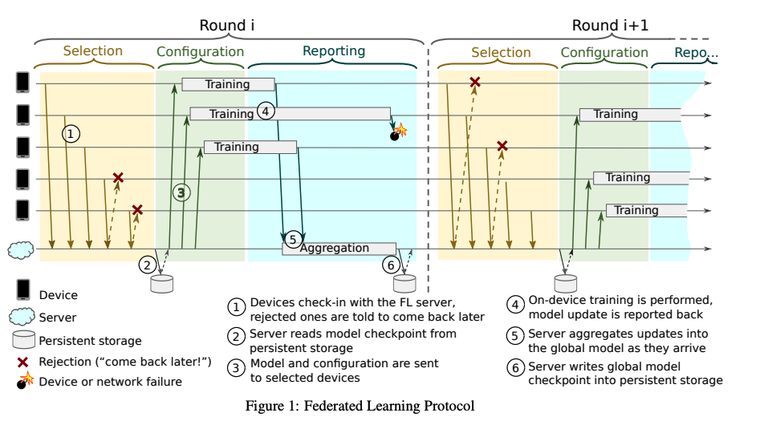

# Federated Learning at Scale - Part I

### Summary

**Federated learning** \(FL\) is a machine learning setting where many clients \(e.g. mobile devices or whole organizations\) collaboratively train a model under the orchestration of a central server \(e.g. service provider\), while keeping the training data decentralized.   FL allows for smarter models, lower latency, less bandwidth usage, and less power consumption, all while ensuring privacy and user experiences.

Nowadays, much of the data is born decentralized. For example, billions of phones and IoT devices constantly generate data, and the data can be used to enable better products. Informally, instead of bringing all data into a centralized server and train a model, FL brings the model to where the data lives, train it locally, and only upload the update to the server. Local data storing and processing with global coordination is made possible by the emerging technology of mobile edge computing\(MEC\), where edge nodes, such as sensors, home gateways, micro servers, and small cells, are equipped with storage and computation capability. 

Note: FL is a term coined by researchers from Google and research projects in Berkeley use the term _shared learning_ instead of _Federated Learning_.

### [The Lifecycle of a Model in Federated Learning](https://arxiv.org/pdf/1912.04977.pdf)

The FL process is typically driven by a model engineer developing a model for a particular application. At a high level, a typical workflow is:

* **Problem identification**: The model engineer identifies a problem to be solved with FL.
* **Client instrumentation:** If needed, the clients \(e.g. an app running on mobile phones\) are instrumented to store locally \(with limits on time and quantity\) the necessary training data. In many cases, the app already will have stored this data \(e.g. a text messaging app must store text messages, a photo management app already stores photos\). However, in some cases additional data or metadata might need to be maintained, e.g. user interaction data to provide labels for a supervised learning task.
* **Simulation prototyping \(optional\):** The model engineer may prototype model architectures and test

  learning hyperparameters in an FL simulation using a proxy dataset.

* **Federated model training:** Multiple federated training tasks are started to train different variations of the model, or use different optimization hyperparameters.
* **\(Federated\) model evaluation:** After the tasks have trained sufficiently \(typically a few days\), the models are analyzed and good candidates selected. Analysis may include metrics computed on standard datasets in the datacenter, or federated evaluation wherein the models are pushed to held-out clients for evaluation on local client data.
* **Deployment:** Finally, once a good model is selected, it goes through a standard model launch process.

### [Google's System design for FL](https://arxiv.org/pdf/1902.01046.pdf)

> We term our approach Federated Learning, since the learning task is solved by a loose federation of participating devices which are coordinated by a central server.

The goal is to build a system that can train a deep neural network on data stored on the phone which will never leave the device. The weights are combine in the cloud with [_Federated Averaging_](https://arxiv.org/abs/1602.05629), constructing a global model which is pushed back to the phone for inference.

#### Device-server protocol

Each round of the protocol contains three phases. 

* **Selection**: The server\(i.e. the coordinator in the server\) picks a subset of available devices to work on a specific FL task\[1\]. 
* **Configuration**: The server sends the FL plan\(execution plan\) and the FL checkpoint\(i.e. a serialized state of a Tensorflow session\) with the global model to each of the chosen devices. When receiving a FL task, the FL runtime will be responsible for performing local training.
* **Reporting**: The server waits for the participating devices to report updates. The round is considered successful if enough devices report in time. \(The update to the model is often sent to the server using encrypted communication.\)

As an analogy, we can interpret the FL server as the reducer, and FL devices as mappers. 

\[1\]An FL task is a specific computation for an FL population\(a learning problem/application\), such as training to be performed with given hyperparameters.

#### Device 

The device should maintain a repository of locally collected data for model training and evaluation. Applications are responsible for making their data available to the FL runtime as an _example store_\(e.g. an SQLite database recording action suggestions show to the user and whether or not these suggestions were accepted\). When a task arrived at the device, the FL runtime will access an appropriate example store to compute model updates.

Two things to note here:  1. We need to avoid any negative impact on the user experience. Thus, the FL runtime will only start the task when the phone is idle, connected to the WiFi/power etc. 2. FL plans are not specialized to training, but can also encode evaluation tasks. 

For other details, such as multi-tenancy and attestation, please refer to the paper. 

#### Server

The FL server is designed around the [Actor Programming model](https://xzhu0027.gitbook.io/blog/misc./actor-model). The main actors include:

* **Coordinators** are Top-level actors\(one per population\) which enable global synchronization and advancing rounds in lockstep. As previously mentioned, The Coordinator receives information about how many devices are connected to each Selector and instructs them how many devices to accept for participation, based on which FL tasks are scheduled.
* **Selectors** are responsible for accepting and forwarding device connections. After the Master Aggregator and set of Aggregators are spawned, the Coordinator instructs the Selectors to forward a subset of its connected devices to the Aggregators, allowing the Coordinator to efficiently allocate devices to FL tasks regardless of how many devices are available
* **Master Aggregators** manage the rounds of each FL task. In order to scale with the number of devices and update size, they make dynamic decisions to spawn one or more **Aggregators** to which work is delegated.

### [Federated Averaging](https://arxiv.org/pdf/1602.05629.pdf)

`FederatedAveraging` is a variation of traditional Stochastic gradient descent\(SGD\) algorithm, which combines local SGD on each client with a server that performs model averaging. 

At the beginning of each round, a random fraction C of clients is selected, and the server sends the current global algorithm state to each of these clients \(e.g., the current model parameters\). We only select a fraction of clients for efficiency, as the experiments show diminishing returns for adding more clients beyond a certain point. Each selected client then performs local computation based on the global state and its local dataset, and sends an update to the server. The server then applies these updates to its global state, and the process repeats.

In other words, the high-level protocol is:

1. Workers pull the latest model from the server
2. Workers compute an update l based on their local data
3. Workers send their local update to the server
4. The server aggregates these updates \(by averaging\) to construct the new global model

The amount of computation is controlled by three key parameters: C, the fraction of clients that perform computation on each round; E, the number of training passes each client makes over its local dataset on each round; and B, the local minibatch size used for the client updates.

However, the paper does not provide any theoretical convergence guarantee and the experiments were not conducted in a network setting.

### Comparison between Parameter Server and FL: 

Federated Learning protocol is very similar to the traditional parameter server protocol. The **differences** are: 

1. In data center setting, shared storage is usually used, which means the worker machine do not keep persistent data storage on their own, and they fetch data from the shared storage at the beginning of each iteration.
2.  In FL, the data, and thus the loss function, on the different clients may be very heterogeneous, and far from being representative of the joint data.\(e.g. the data stored on each client may be highly non-IID\)
3.  In FL, the server never keeps track of any individual client information and only uses aggregates to ensure privacy.
4.  Because of the high churn in FL setting, only a small subset of the devices are selected by the server in each round.

### Applications

Federated Learning applies best in situations where the on-device data is more relevant than the data that exists on servers \(e.g., the devices generate the data in the first place\), is privacy-sensitive, or otherwise undesirable or infeasible to transmit to servers. 

* Risk modeling
* Smart Devices
  * on-device item ranking, [content suggestions for on-device keyboards](https://arxiv.org/pdf/1906.04329.pdf), and [next word prediction](https://arxiv.org/abs/1811.03604)
  * Detecting burglaries within smart homes
* Healthcare 
  * predicting health events like low blood sugar or heart attack risk from wearable devices
* Browsers
  * [Federated Learning for Firefox](https://florian.github.io/federated-learning-firefox/)

In general, FL is most **appropriate** when:

* On-device data is more relevant than server-side proxy data
* On-device data is privacy sensitive or large 
* Labels can be inferred naturally from user interaction

### Security and Privacy

While FL enables model training on decentralized data and only the updates are sent to the server, the attacker may still be able to get some information just from these updates.

The mitigations for this kind of attack include **homomorphic encryption and** [**secure aggregation**](https://eprint.iacr.org/2017/281.pdf): encrypting the model updates such that the server can still perform the algebraic operations necessary to combine them, but updates not sent in plaintext. 

The other mitigation is [**differential privacy**](https://arxiv.org/abs/1710.06963). The basic idea is to add random noise to the individual updates. These updates are going to be accumulated, and thus your noise should cancel with all the noise other people have added. For example, if we want to compute the average height of people in a class without asking each individual's height, which might be sensitive, we could ask everyone in the class to add a random number\(e.g. normally distributed with a mean of 0\) to our height and tell us the result. Then, we can compute the average height without knowing anyone's height.

### Advantages

* **Highly efficient use of network bandwidth**
  * Less information is required to be transmitted to the cloud.
* **Privacy**
  * As described above, the raw data of users need not be sent to the cloud.
  * With guaranteed privacy, more users will be willing to take part in collaborative model training and so, better inference models are built.
* **Low latency**
  * The latency is much lower than that when decisions are made in the cloud before transmitting them to the end devices. This is vital for time critical applications such as self-driving car systems in which the slightest delays can potentially be life threatening

### Challenges and Limitations

* **Does it work? And if so, why?**
  * We can prove FL works for linear models and a couple of other special cases, but we cannot prove it works for more complicated things like neural networks unless we train the model in a non-federated way and demonstrate that it gets almost the same performance.
* **Security**
  * Recent [study](https://arxiv.org/pdf/1702.07464.pdf) shows that a malicious participant may exist in FL and can infer the information of other participants from shared parameters. As such, privacy and security issues in FL need to be considered.  
* **Statistical and System heterogeneity**
  * In a large and complex mobile edge network, the heterogeneity of participating devices in terms of data quality, computation power, and willingness to participate have to be well managed from the resource allocation perspective.
  * Problem of Non-IID data: In datacenters, workers usually use a shared storage. The worker machine do not keep persistent data storage on their own, and they fetch data from the shared storage at the beginning of the learning process\(or each iteration\). As a result, it's possible to guarantee that the data samples obtained by different workers are IID. In Federated Learning, we cannot make [iid](https://en.wikipedia.org/wiki/Independent_and_identically_distributed_random_variables) assumptions. ; that is, a device’s local data cannot be regarded as samples drawn from the overall distribution.
  * See next post for more detail.
* **Slow, unstable and limited communication**: 
  * Due to the high dimensionality of model updates and limited communication bandwidth of participating mobile devices, communication costs remain an issue.
  * If we use mobile phone for Federated Learning, uploads are typically going to be much [slower](http://www.speedtest.net/reports/united-states/) than downloads and network latency may be very slow as well. Even worse, the FL system does not have control over users’ devices. For example, when a mobile phone is turned off or WiFi access is unavailable, the central server will lose connection to this device.
  * One potential mitigation is that we can select N devices in each round and proceed with K response\( $$K\le N  $$\). 
* **May not work for tree-based algorithms\(e.g. decision trees\)**

### Related Links:

* [Tensorflow Federated Github Repo ](https://github.com/tensorflow/federated)
* [Google's blog on Federated Learning](%20https://ai.googleblog.com/2017/04/federated-learning-collaborative.html)\(A great introduction\)
* [Pysyft](https://github.com/OpenMined/PySyft) - a Python library for secure, private Deep Learning
* [Federated Learning for Firefox](https://florian.github.io/federated-learning-firefox/)
* [Damien Desfontaines's blog post on differential privacy](https://desfontain.es/privacy/)
* [Frank McSherry's blog  on deep learning and differential privacy](https://github.com/frankmcsherry/blog/blob/master/posts/2017-10-27.md)
* [IID Statistics: Independent and Identically Distributed Definition and Examples](https://www.statisticshowto.datasciencecentral.com/iid-statistics/)

  
  

