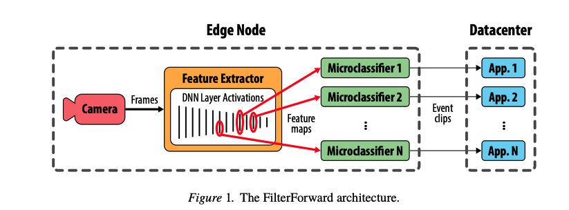

# Scaling Video Analytics on Constrained Edge Nodes

### Motivation:

The scenarios that motivate FilterForward include remote “Internet of Things” monitoring and “smart city” deployments of tens or hundreds of thousands of wide-angle, fixed-view cameras. However, there are a number of challenges: 

* **Limited Bandwidth**: Each camera in large-scale deployments may only have few hundred kbp, while each stream coming in may be several orders of magnitude greater than our available uplink bandwidth. This bandwidth gap, exacerbated by the requirement for high-quality data, necessitates an edge-based decision about which frames to send to the datacenter
* **Scalable Multi-tenancy**: In real-world deployments, cameras observe scenes containing diverse objects and activities. Different applications are simultaneously interested in all of this information, and more. Given edge nodes’ limited compute resources, scaling to multiple applications naturally poses a performance challenge. 

### FilterForward

To address the above challenges, FilterForward uses a feature extractor and microclassifier to provide highly accurate, multi-tenant video filtering for bandwidth-constrained edge nodes. 

#### Feature Extractor

In FF, microclassifiers reuse computation by taking as input feature maps produced from the intermediate results \(activations\) of a single reference DNN, called base DNN. The component that evaluates the base DNN and produces feature maps is called the feature extractor. As prior work observes, activations capture information that humans intuitively desire to extract from images, such as the presence and number of objects in a scene, and outperform handcrafted low-level features. 

Although feature extraction is computationally intensive phase, its results are reused by all of the MCs, amortizing the per-frame, upfront overhead once the number of MCs passes a break-even point.

#### Microclassifier

Microclassifiers are lightweight binary classification neural networks that take as input feature maps extracted by the base DNN and output the probability that a frame is relevant to a particular application. 

Choosing which base DNN layer to use as input to each microclassifier is critical to their accuracies. Too late a layer may not be able to observe small details \(because they have been subsumed by global semantic classification\). Too early a layer could be computationally expensive due to the large size of early layer activations and the amount of processing still required to transform low-level features into a classification. The authors discuss some microclassifier architectures in the paper. 

### Final Note:

FilterForward is designed for scenarios meeting two key assumptions, which hold for some, though certainly not all, applications. First, relevant events are rare. There is bandwidth to be saved by transmitting only relevant data. Second, datacenter applications require high-quality video data to complete their tasks. This precludes solutions such as heavily compressing streams or reducing their spatial \(frame dimensions\) or temporal \(frame frequency\) resolutions

