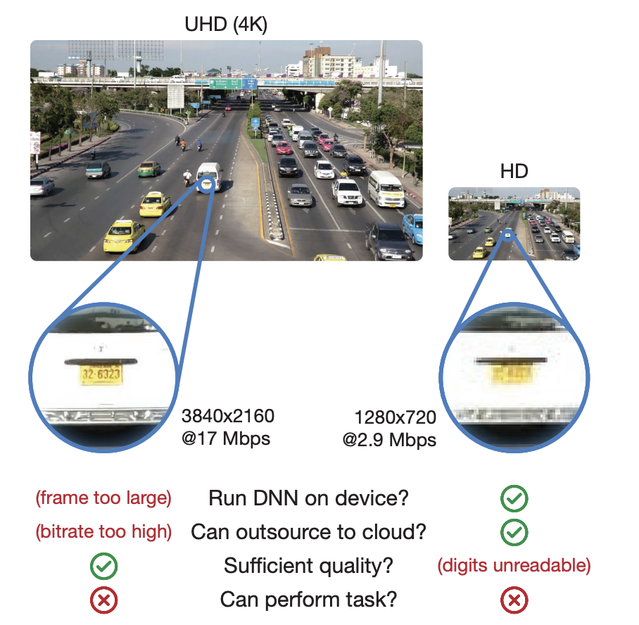
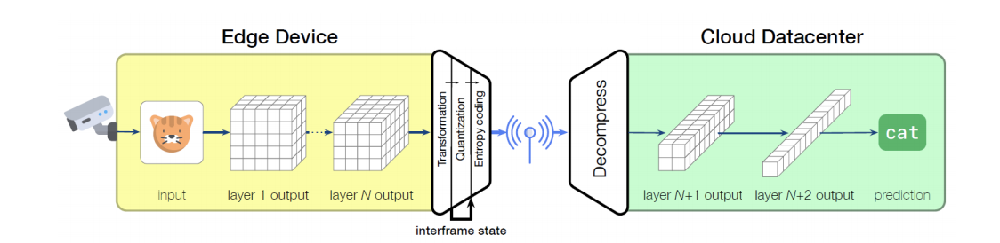
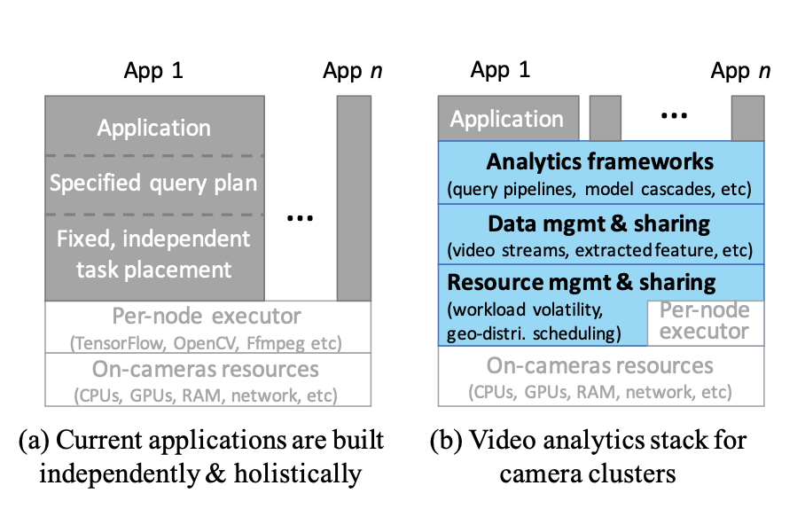

# Workshop papers

### [Cracking open the DNN black-box: Video Analytics with DNNs across the Camera-Cloud Boundary](http://shivaram.org/publications/hotvid06-final.pdf) - Emmons et al., HotEdgeVideo' 19

Most existing serving systems treat DNNs largely as “black boxes” and either deploy models entirely on a camera or compress videos for analysis in the cloud. However, as shown in the below figure, neither camera-only nor cloud-only is satisfiable. 

This paper proposes "split-brain" inference, where the video is processed partly on the camera, subject to a limit on computation. Then, intermediate values are transmitted, limited by network capacity, to a cloud datacenter for further DNN inference. The objective is to rely on the cloud for "overflow" capacity. 

However, one of the key challenges of this approach is data amplification, in which the size of intermediate data is far larger than the input size\(by up to 4500x\), making it challenging to identify a "split point" for the cloud. 

### [Networked Cameras Are the New Big Data Clusters](https://www.microsoft.com/en-us/research/uploads/prod/2019/08/hotedgevideo19camera.pdf) - Jiang et al.,  HotEdgeVideo' 19

This paper is motivated by the recent trends in video cameras. First, networked cameras are being deployed en masse. Second, the cameras are empowered with more onboard compute resources and can run complex deep learning models locally. 

Based these observations, the authors propose a novel approach - transforming a group of networked cameras to a compute cluster, called camera cluster, which manages the resource sharing and video streams with an unifying abstraction. 

#### Potential benefits

* **Saving computing resource**: 1. Multiple queries over the same video feeds or historical video queries create opportunities to save resource consumption by reusing intermediate data. 2. different applications sometimes use the same set of models. One can share models between applications that perform the same tasks. For example, one can load models on specific cameras and route the "data" to these locations, achieving better model locality
* **Resource Pooling**: 1. Such a camera cluster will allow the video streams to be load-balanced between cameras. 2. By pooling together the ever-growing resource on cameras a camera cluster can run more complex and more accurate models than today's solutions.
* **Hiding low-level intricacies**: The abstraction will allow applications and implementation to evolve independently. 

### Scaling Video Analytics Systems to Large Camera Deployments

