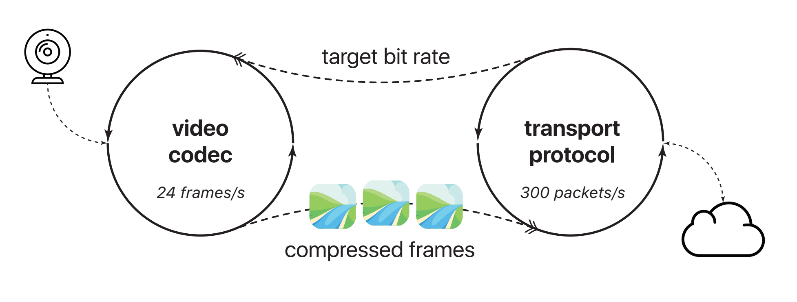

# Salsify: Low-Latency Network Video through Tighter Integration between a Video Codec and a Transport

### Background and Motivation

Real-time Internet video systems are built by combining two components: **a transport protocol and a video codec**. In existing systems, these components operate independently, occasionally communicating through a standardized interface. For example,  the video encoder reads frames off the camera at a particular frame rate and compresses them, aiming for a particular average bit rate. The transport protocol updates the encoder’s frame rate and target bit rate on a roughly one-second timescale. The congestion response is generally reactive: if the video codec produces a compressed frame that overshoots the network’s capacity, the transport will send it \(even though it will cause packet loss or bloated buffers\), but it subsequently tells the codec to pause encoding new frames until congestion clears. 

As a result, current systems do not react fast enough to network variations, end up congesting the network, causing stalls and glitches. 

### Salsify

This paper proposes Salsify, which includes a video-aware congestion control and a network-aware video codec. The goal of Salsify is to match video to varying network capacity. The high-level protocol is:

* Every iteration of the control loop, encode:
  * A higher-quality version of next frame
  * A lower-quality version of next frame
* Three options to send, based on sizes of encoded output:
  * Higher-quality version
  * Lower-quality version
  * Nothing: Skip frame after encoding it
* Never send a frame unless the network is ready

Salsify achieve this by exploiting its codec's ability to save and restore its internal state\(introduced in their ExCamera paper\)

