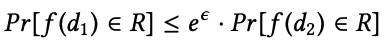

# Differential Privacy

Differential privacy is a property of randomized functions that take a database as input, and returns an aggregate output. It is a quantitative notion of privacy that bounds how much a single individual's private data can contribute to the output. 

Informally, a function is differentially private if changing any single row in the input database results in almost no change in the output.

Formally, for any two databases d1 and d2 that differ only in a single row, we say that f is ϵ-differentially private if, for any set of outputs$$R$$ 

In other words, a change in a single row results in at most a multiplicative change of $$e^{\epsilon}$$ in the probability of any output, or set of outputs. 

The standard method for achieving differential privacy for numeric queries is the **Laplace mechanism**, which involves two steps: 

* Calculate the sensitivity,$$s$$, of the query, which is how much the un-noised output can change based on a change to a single row. For example, if you want to release the average rating of a movie and the rating range from -10 to 10. Then, the sensitivity is 20. 
* Add noise drawn from a Laplace distribution with scale parameter $$s/\epsilon$$ 

This results in ϵ-differential privacy.

The scale $$s/\epsilon$$ of the Laplace distribution controls its spread: the distribution is wider for more sensitive functions \(larger$$s$$\) or stronger privacy guarantees \(smaller$$\epsilon$$\), giving a higher probability of adding more noise. 

Check [this](https://desfontain.es/privacy/differential-privacy-in-practice.html) link for a concrete example.

