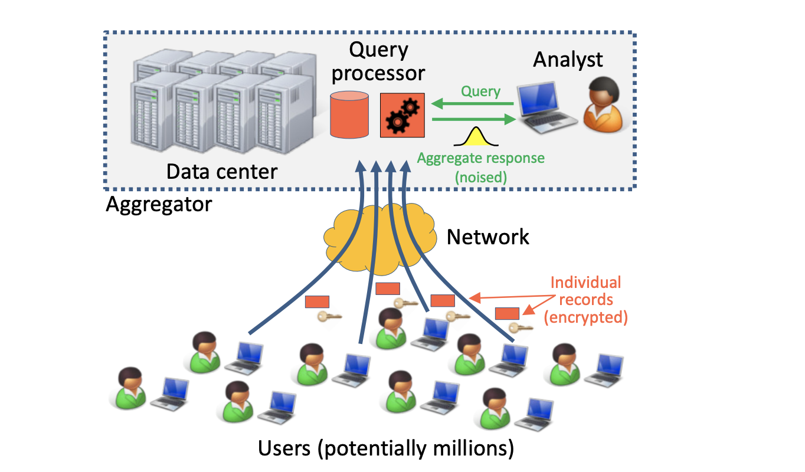
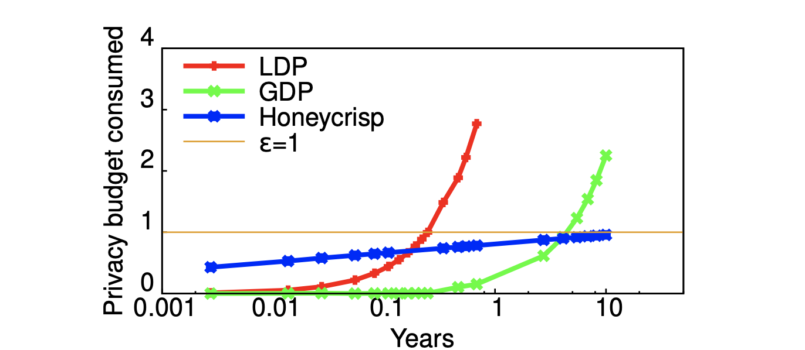

# Honeycrisp: Large-Scale Differentially Private Aggregation Without a Trusted Core

### Assumption

This paper considers the scenario in which there is a very large number of users\(e.g., all iPhone users\), as well as one central aggregator\(e.g., Apple\). Each user regularly collects some sensitive information on her device that she wishes to make available to the aggregator for analysis, provided that her privacy can be guaranteed. The protocol should be robust not just to honest-but-curious\(HbC\) behavior, but rather to actual Byzantine faults. More specifically, this paper assumes the aggregator to be **occasionally Byzantine**\(OB\) and the users to be **mostly correct**\(MC\). Moreover, there is no trusted third party that is willing to be actively involved. 

### Background and motivation

Much of the early literature assumes a **trusted data curator**, who collects data in the clear, aggregates it, and, as the final step, adds noise to the answer of the query.\(a.k.a., global differential privacy.\). However, such a  trusted third party may not exist in most cases. Some recent works proposes a model called **local differential privacy**\(LDP\), where the noises is added locally by each user before the contributions are collected by the aggregator. Although LDP is clearly better, it also introduces a tradeoff between privacy and utility. \(Better Privacy guarantee vs. more accurate answers\). 

The differential privacy literature reasons about this tradeoff between **privacy** and **utility** by assuming a privacy budget that reflects the users’ privacy expectations; it then assigns a “cost” to each query that reflects the amount of information the query can leak and that must be deducted from the budget each time the query is asked. In general, LDP requires a much larger privacy budget than GDP because, to achieve similarly accurate results, the amount of perturbation of each data point must be significantly lower. 

Moreover, even if the answers are appropriately noised, the noise terms from repeated queries will eventually cancel out as more and more queries are answered, revealing statistics about the user's behavior. 

The existing works suggest that we should have a privacy budget of $$\epsilon = 1$$ for the entire system to run. However, to get accurate answers, Apple uses $$\epsilon = 16$$ and renews the privacy budge every day. 

### Honeycrisp

Honeycrisp is a system that can sustainably run queries like the one from [Apple's deployment](https://www.apple.com/privacy/docs/Differential_Privacy_Overview.pdf) while protecting user privacy in the long run, as long as the underlying data does not change too often. The key idea behind Honeycrisp is to utilize sparse vector theorem\(SVT\) and homomorphic encryption. 

The algorithm consists of three distinct phases:

* **Setup Phase**: In the first phase, it uses a sortition scheme to randomly and accountably choose a committee, which is a small subset of devices. The committee then uses MPC to generate a keypair for an additively homomorphic cryptosystem. The private key is secret-shared, and the shares are kept on the committee’s devices, whereas the public key is endorsed by the devices and sent to the aggregator.
* **Collect phase**: In the next phase, the aggregator uses its resources to distribute the public key and the endorsements to all the devices; each device verifies the endorsements, then encrypts her data with this key, and sends the ciphertext back to the aggregator, along with a zero-knowledge proof that the encrypted plaintext is formatted correctly and in the right range. \(Note that the aggregator does not know the private key for the cryptosystem and thus cannot perform these checks on the plaintext directly!\) Finally, the aggregator verifies the range proofs, aggregates the ciphertexts using the homomorphic property of the cryptosystem, and thus obtains a single ciphertext that contains the \(precise, un-noised\) sum of the individual records. 
* **Test phase**: Finally, the aggregator sends the \(single\) aggregate ciphertext back to the committee, along with its “guess” for the plaintext value. The committee members input their key shares, the guess and the ciphertext into another MPC, which combines the shares, recovers the private key , and decrypts the ciphertext to obtain the precise sum. The MPC then generates random bits to noise the sum and compares the result to the aggregator’s “guess” . If the difference is larger than the threshold, the MPC outputs the true result; otherwise it outputs a default value to indicate that the result is close to the guess. 

Notes:

* Honeycrisp segments its execution into discrete rounds, and it randomly appoints a new committee for each round.
* Since Honeycrisp relies on an additively homomorphic cryptosystem for aggregating the collected records, not all queries can be supported.
* **The actual noise is added in the test phase**: Once the encrypted sums have been decrypted inside the MPC,some noise must be added to the plain text values before they are compared to the analyst’s guess.
* In the test phase, if the difference between the guess and the noised result is larger than the threshold, the computation outputs the noised result, and otherwise a default value to indicate that the guess was approximately correct.

As a result, the privacy cost in Honeycrisp depends on how often the data changes, and not on how often the query is asked\(by using SVT\). Thus, if the data is relatively stable\(as is likely in many cases, e.g., user typing habits do not change very often.\), Honeycrisp can answer periodic queries for many years, as long as the underlying data does not change too often.

