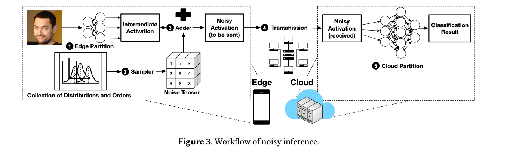

# Short Summaries

### [Opaque: An Oblivious and Encrypted Distributed Analytics Platform](https://people.eecs.berkeley.edu/~wzheng/opaque.pdf) - Zheng et al., NSDI' 17

Hardware enclaves\(e.g., Intel SGX and AMD Memory Encryption\) provide three great security properties: 1. **isolated execution**: an enclave process restricts access to a subset of memory such that only that particular enclave can access it. 2. **sealing**, which enables encrypting and authenticating the enclave's data such that no process other than the exact same enclave can decrypt or modify it. 3. **remote attestation**, which provides the ability to prove that the desired code is indeed running securely. 

Opaque is a distributed data analytics platform that utilizes Intel SGX hardware enclaves, providing strong security guarantees including computation integrity and **obliviousness**\*. Opaque operates in the query optimization layer, where it introduces a set of new distributed relational operators and novel query planning techniques.

\*\(Memory-level\) Access pattern leakage is an attack in which a compromised OS is able to infer information about the encrypted data by monitoring an application's page access. \(such leakage can also occur at the network level.\). Oblivious means the computation does not leak any access patterns.

### [Prio: Private, Robust, and Scalable Computation of Aggregate Statistics](https://www.usenix.org/system/files/conference/nsdi17/nsdi17-corrigan-gibbs.pdf) - Corrigan-Gibbs et al., NSDI' 17

This paper talks about Prio, a privacy-preserving system for the collection of aggregate statistics. Prio uses a small number of servers to collect the data; as long as one of the Prio servers is honest, the system leaks nearly nothing about client's private data. Prio also maintains robustness in the presence of an unbounded number of malicious clients. 

Prio is built on a simple scheme, where each client splits its private value $$x_i$$ into s shares, one per server, using a secret-sharing scheme. \(i.e., the sum of x shares = $$x_i$$\). For example, if there are 3 servers and $$x_i$$= 1, the client could generate \(10, -17, 8\) and send them to the corresponding server. As a result, as long as one server is honest, the client data remain private. To maintain robustness, Prio asks the clients to send to each server a "share" of proof of correctness, in which the servers can collectively verify the validity of the input. \(a variant of zero-knowledge proof?\)

### [Shredder: Learning Noise Distributions to Protect Inference Privacy](https://dl.acm.org/doi/pdf/10.1145/3373376.3378522) - Mireshghallah et al., ASPLOS' 20

Similar to [Neurosurgeon](https://web.eecs.umich.edu/~jahausw/publications/kang2017neurosurgeon.pdf), Shredder also partitions the model for inference between edge and cloud. In addition, it proposes a technique that adds noise to the intermediate result to preserve privacy while maintaining good inference results. The key idea is to find noise distributions through a disjoint offline learning process with a loss function that strikes a balance between information loss and accuracy. 

### [Orchard: Differentially Private Analytics at Scale](https://www.usenix.org/conference/osdi20/presentation/roth) - Roth et al., OSDI' 20

 This is a follow-up work of their Honeycrisp system in SOSP' 19. Honeycrisp's key idea is to use a small committee of 20-40 randomly selected user devices\(instead of a trusted third party\) to decrypt the aggregated data and add noise. However, Honeycrisp only supports count mean sketch. Orchard aims to support a wide range of queries on user devices.

Orchard's key observation is that many queries can be transformed into node-local computation, sequences of sums, and some public computation. As a result, we can transform complex queries \(the paper uses k-means as an example\) into ones that use mostly sums, which means we can use Honeycrisp's primitives to do differentially private analytics.

The workflow of Orchard is the following: 1\)Aggregator writes \(centralized\) query 2\)Orchard translates to a distributed query 3\) Users process local data and encrypt results 4\)Encrypted results are securely aggregated 5\) Committee adds noise and returns query result and 6\) Aggregator sees only the result, but never any individual's data.

The evaluation shows that Orchard can support 14 out of 17 selected queries, including neural networks. However, the computation cost of user devices raises some concerns. For example, the neural network in Orchard takes about 25 minutes of computation time.

