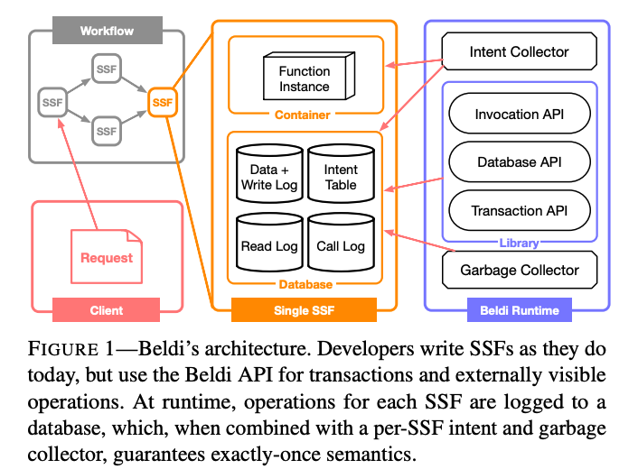

# Fault-tolerant and Transactional Stateful Serverless Workflows

This paper introduces **Beldi**, which guarantees exactly-once semantics to workflows in presence of worker crash failures.

### Problem with existing stateful serverless functions

Stateful serverless functions \(SSFs\) usually keep their state in low-latency NoSQL databases\(e,g., DynamoDB and Bigtable\). However, if a worker hangs or crashes, existing serverless platforms either 1\) do nothing, leaving the workflow incomplete, or 2\) restart the function on a different worker, potentially violating the exactly-once semantics. As a result, serverless providers recommend that developers write SSFs that are idempotent to ensure that re-execution is safe.

### The design of Beldi 

Beldi executes SSF operations while atomically logging these actions and periodically re-executes SSFs that have not yet finished. The logs prevent duplicating work that has already been done, guaranteeing at-most-once semantics, while the re-execution ensures at-least-once semantics.

Figure 1 depicts Beldi’s high-level architecture. It consists of four components: \(1\) the Beldi library, which exposes APIs for invocations, database reads/writes, and transactions; \(2\) a set of database tables that store the SSF’s state, as well as logs of reads, writes, and invocations; \(3\) an intent collector, which is a serverless function that restarts any instances of the corresponding SSF that have stalled or crashed; and \(4\) a garbage collector, which is a serverless function that keeps the logs from growing unboundedly.

#### Guaranteeing exactly-once semantics

Each intent \(i.e., an arbitrary code snippet\) is assigned a _unique identifier_ \(intent id\), which is used to save its progress. Each external operation\(e.g., reading a value from storage\) in the intent is assigned a monotonically increasing _step number_. Whenever an intent tries to execute an external operation, the client \(1\) determines the operation’s step number; \(2\) performs the operation \(e.g., writes to the database\); \(3\) logs the intent id, step number, and the operation’s return value \(if any\) into a separate database table called the operation log. 

To ensure at-most-once semantics, Beldi performs actions \(2\) and \(3\) atomically\* by using a technique called **distributed atomic affinity logging** \(DAAL\), which collocates log entries for an item in the same atomicity scope with the item's data. For example, in a storage system where operations are atomic at the row level, Beldi would store the item’s value and its log entries in different columns of the same row. 

\*if the worker crashed between \(2\) and \(3\), at-most-once semantics will be violated.

