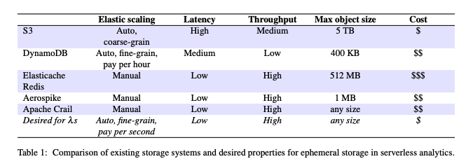
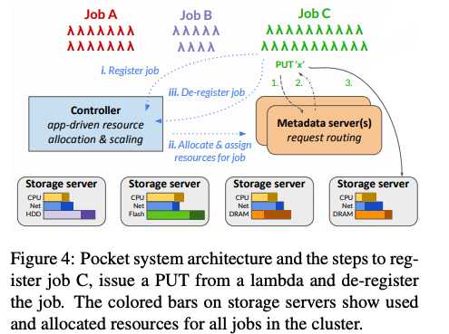

# Pocket: Elastic Ephemeral Storage for Serverless Analytics

Exchanging intermediate\(ephemeral\) data between execution stages\(e.g., map and reduce\) is a key challenge as direct communication between serverless tasks is difficult. **Pocket** is an elastic, distributed data store that provides serverless applications with the desired performance at a low cost. 

### Requirements for Ephemeral Storage

* **High performance for a wide range of object sizes**: Ephemeral data access granularity varies greatly in size, ranging from hundreds of bytes to hundreds of megabytes.
* **Automatic and fine-grain scaling**: An ephemeral data store can observe a storm of I/O requests within a fraction of a second. Thus, it must automatically rightsize resources to satisfy application I/O requirements while minimizing cost.  
* **Storage technology awareness**: The variety of storage media available in the cloud allow for different performance-cost trade-offs. An ephemeral data store must place application data on the right storage tier\(s\) for performance and cost efficiency.
* **Fault-\(in\)tolerance**: Because ephemeral data has a short lifetime of 10-100s of seconds, an ephemeral storage does not have to provide high fault-tolerance as expected of traditional storage systems

However, existing storage systems do not satisfy the above combination of requirements, as shown in table 1.

### The design of Pocket

Pocket consists of a logically centralized controller, one or more metadata servers, and multiple data plane storage servers. The three places can be scaled independently based on variations in load.

#### Controller

The controller allocates storage resources for jobs and dynamically scales Pocket metadata and storage nodes up and down as the number of jobs and their requirements vary over time. The controller also makes data placement decisions for jobs \(i.e., which nodes and storage media to use for a job’s data\).

#### Metadata Servers

Metadata servers enforce coarse-grain data placement policies generated by the controller by steering client requests to appropriate storage servers. Pocket’s metadata plane manages data at the granularity of blocks, whose size is configurable \(64k by default\). Objects larger than the block size are divided into blocks and distributed across storage servers, enabling Pocket to support arbitrary object sizes.

### Rightsizing Resource Allocations

By default, Pocket uses a default allocation that conservatively over-provisions resources to achieve high performance. However, applications can provide **hints** about the job characteristics, such as its latency sensitivity, the maximum number of concurrent lambdas, and peak aggregate bandwidth. The controller uses these hints to determine a job's _resource allocations_ \(throughput, capacity, and the choice of storage media\) to meet its requirements while minimizing the cost. For example, knowing a job's maximum number of concurrent lambdas allows Pocket to compute a less conservative estimate of the job's throughput requirement. 

Pocket translates a job’s resource allocation into a resource assignment on specific storage servers by generating a weight map for the job. The weight map is an associative array mapping each storage server \(identified by its IP address and port\) to a weight from 0 to 1, which represents the fraction of a job’s dataset to place on that storage server

 

