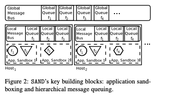

# SAND: Towards High-Performance Serverless Computing

SAND is a serverless computing system that provides lower latency, better resource efficiency, and more elasticity than existing serverless platforms. The key techniques in SAND are 1\) application-level sandboxing, and 2\) a hierarchical message bus.

### Problem with existing serverless systems

First, most existing serverless platforms execute each application within a separate container instance. This approach can either suffer from **high startup latency**\(i.e., cold start\) or **resource inefficiency**\(i.e., running idle when keeping a launched container warm\).

Second, existing serverless platforms do not consider **interactions** among functions. Events that trigger function executions can be categorized as external \(e.g., a user request calling a function sequence\) and internal \(e.g., a function initiating other functions during the workflow execution\). Existing serverless platforms normally treat these events the same, which means all events have to traverse the full end-to-end function call path, incurring undesired latencies.

### The design of SAND

SAND is built on two key ideas: 1\) application-level sandboxing, and 2\) a hierarchical message bus.

#### Application-level sandboxing

The authors argue that, while stronger mechanisms \(e.g., containers\) are needed for isolation among applications, weaker mechanisms \(e.g., processes and light-weight contexts\) are well-suited for isolation among functions within the same application. As a result, SAND separates applications from each other via containers and runs functions that compose an application in the same container but as separate processes. 

Such design has three benefits: 1\) forking a process within a container incurs short startup latency, 2\) the libraries shared by multiple functions need to be loaded into the container only once, and 3\) the cloud operator can achieve better resource efficiency and has more flexibility to divert resources.

#### Hierarchical message queuing

As shown in the figure, the local message bus creates shortcuts for functions that interact with each other. In other words, the interacting functions can benefit from reduced latency because accessing the local message bus is much faster than accessing the global message bus. 

