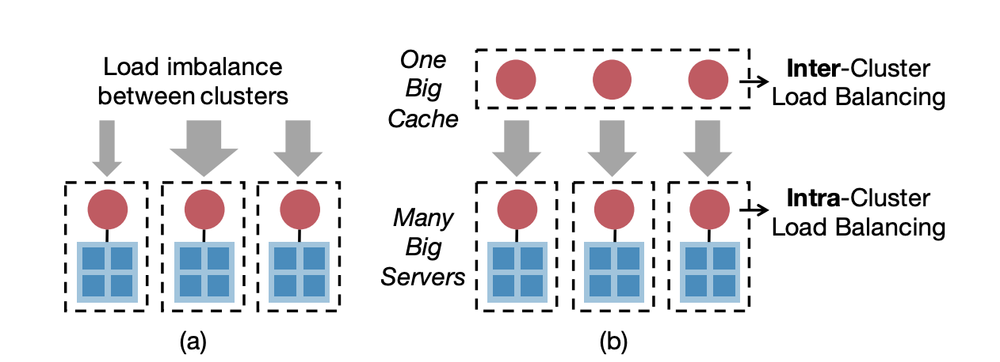
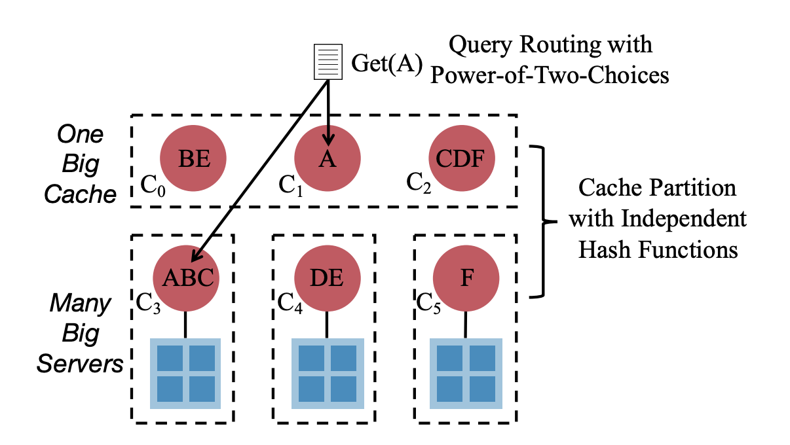

# DistCache: provable load balancing for large-scale storage systems with distributed caching

### Motivation

The last paper shows that caching O\(nlogn\) hottest objects is enough to balance n storage nodes, regardless of the query distribution. **However, it also requires that the throughput needs to be no smaller than the aggregate throughput of the storage nodes not to become the system bottleneck.** 

As a result, the small cache solution cannot scale out to multiple clusters. However, if we only put a cache in front of each clusters, the load between clusters can be unbalanced. One way to mitigate this issue is to use multiple upper-layer nodes, but it brings the question of how to allocate hot objects to the upper-layer cache nodes. Traditional cache allocation mechanisms are suboptimal. Cache partition has low overhead for cache coherence, but cannot increase the cache throughput linearly with the number of cache nodes; cache replication achieves the opposite.

Thus, the main challenges are to carefully partition and replicate the hot objects, in order to \(i\) avoid load imbalance between upper-layer cache nodes, and to \(ii\) reduce the overhead for cache coherence.

### DistCache

**The key ideas of DistCache are 1\) use independent hash functions to partition hot objects in different layers. 2\) Use the power-of-two-choices to route queries. e.g., route Get\(A\) to either C1 or C3 based on cache load.** 

DisCache's lower-layer cache nodes primarily guarantee intra-cluster load balancing and each cluster appears as one "big server". The upper-layer cache nodes are primarily for inter-cluster load balancing, and uses a different hash function for partitioning. The independent hash functions guarantee that if one cache node in a layer is overloaded by receiving too many queries to its cached objects, the set of hot objects would be distributed to multiple cache nodes in another layer with high probability. 

DistCache uses an efficient, distributed, online solution based on the power-of-two-choices to route queries. Specifically, the sender of a query only needs to look at the loads of the cache nodes that cache the queried object, and sends the query to the less-loaded node. 

\*\*\*\*

